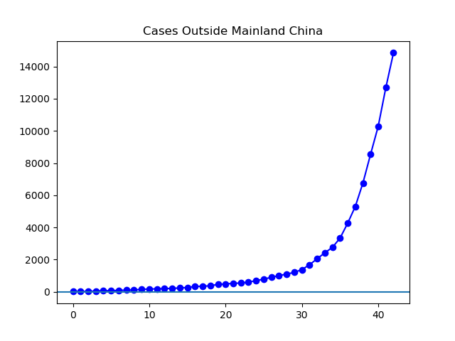
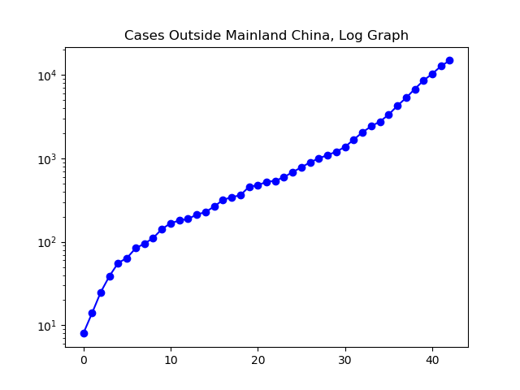
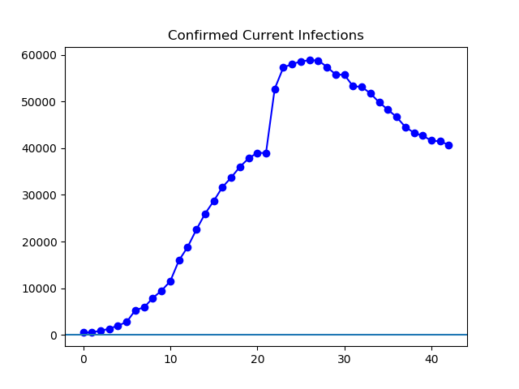
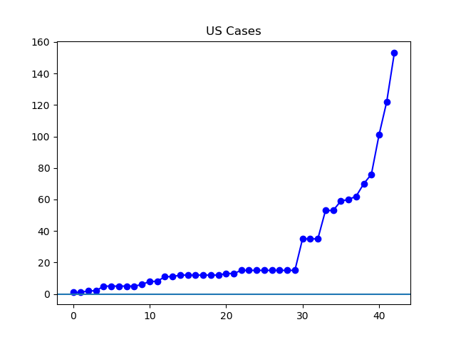
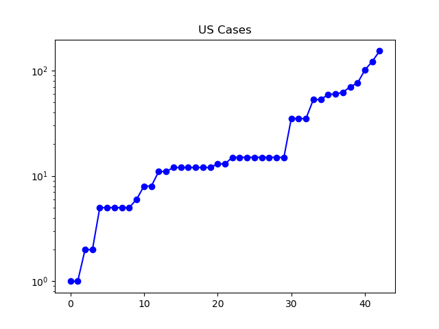

**Disclaimer**

I'm not a medical expert or any other kind of expert. I'm just a guy who's graphing some data from Johns Hopkins. And while my impression of Johns Hopkins is quite good, at the end of the day, their data is derived from whatever the world's governments are reporting.

**The Latest**

Deaths continue to rise in my country, the United States, and so do cases. Last I read there were 11 deaths and 154 cases in the United States, a total which may well be obsolete by the time I hit "publish" on this post. We're at nearly triple the number of cases we had a week ago.

The number of cases outside of China also continues to rise rapidly. At about 14,853, it's more than quadruple the number of cases reported a week ago.

Finally, due to the continued drop in current infections in China, the overall world total active cases continues to drop. People are, for now, recovering from coronavirus faster than they are catching it -- or at least the official statistics are dropping.

**The Graphs**

**Figure 1.** The cases outside of Mainland China continue to explode, at a pace lately of about two doublings per week.

**Figure 2.** This log plot shows that the growth has been pretty close to exponential since about the beginning of February.

**Figure 3**. Worldwide, the number of confirmed current infections continues to drop, driven by the continued decline in Hubei province.

**Figure 4**. The cases in the United States continue to grow at an increasingly fast clip, especially over the past three days. I hesitate to say they're growing "exponentially", because the graph it a bit too chaotic and this early stage to look like a smooth exponential curve. But like exponential growth, it does start out slow and get a lot faster toward the end of the graph.

**Figure 5.** This log plot would appear as a straight line if this were smooth exponential growth. While in total we've had a little over seven doublings in a little over six weeks, it's a bit early to say it's "doubling once a week" as though that were some kind of law. We will have to wait and watch this develop.
