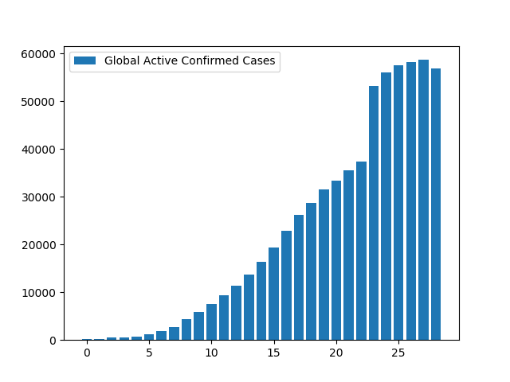
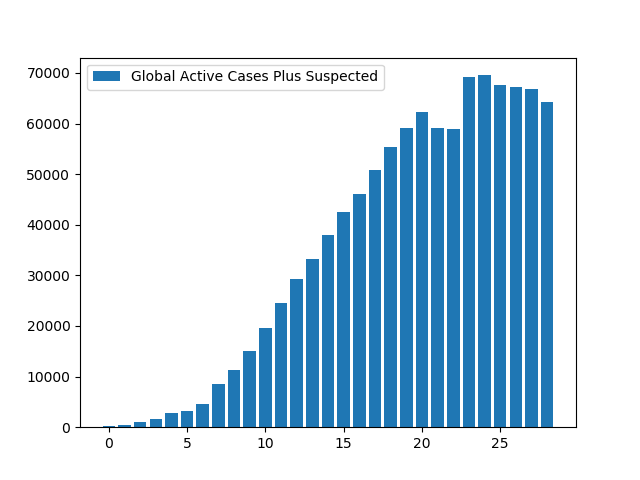
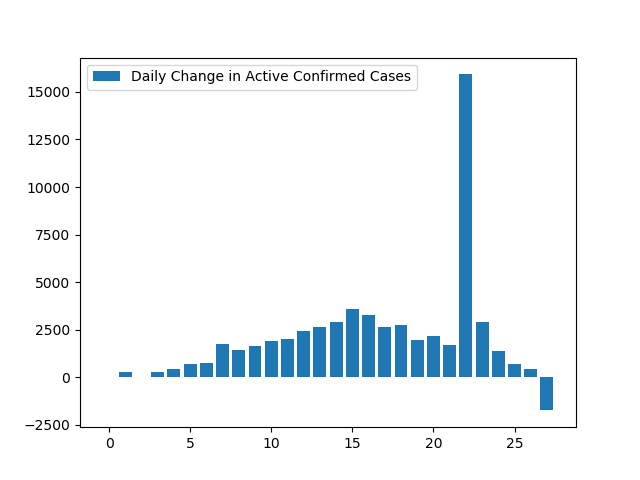
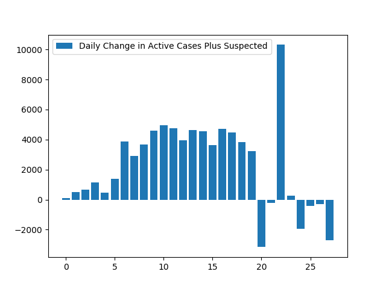
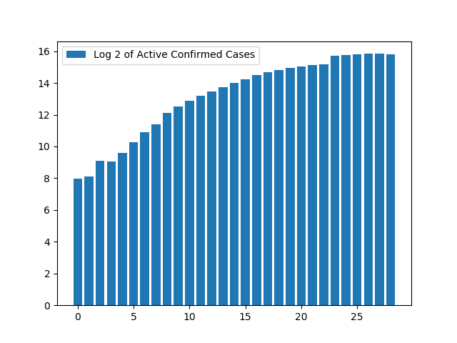
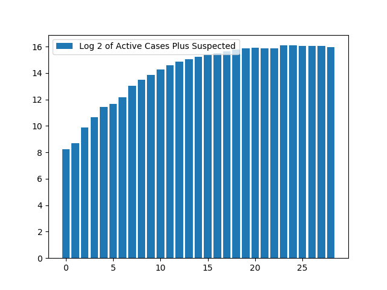
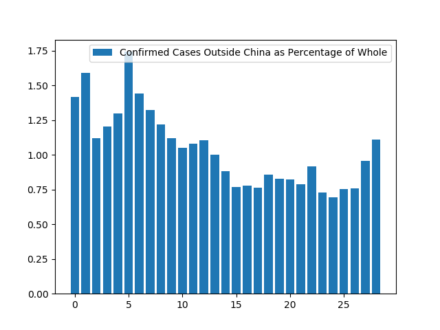

**Disclaimer**

Like I said before, I’m just a completely unqualified person trying to track some coronavirus numbers, so take anything said here with a grain of salt.

**Redefinition**

Today, the World Health Organization switched to China’s standard of reporting confirmed cases as including clinical diagnosis, so I will likewise stop reporting the “lab-tested” measures. Instead of the old `active_narrow`, the new “narrower” measure will consist of the “confirmed” (including clinical) minus the dead and recovered. I’ll simply call this `active`. The measure which includes suspected cases I will call `active_plus`.

Where I previously had WHO data versus data that included Chinese clinical diagnoses, there is now basically one stream of data on confirmed cases. China won. The only big discrepancy now is that the “spike” of clinical cases introduced into the data occurs on February 12th in the Chinese data and February 17th in the WHO data. I am going to follow the Chinese “spike” because it places the cases closer to when they were actually diagnosed. Ideally, we will eventually learn exactly on what days the “extra” cases occurred, so I can correct the graphs accordingly.[^1]

Instead of using the lists `lab_tested` and `broad_tested`, which contained data drawn at various times from multiple data sources, today I redid all my data on the principle that WHO data is preferred whenever it exists, except for its treatment of lab-tested cases in the brief periods from February 12th to February 16th. Where WHO data is not available, I am filling in my lists with data from outbreak.cc.

So here’s my little program as it now exists:


"""A little coronavirus exercise."""
import matplotlib.pyplot as plt
def quick_dirty_graph(y, caption):
    """Make a quick, dirty graph from some list with a caption."""
    x = []
    for i in range(len(y)):
        x.append(i)
    plt.bar(x, y, label=caption)
    plt.legend()
    plt.show()
def delta_list(data):
    """Show how a list changes from index to index."""
    x = []
    for i in range(1, len(data)):
        x.append(data[i] - data[i-1])
    return x
def percent_changes(data):
    """Show how a list changes from index to index, as a percentage."""
    x = []
    for i in range(1, len(data)):
        x.append((100 * (data[i] - data[i-1]) / data[i-1]))
    return x
"""Where possible, data is from WHO situation reports.
For January 22 and February 12, 13, 14, 15, and 16th,
numbers were taken on February 17th from outbreak.cc."""
confirmed = [282, 314, 580, 581, 846, 1320, 2014, 2798, 4593, 6065,
             7818, 9826, 11953, 14557, 17391, 20630, 24554, 28276,
             31481, 34886, 37558, 40554, 43103, 60326, 64442,
             67100, 69197, 71329, 71429]
"""Data on suspected cases was available from WHO situation reports
for January 25 and 27th through 31st, inclusive. For all other days,
the data was taken from outbreak.cc's tracking on February 17."""
suspected = [54, 136, 393, 1072, 1965, 1965, 2684, 5794, 6973, 9239, 12167,
             15238, 17988, 19544, 21558, 23214, 23260, 24702, 26539,
             27657, 28942, 23598, 21675, 16067, 13435, 10109, 8969,
             8228, 7264]
"""All recovery data taken from outbreak.cc; not available in WHO
situation reports."""
recovered = [25, 28, 28, 34, 38, 49, 51, 60, 104, 125, 175, 255, 341, 489,
             648, 912, 1175, 1563, 2075, 2675, 3324, 4039, 4783, 5988,
             6944, 8192, 9434, 10973, 12712]
"""All death statistics taken from WHO situation reports except January
22, which was obtained at outbreak.cc on February 17th."""
dead = [6, 6, 9, 17, 25, 41, 56, 80, 106, 132, 170, 213, 259, 304, 361,
        425, 492, 565, 638, 724, 813, 910, 1018, 1115, 1369, 1383, 1526,
        1669, 1775]
"""Cases outside China, as defined by the WHO to include Taiwan,
Hong Kong, and Macau. For January 22, a
comparison of WHO January 21 and 23 numbers, along with the outbreak.cc
number for cases outside mainland China indicates that 6 or 7 persons
outside China had the virus. Accordingly a guess of 6.5 was entered."""
outsiders = [4, 5, 6.5, 7, 11, 23, 29, 37, 56, 68, 82, 106, 132, 146,
             153, 159, 191, 216, 270, 288, 309, 319, 395, 441, 447,
             505, 526, 683, 794]
# Tests to make sure lists all match up.
print(len(confirmed))
print(len(suspected))
assert len(confirmed) == len(suspected)
assert len(suspected) == len(recovered)
assert len(recovered) == len(dead)
assert len(dead) == len(outsiders)
active_plus = []
for x in range(len(confirmed)):
    active_plus.append(confirmed[x] + suspected[x] -
                       recovered[x] - dead[x])
active = []
for x in range(len(confirmed)):
    active.append(confirmed[x] - recovered[x] - dead[x])
active_increase = [0]
for x in range(1, len(active)):
    active_increase.append(active[x] - active[x-1])
outsider_percentage = []
for x in range(len(outsiders)):
    outsider_percentage.append(100 * outsiders[x] / confirmed[x])
quick_dirty_graph(active, "Global Active Confirmed Cases")
quick_dirty_graph(active_plus, "Global Active Cases Plus Suspected")
print(active)
print(active_plus)
y = delta_list(active)
quick_dirty_graph(y, "Daily Change in Active Confirmed Cases")
y = delta_list(active_plus)
quick_dirty_graph(y, "Daily Change in Active Cases Plus Suspected")
y = outsider_percentage
quick_dirty_graph(y, "Confirmed Cases Outside China as Percentage of Whole")


**The Graphs**

And here are the outputs, with commentary interspersed.

_By the way, if you print this list of numbers, you get_ `[251, 280, 543, 530, 783, 1230, 1907, 2658, 4383, 5808, 7473, 9358, 11353, 13764, 16382, 19293, 22887, 26148, 28768, 31487, 33421, 35605, 37302, 53223, 56129, 57525, 58237, 58687, 56942]`_. February 17th is the first day this figure has declined, and it's down a healthy 3%._

_And if you print this list of numbers, you get_ `[305, 416, 936, 1602, 2748, 3195, 4591, 8452, 11356, 15047, 19640, 24596, 29341, 33308, 37940, 42507, 46147, 50850, 55307, 59144, 62363, 59203, 58977, 69290, 69564, 67634, 67206, 66915, 64206]`_. This figure peaked on February 13th, and has since declined by 7%._

_Since the Great Spike of China, this figure has dropped each day for five days, and prior to the great spike, was mostly dropping over a period of six days after peaking on February 5th._

_This figure has been negative six out of the last eight days, after never being negative before._

_If the growth of the active cases were in fact exponential, we would expect this graph to turn out showing a linear increase. Instead, we see a largely smooth and sustained drop in the rate of increase._

_This is perhaps the smoothest graph of all, and it is some small compensation for the loss of the pretty WHO lab-test graphs I was hoping to keep producing._

_While the last few graphs were perhaps reassuring, this one is less so. While the percentage of confirmed cases outside China decreased until February 12, it has increased since. It will be worth watching this ratio over time to see whether this is becoming more of a global problem than it is already._

[^1] (2020-11-3) I never did learn on which days those confirmed cases occurred, but given what's happened since with the coronavirus, it seems almost a moot point.
