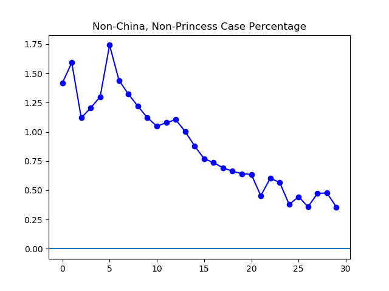

**Disclaimer**

As I keep saying, I know little about statistics and less about medicine. So don't take anything you see here too seriously. And whenever I point out a trend in the numbers, that's not necessarily a trend in the real-world situation. The analysis is never better than the data it works with, and I'm in no position to say how good the data is.

**Today**

Yesterday I included a big preface and the code before the numbers. Less has changed today, so less preface is needed. I continued to remove errors from the data and standardize my use of sources. I've also somewhat expanded my tracking of non-China cases. Cosmetically, I've made the graphs a little bit less awful. And I've stuck the code I'm currently using at the end of the post.

**The Graphs**

Since the spike on February 12th, caused by a sudden redefinition of "confirmed", things seem to be leveling off. Time will tell.

When suspected and confirmed cases are plotted together, some of the effects of the February 12th redefinition are smoothed, because that redefinition was directly related to the boundary between confirmation and suspicion. And, for the last three days, the current infections appear to be dropping.

With the exception of the spike around the redefinition, the daily increase in infection got larger and larger for about two weeks, and has now been getting smaller and smaller for about two weeks. Perhaps it will cross into negative territory soon.

In the four days leading up to the redefinition, this measure becomes chaotic, with large decreases and increases. Outside of February 8 through 12, the data seems to tell a story of a rapid increase over the first five days, a long peak, and then a steady decline over the last five days.

This is a graph of accumulated confirmed cases outside of China as a percentage of all accumulated confirmed cases. Interestingly, this seems to show the problem to be more and more concentrated in China itself, except for the last few days. However, most of the recent increase in non-China cases consists of passengers on the _Diamond Princess_, a cruise ship.

I had trouble thinking of a good title for this graph. It shows the number of cases that have occurred outside China, excluding a single cruise ship, as a fraction of overall cases. These cases make up a smaller and smaller fraction of the total.

**The Code**

"""Graph various coronavirus-related numbers."""


import matplotlib.pyplot as plt

def quick\_dirty\_graph(y, caption):
    """Make a quick, dirty graph from some list with a caption."""
    x = \[\]
    for i in range(len(y)):
        x.append(i)
    plt.plot(x, y, 'b-o')
    plt.axhline()
    plt.title(caption)
    plt.show()

def delta\_list(data):
    """Track day to day delta for a list of numbers."""
    x = \[\]
    for i in range(1, len(data)):
        x.append(data\[i\] - data\[i-1\])
    return x

def percent\_changes(data):
    """Give day to day delta, as a percentage."""
    x = \[\]
    for i in range(1, len(data)):
        x.append((100 \* (data\[i\] - data\[i-1\]) / data\[i-1\]))
    return x

"""Where possible, data is from WHO situation reports.
For January 22 and February 12-16th, numbers are from outbreak.cc."""
confirmed = \[282, 314, 580, 581, 846, 1320, 2014, 2798, 4593, 6065,
             7818, 9826, 11953, 14557, 17391, 20630, 24554, 28276,
             31481, 34886, 37558, 40554, 43103, 46997, 60326, 64442,
             67100, 69197, 71429, 73332\]

"""Data taken from outbreak.cc."""
suspected = \[54, 136, 393, 1072, 1965, 2684, 5794, 6973, 9239, 12167,
             15238, 17988, 19544, 21558, 23214, 23260, 24702, 26539,
             27657, 28942, 23598, 21675, 16067, 13435, 10109, 8969,
             8228, 7264, 6242, 5248\]

"""All recovery data taken from outbreak.cc; not available in WHO
situation reports."""
recovered = \[25, 28, 28, 34, 38, 49, 51, 60, 104, 125, 175, 255, 341, 489,
             648, 912, 1175, 1563, 2075, 2675, 3324, 4039, 4783, 5988,
             6944, 8192, 9434, 10973, 12712, 14440\]

"""All death statistics taken from WHO situation reports except January
22, which was obtained at outbreak.cc."""
dead = \[6, 6, 9, 17, 25, 41, 56, 80, 106, 132, 170, 213, 259, 304, 362,
        426, 492, 565, 638, 724, 813, 910, 1018, 1115, 1369, 1383, 1526,
        1669, 1775, 1873\]

"""Cases outside China. For January 22, a
comparison of WHO January 21 and 23 numbers, along with the outbreak.cc
number for cases outside mainland China indicates that 6 or 7 persons
outside China had the virus. Accordingly a guess of 6.5 was entered."""
outsiders = \[4, 5, 6.5, 7, 11, 23, 29, 37, 56, 68, 82, 106, 132, 146,
             153, 159, 191, 216, 270, 288, 309, 319, 395, 441, 447,
             505, 526, 683, 794, 804\]

"""Cases on the Diamond Princess, from Wikipedia."""
princess = \[0, 0, 0, 0, 0, 0, 0, 0, 0, 0, 0, 0, 0, 0, 0, 0,
            10, 20, 61, 64, 70, 135, 135, 174, 218, 218,
            285, 355, 453, 542\]

# Tests to make sure lists all match up.
assert len(confirmed) == len(suspected)
assert len(suspected) == len(recovered)
assert len(recovered) == len(dead)
assert len(dead) == len(outsiders)

# Define variables.
active = \[\]
for x in range(len(confirmed)):
    active.append(confirmed\[x\] - recovered\[x\] - dead\[x\])

active\_plus = \[\]
for x in range(len(confirmed)):
    active\_plus.append(confirmed\[x\] + suspected\[x\] -
                       recovered\[x\] - dead\[x\])

active\_increase = \[0\]
for x in range(1, len(active)):
    active\_increase.append(active\[x\] - active\[x-1\])

outsider\_percentage = \[\]
for x in range(len(outsiders)):
    outsider\_percentage.append(100 \* outsiders\[x\] / confirmed\[x\])

outsiders\_minus = \[\]
for i in range(len(outsiders)):
    outsiders\_minus.append(100 \* (outsiders\[i\] - princess\[i\])/confirmed\[i\])

# Make the graphs.
quick\_dirty\_graph(active, "Confirmed Current Infections")

quick\_dirty\_graph(active\_plus, "Confirmed and Suspected Current Infections")

y = delta\_list(active)
quick\_dirty\_graph(y, "Daily Change in Confirmed Current Infections")

y = delta\_list(active\_plus)
quick\_dirty\_graph(y, "Daily Change in Confirmed Plus Suspected Infections")

caption = "Non-China Case Percentage"
y = outsider\_percentage
quick\_dirty\_graph(y, caption)

caption = "Non-China, Non-Princess Case Percentage"
y = outsiders\_minus
quick\_dirty\_graph(y, caption)


---

_This page is released under the [CC0 1.0](https://creativecommons.org/publicdomain/zero/1.0/) license._

