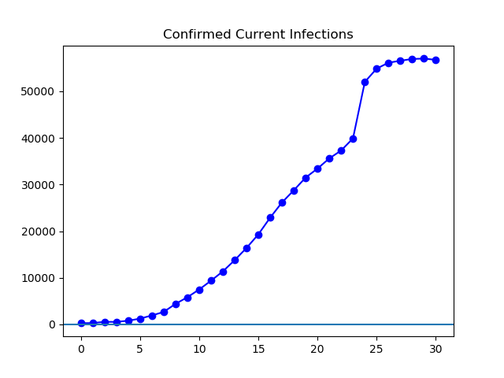
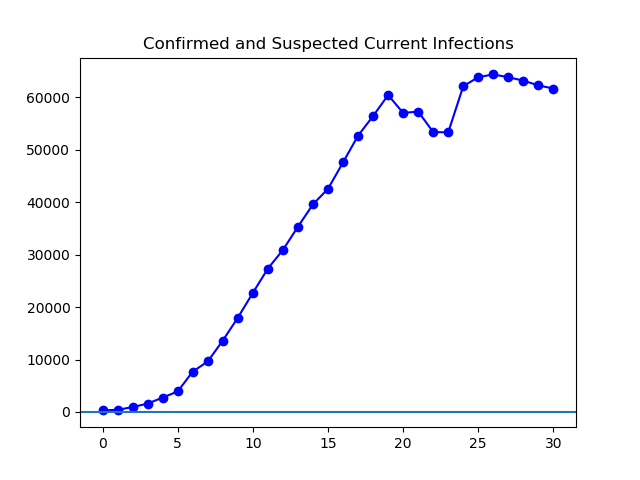
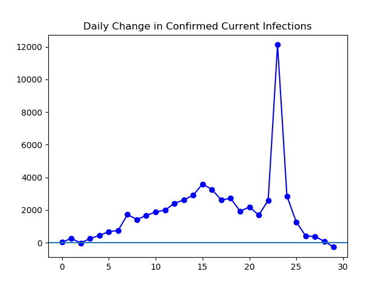
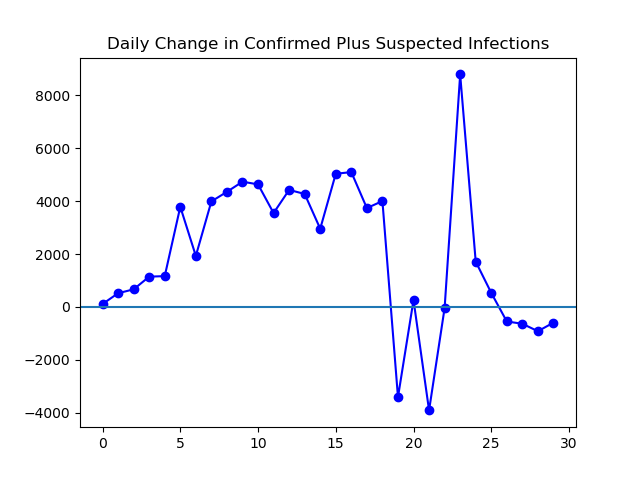
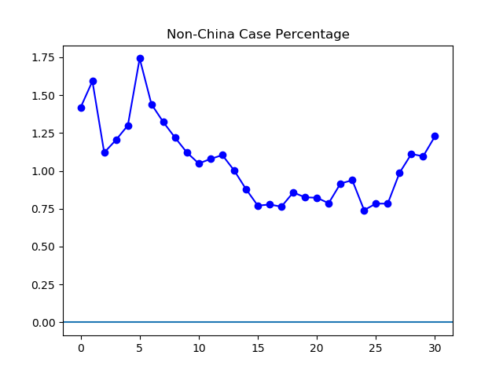
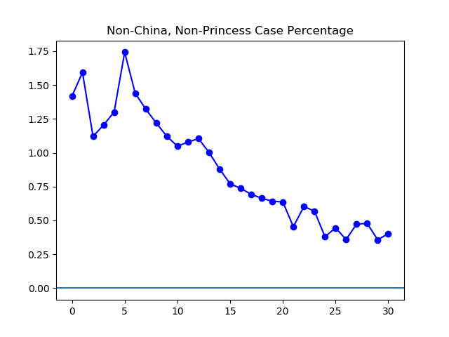

**Disclaimer**

I don't know my way around medicine, and I don't have a good grasp on the
quality of the statistics here. But I find graphing it interesting.

**Today**

As for the overall size of the disease, today was largely uneventful; nothing
big happened. I am seeing reports that the Chinese government is once again
shifting its definition of "confirmed". If so, it doesn't seem to be having any
dramatic impacts on the data yet. I have been slightly frustrated so far by
cobbling together data from multiple sources, which may have slightly different
numbers, or report at different times of day. However, I've recently discovered
the Johns Hopkins [online
dashboard](https://gisanddata.maps.arcgis.com/apps/opsdashboard/index.html#/bda7594740fd40299423467b48e9ecf6),
which I made use of for today's data, except for "suspected", which I got from
the Chinese government.

Tomorrow, I intend to conform my data to Johns Hopkins, and use that going
forward as far as possible.

**The Graphs**

Not much change in this graph, which remains on a six-day trend of levelling
off.

Likewise, this graph has stayed on the previous path, and has now dropped four
days in a row.

Though the last day has brought no new changes to the _trendline_ itself,
although it does seem to show the first day of actual decrease in confirmed
ongoing infections since the peak. However, this might be affected by the use
of Johns Hopkins data for today. Tomorrow I will standardize to Johns Hopkins
data, so there shouldn't be any little hiccups in the trendline caused by
switching sources.

For this figure, there's not much change. We're still seeing this number stay
slightly below zero.

As this graph shows, we are seeing non-China cases spiking relative to the
overall count. But, as the next graph shows, this spike continues to be driven
by the _Princess Diamond_.

Outside of the _Princess Diamond_, the data so far does not seem to show cases
exploding out of China.

---

_This page is released under the [CC0
1.0](https://creativecommons.org/publicdomain/zero/1.0/) license._

