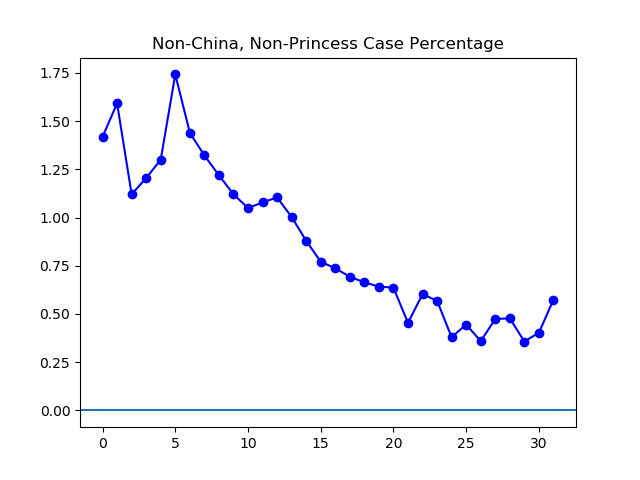

**Disclaimer**

I don't understand medicine, and don't even really understand statistics. I'm just toying around with numbers. There's two big points of failure here: my analysis can be no better than the data I'm working with, and it might be quite a bit worse.

**Today**

Today my grandmother, who is eighty, decided she wanted to watch _1917_ after I got off work, and so I went along. It took priority, so I didn't do anything grand with the graphs, like get everything standardized to include the Johns Hopkins numbers. Nevertheless, I pulled updates on the data from the Johns Hopkins dashboard and (for suspected numbers) China.

**The Graphs**

These are the total global "confirmed" cases, including China's redefinition of "confirmed" on February 12th.

This is a speculative measure me and my brother came up with last night. It multiplies all pre-February 12 cases by 1.2, thus eliminating the spike, and is otherwise based on exactly the same data as the graph above it. It's based on the assumption that prior to February 12, there was always 1 "clinically diagnosed" case not being reported by China for every 5 lab-tested confirmed cases. This assumption is certainly not exactly correct, and may not even be approximately correct. If I find time tomorrow, I may try to write down my thoughts on why this flawed speculative measure might be looking at anyhow.

Here we take the total number of globally reported confirmed cases, add the "suspected" cases, and then remove the dead and recovered.

This takes the "Confirmed Current Infections" from the top of the page and shows its daily change. This last day was the best one ever by this measure.

The non-China cases continue to grow faster than the China cases, which is worrisome.

This measure captures the percentage of total infections that are neither in China nor in the _Princess Diamond_ cases. However, even that number is going up the last couple days, and people are quickly leaving the _Princess Diamond_. I'm not sure if this number will be worth tracking much longer.
