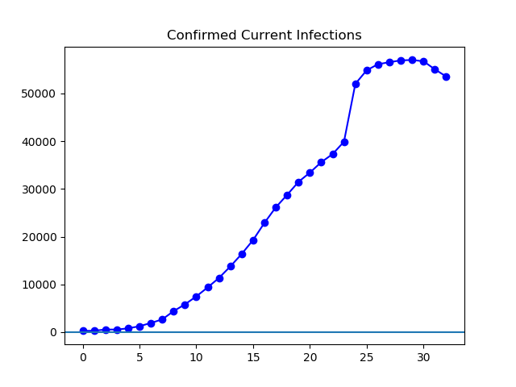
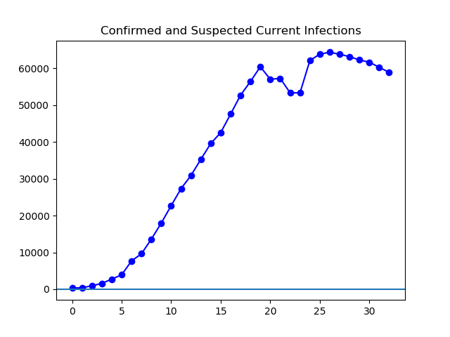
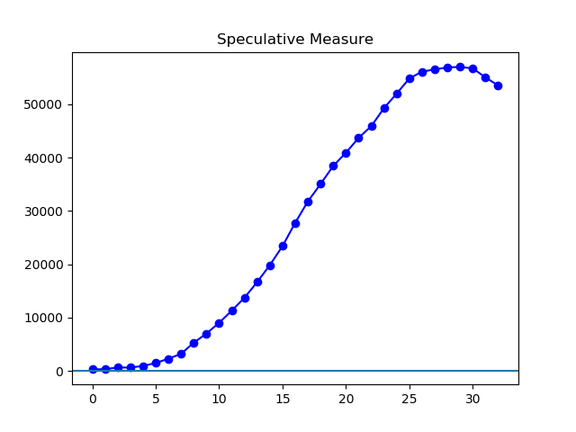
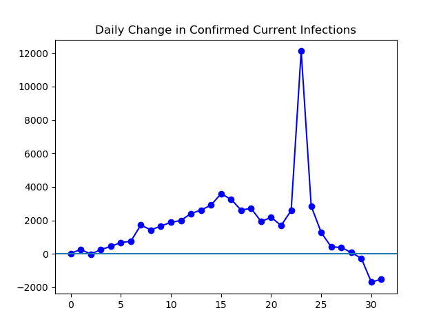
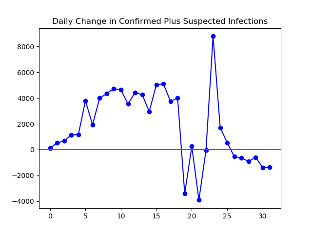
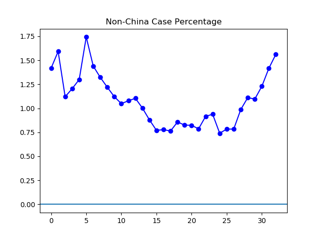
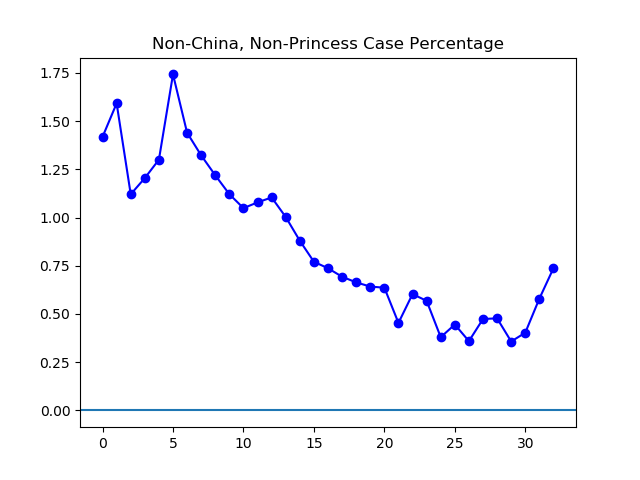

**Disclaimer**

I still am not an expert on medicine or statistics. All graphs are no better
than the data they are based on, and I don't know how good the data is. Past
performance does not always predict future direction of little squiggly lines
on graphs.

**Today**

Today, I have just updated existing graphs. The situation inside China, as far
as the official numbers go, continues to improve. The situation outside China
appears to be getting worse.

**The graphs**

**Figure 1.** This graph is based on the "confirmed" reports from various
countries health departments, minus the dead and recovered. It seems to show
the number of active infections peaking, then dropping a bit lately. It also,
unfortunately, show a spike on February 12th, a statistical artifact based on a
redefinition of "confirmed" by China on that date.

**Figure 2.** One way to "control" for the February 12th spike is to add in the
count of "suspected" infections, because the redefinition appears have hinged
on the exact borderline between suspected and confirmed. However, there is
still some chaotic behavior here around the date of redefinition.

**Figure 3.** Another way to adjust for the spike of February 12th, which a
bunch of prior "clinical diagnoses" on one day of reporting. Here we
speculatively "redistribute" those clinical diagnoses across prior days. To
avoid any fancy data manipulation, they are distributed evenly in proportion to
the number of prior lab-tested cases by multiplying all active cases prior to
February 12th by 1.2.

**Figure 4.** Here we see, ever since February 4th if you ignore the
redefinition, or if you don't ever since February 12th, that the net movement
in confirmed current infections is headed downhill, which is what we'd like to
see.

**Figure 5.** If we toss in suspected infections on top of confirmed, we
continue to see a similar decrease lately.

**Figure 6.** This is the percentage of total confirmed cases (not adjusted for
deaths and recoveries) that are outside of China. The last eight days reflect a
spike in the extent to which the virus has been found outside China.

**Figure 7.** This is the same as Figure 6, but if you remove the _Princess
Diamond_ cases. It does show that parts of the recent uptick is to some degree,
but not entirely, driven by the happenings on a single cruise ship.

---

_This page is released under the [CC0
1.0](https://creativecommons.org/publicdomain/zero/1.0/) license._

