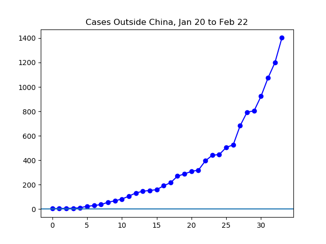
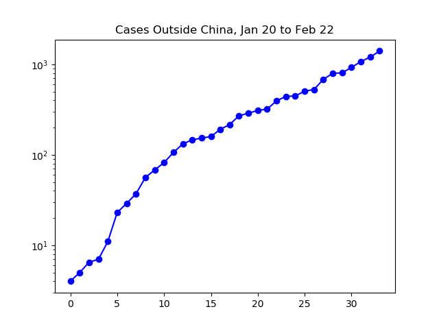
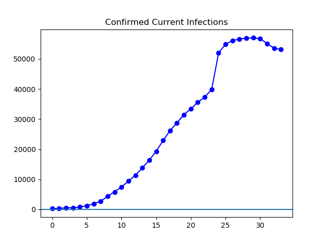
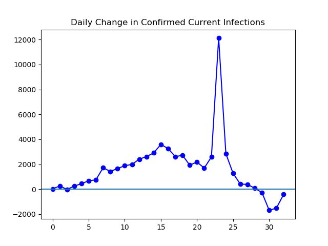
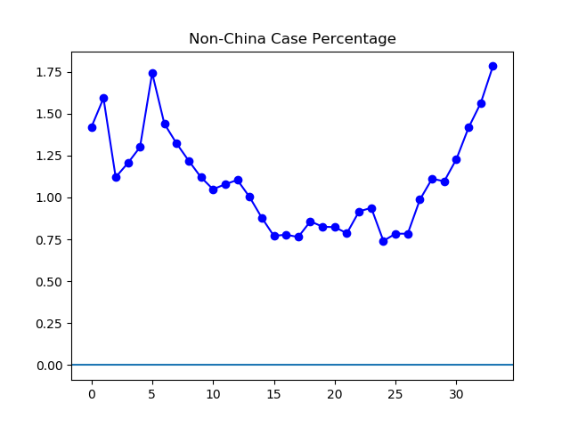

**Disclaimer**

I don't know medicine, and I don't know much about statistics. But I find making the graphs interesting, even though I'm not sure about the accuracy of the data I'm graphing.

**Today**

Today was a particularly bad day for cases outside of China. In fact, I think it's best I started graphing the raw number of non-China cases, as that seems to be the [biggest news](https://www.cnn.com/2020/02/22/asia/novel-coronavirus-covid-19-update-intl-hnk/index.html) at the moment. Italy has placed [a dozen towns](https://abcnews.go.com/International/wireStory/italy-towns-effective-lockdown-virus-clusters-form-69141352) under one form or another of lockdown, what appears to be a pretty big outbreak [is starting to be documented](https://www.aljazeera.com/news/2020/02/iran-shuts-schools-cultural-centres-coronavirus-kills-200223000740899.html) in Iran, and South Korea has seen an escalation from about 50 to 433 confirmed cases in just three days. The _Princess Diana_ now represents a minority of the non-China cases, and its passengers increasingly are no longer on the cruise ship, so I will not be treating it any longer as distinct from the rest of the global cases. It is now not much bigger a case than South Korea, and may not be bigger at all than whatever is happening in Iran. Recently I created a "speculative" measure to account for clinical diagnoses before February 12th. However, now that the Chinese government is no longer using clinical cases to record new cases, I don't think fiddling further with the "speculative measure" is worthwhile, and for now I'll stick with official numbers.

**The Graphs**

**Figure 1.** Note that this data comes from the WHO Situation Reports, so the cases for today really just reflect up to this morning. As of this evening around 9 pm Eastern Time, US, we're closer to 1700 cases than the 1400 reported this morning, according to BNO News. While to the naked eye this looks exponential, there's a way we can graph this to see more clearly. See Figure 2.

**Figure 2.** The same as Figure 1, but plotted on a log scale. To the extent that the infection resembles pure exponential growth, it should look linear when plotted this way. Lately, it seems to be resembling exponential growth with doubling on the order of more than once per week.

**Figure 3.** Turning now to the whole world's cases, the overall figure gently continues decline; the spike in cases outside of China has so far not been large enough to outweigh the decrease in cases inside China.

**Figure 4.** Using the same underlying data as in Figure 3, but plotting the day to day net change in number of confirmed current infections, we see another day of the number lowering, though not by as much as the two days previous.

**Figure 5.** With the continued drop in Chinese infection rates and the continued rapid growth of the non-China cases, we see a continued steady rise in the percentage of confirmed infections that have been recorded outside of China compared to the whole total.

---

_This page is released under the [CC0 1.0](https://creativecommons.org/publicdomain/zero/1.0/) license._

