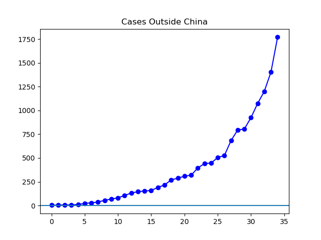

**Disclaimer**

I'm still not qualified to talk about medicine or even statistics, or the
reliability of the statistics coming out of the WHO, China, or other world
media. Those are complicated questions that I'm not the person to answer.
However, what I can do is graph those statistics.

**Today**

The main thing I'm watching currently is the rapid rise in cases outside of
China. The situation in China continues to be stable -- as far as reported
numbers go. The biggest news in cases outside China at the moment seems to be
in South Korea, Iran, and Italy. South Korea has gone from about 50 cases to
600 in four days. In the same four days, Iran has reported 43 infections and 8
deaths -- more deaths than any country outside China. Given how the ratio of
deaths to infections is much lower globally, this probably means large numbers
of cases are still unreported in Iran. And finally, Italy has gone from about
three to about 165 cases in the same four days, with something like a dozen
towns in northern Italy now under quarantine.

**The Graphs**

**Figure 1.** The number of cases outside China continues its steep climb, more
than doubling in the past week.

**Figure 2.** This is the same as Figure 1, but on a log graph. On this sort of
graph steady exponential growth is converted to steady linear growth. If the
growth in cases begins to fall below an exponential path, it may be visible
more quickly on a graph like this than in Figure 2, just because the human eye
is better at judging the straightness of lines than the exponentialness of
curves. So far, this graph shows no sign that the virus is leaving its path of
doubling in less than a week. We can only hope that speed of growth will slow.
Hypothetically, if it were not to slow, the majority of the world would have
the virus sometime around July.

**Figure 3.** At present, the "Confirmed Current Infections" is caught in a
recently emerged tug-of-war, as the worsening situation outside China and the
improving situation inside China contribute to a relatively flat number of
current infections in total.

**Figure 4**. This is just like Figure 3, but adds in China's count of
"suspected" cases. In my highly unqualified opinion graphs based on this method
are better summaries of what's actually going on in China than graphs that do
not count "suspected", which suffer from an enormous artificial spike on
February 12th.

Figure 5. This is the daily delta in Figure 3. Still no increase in confirmed
current infections since about a week ago, but one might say the last three
days didn't go quite as well as one might have hoped. Please note that because
I've made today's graphs a little earlier in the evening than previous graphs,
the last dot does not capture tonight's numbers from China.

**Figure 6.** This is the daily delta for Figure 4. Like Figure 5, it suffers
from not having today's China data in yet. But we'll know more tomorrow.

---

_This page is released under the [CC0
1.0](https://creativecommons.org/publicdomain/zero/1.0/) license._

