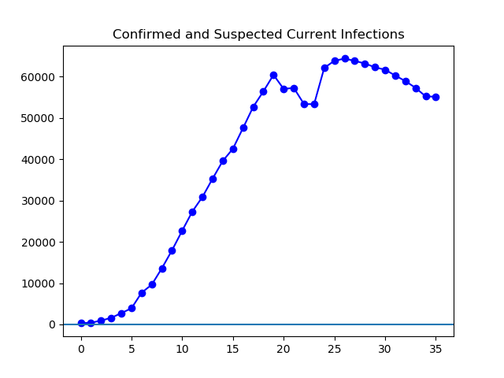

**Disclaimer**

I'm not a medical expert or a statistical expert. I'm just some guy making
graphs, graphs no better than the data behind them.

**Today**

In the last day or so, the importance of the Iranian outbreak has been
underscored by the appearance of new Iran-linked cases in Oman, Bahrain, Iraq,
Afghanistan, and Kuwait, all countries with no previous confirmed cases. Still,
while battling rumors of 50 deaths in one city, Iran is reporting 12 deaths and
61 cases ([source](https://apnews.com/32540d09ec101aac057660ef1b0aa970)).
Meanwhile, the biggest source of officially reported infections is South Korea,
now at [over 800](https://time.com/5789596/south-korea-coronavirus-outbreak/),
up from [51 on
Wednesday](https://en.wikipedia.org/wiki/2020_coronavirus_outbreak_in_South_Korea).
And in Italy, twelve towns are locked down and over 220 cases have been
reported, [up from 53 on
Thursday](https://en.wikipedia.org/wiki/2020_coronavirus_outbreak_in_South_Korea).
The overall count continues to march upward at a rate of more than doubling
weekly. The WHO reported [2069
cases](https://en.wikipedia.org/wiki/2020_coronavirus_outbreak_in_South_Korea)
this morning, up from 1769 yesterday.

On the other hand, China continues to see a decline, as they report more
recoveries than infections each day.

**The Graphs**

**Figure 1.** The trend here is pretty self-explanatory. Cases outside of China
continue to double at a rate faster than once per week. We are currently
twenty-one doublings away from most of the world being infected, so it is in
everyone's interest to find some way to slow this growth.

**Figure 2.** This is the percentage of cases in the world that have occurred
outside China. The rapid increase from below 1% to over 2.5% in less than two
weeks illustrates how the virus is increasingly no longer a distinctively
Chinese problem. The daily new cases show this even more clearly: the latest
WHO Situation Report has 300 new cases outside China, compared to 415 inside
China.

**Figure 3.** This is the number of confirmed infections, minus dead and
recovered cases, yielding a measure of how many people are known to be actively
infected. It continues to fall as Chinese recoveries outnumber both Chinese and
non-Chinese new cases.

**Figure 4.** This is the same as Figure 3, except that it also adds the number
of suspected infections. This graph suffers less distortion from the artificial
"spike" that occurred February 12th when the Chinese government changed its
definition of "confirmed". However, it tells a similar story to Figure 3.

---

_This page is released under the [CC0
1.0](https://creativecommons.org/publicdomain/zero/1.0/) license._

