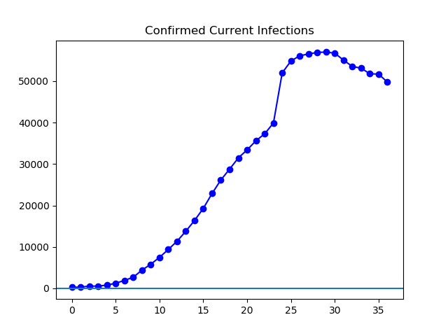

**Disclaimer**

I'm not a medical expert, and I can't vouch for the accuracy of reported data. This is just an exercise in graphing the data and seeing what there is to see. Anything here should be taken with a grain of salt.

**Today**

Today is the second day in a row that the US stock markets have taken an approximately 3% hit, so there seems to be an increasing public awareness of the new coronavirus. The CDC is also telling people to prepare for the possibility that things might get more serious in the USA. The trendlines did not change in any significant way today: cases outside China continue to grow at a rapid pace, while the overall number of active infections worldwide continue to drop, as the number of people recovering in China continues to outnumber new cases everywhere.

**The Graphs**

**Figure 1.** These are cases outside China, as reported each day by the WHO. We are at triple the number of cases reported a week ago. Tripling every week would see most of the world infected by about the end of May. I can only hope that isn't where we wind up. For a far more optimistic projection, see Figure 3.

**Figure 2.** This is built on the same data as Figure 1, but plotted on a log graph. The last three weeks look pretty steadily linear based on this view.

**Figure 3.** This is the total number of cases ever confirmed, minus the number who have died or recovered. It continues to drop steadily. Lately it's dropped an average of about 1000 infections per day. If this trend continues, we should see the disease eradicated by some time in the first half of April. This would be nice. For a far less optimistic scenario, see Figure 1.

**Figure 4**. This is the same data as in Figure 3, except with the Chinese "suspected" cases added. It tells a similar story, but without quite as much of a distortion due to artificial redefinitions of "confirmed". See the one-day spike in Figure 3 for what happened when the Chinese government decided CT scans counted as confirmation.

---

_This page is released under the [CC0 1.0](https://creativecommons.org/publicdomain/zero/1.0/) license._

