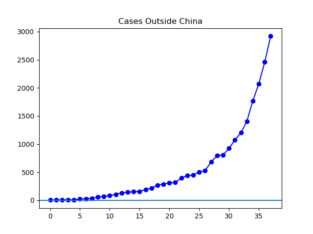
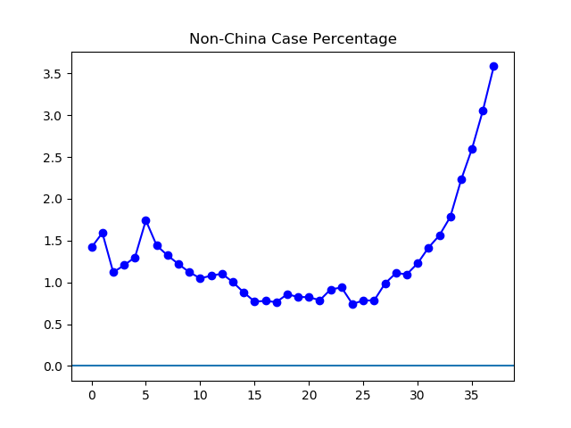
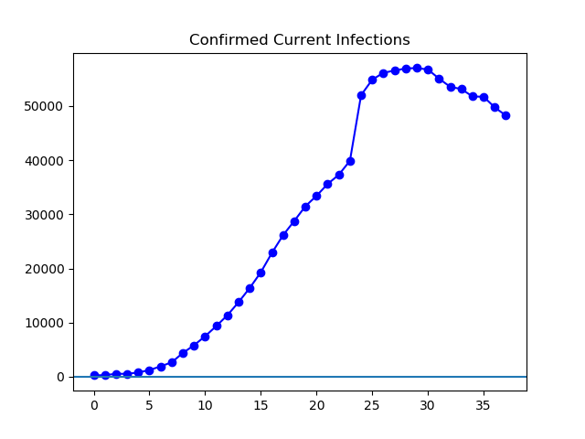
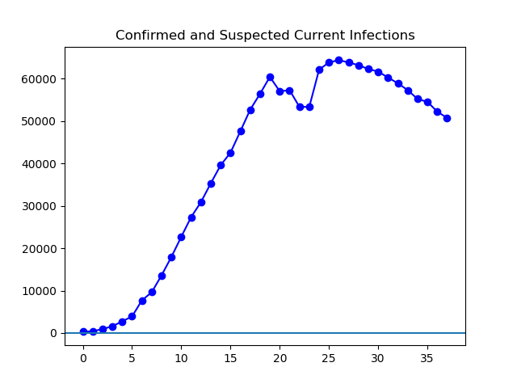

**Disclaimer**

I'm not an expert in medicine. If you want authoritative opinions on the novel coronavirus, you've come to the wrong place. If you want to see the official numbers in little blue charts, though, that I can do. Although, of course, the charts are no better than the reported data, and I cannot speak to how accurate the international reports are.

**Today**

Today, for what I think is the first time, the number of new cases outside China is [greater](https://www.who.int/docs/default-source/coronaviruse/situation-reports/20200226-sitrep-37-covid-19.pdf?sfvrsn=6126c0a4_2) than the number of new cases reported inside China. Saudi Arabia has [suspended _umrah_](https://www.arabnews.com/node/1633826/saudi-arabia). The total number of reported infections continues to drop, driven by about 2,000 recoveries per day in China, while the number of worldwide infections continues its rapid ascent.

**The Graphs**

**Figure 1.** The number of cases outside China continues to grow rapidly. Once again, cumulative cases as of today are a bit more than triple the number a week ago.

**Figure 2**. This is the same as Figure 1, but with graphed logarithmically for those who are into that kind of thing. If this graph looks less severe to you than figure one, just forget you ever saw Figure 2 and concentrate on Figure 1.

**Figure 3**. This figure shows what percentage of all cases reported so far have been reported outside of China. It shows that the problem is rapidly less and less restricted to China. What it doesn't show is that as of today, there have been more new infections outside China than in.

**Figure 4.** This shows the total number of confirmed infections, minus the number of recovered and dead. This gives the number of people known to be currently infected. It continues to drop due to a large number of recoveries in China.

**Figure 5.** This is the same as Figure 4, but with the addition of the cases reported under China's "suspected" category. It cancels out some of the distortion caused by the redefinition of "confirmed" that occurred on February 12th, and produces the large one-day spike in Figure 4.
