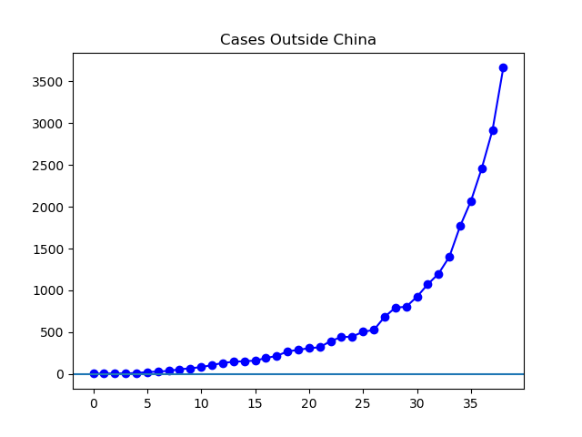
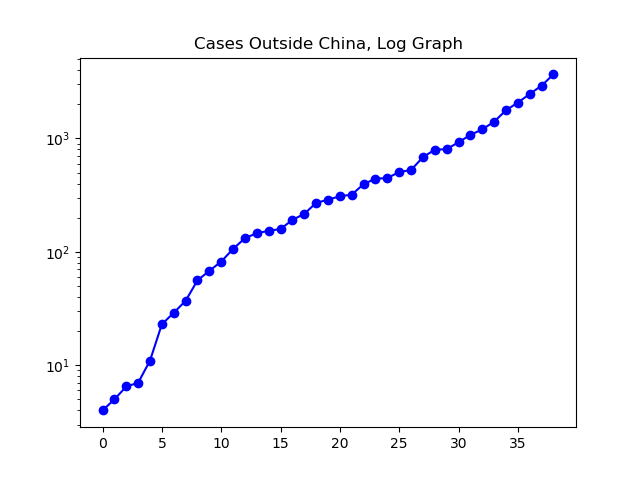
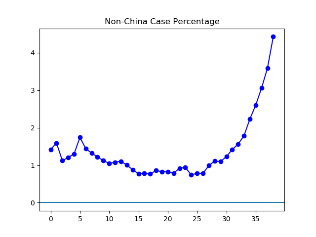
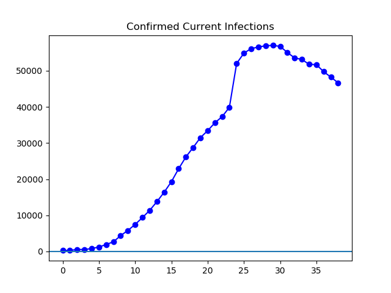
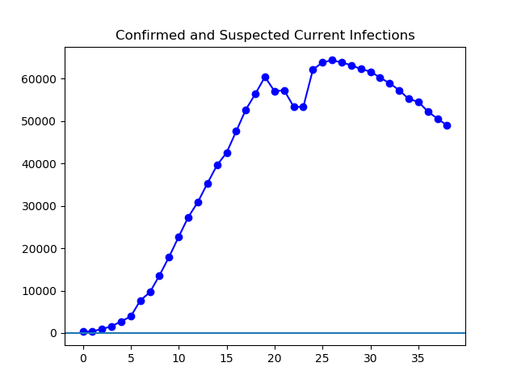

**Disclaimer**

I'm not a medical professional, and have no fancy statistical abilities. These
are just graphs of the reported data. I can't even vouch for the accuracy of
the reported data.

**Today**

Today, US markets dropped about 4.5%, and the word "correction" is getting
thrown around
([NPR](https://www.npr.org/2020/02/27/809934194/stocks-slide-into-correction-territory-on-coronavirus-fears)).
The global tally of cases continues to drop, driven by continued large numbers
of recoveries in China. However, the number of cases outside of China continues
to rapidly rise. I've read about grocery stores selling out in Hawaii, though
it's from a news outlet I don't recognize and I haven't seen that in mainstream
outlets yet
([Khon2](https://www.khon2.com/local-news/worries-over-panic-buying-arise-as-some-supply-shelves-at-stores-empty-out/)).
Anecdotally, family members in Washington are reporting some people wearing
masks and some other interesting things, while here in Ohio I've seen no signs
that the general public is thinking about coronavirus. Yesterday, the WHO
reported for the first time that new cases in China were outnumbered by cases
outside of China ([Situation Report
37](https://www.who.int/docs/default-source/coronaviruse/situation-reports/20200226-sitrep-37-covid-19.pdf?sfvrsn=2146841e_2)).
Today, the WHO reported that cases in China were outnumbered by cases in South
Korea ([Situation Report
38](https://www.who.int/docs/default-source/coronaviruse/situation-reports/20200227-sitrep-38-covid-19.pdf?sfvrsn=9f98940c_2)).

**The Graphs**

**Figure 1.** Cases outside China continue to rise rapidly, and are currently
sitting at 3.4 times the level a week ago. If that growth rate were to
continue, we'd see over 2.5 billion infections by mid-May. That's just a
mathematical calculation; I'm in no position to say things will turn out that
way, and I hope it doesn't.

**Figure 2.** For the last three or four weeks, the slope of this looks pretty
steady, without any obvious signs of stopping.

**Figure 3.** At this point, over four percent of the cumulatively recorded
cases have occurred outside of China so far. Two weeks ago, it was less than
one percent of cases.

**Figure 4.** This is the total number of cases recorded, minus the dead and
recovered. It continues to drop at a healthy rate, driven by large numbers of
recoveries in China.

**Figure 5.** This is calculated like Figure 4, except that all of China's
"suspected" cases are added in. It does not show quick the same one-day "spike"
as Figure 4, which occurred when China abruptly expanded the definition of what
constitutes a "confirmed" case.

---

_This page is released under the [CC0
1.0](https://creativecommons.org/publicdomain/zero/1.0/) license._

