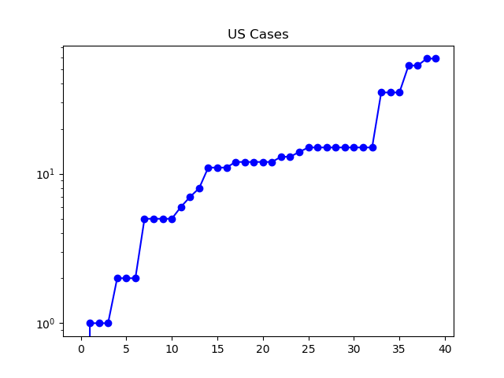

**Disclaimer**

I'm not a medical or statistical expert. I'm in no position to make
predictions, and I cannot say how accurate the publicly reported numbers on
coronavirus are. All I'm doing is making some graphs and talking about what
they look like.

**Today**

Today US markets finished down about 12% for the week on coronavirus fears
([NPR](https://www.npr.org/2020/02/28/810295350/financial-markets-shudder-around-the-world-as-coronavirus-tightens-its-grip)).
The latest WHO report has outside China producing over three times as many
cases as inside China now -- two days ago was the first time new cases outside
outnumbered cases inside China ([Situation Report
39](https://www.who.int/docs/default-source/coronaviruse/situation-reports/20200228-sitrep-39-covid-19.pdf?sfvrsn=aa1b80a7_2)).
The same report also now counts 51 countries with the virus, 5 reporting for
the past time in the previous 24 hours. The number of cases outside China
continues to grow rapidly, and is now at nearly four times the number a week
ago.

While the US is still at a relatively early stage in this story, it had its
first case of unknown origin Wednesday and its second today. I'll start
graphing US cases now, on the possibility that -- as many experts warn -- this
might be the early stages of a more significant outbreak here.

**The Graphs**

**Figure 1.** New cases outside China continue to skyrocket, with over 4691
total cases in the latest WHO report, up from 1200 a week ago. The current rate
of increase, if sustained, would result in most of the world contracting the
disease in the next few months. But I cannot predict future rates.

**Figure 2.** The number of confirmed current infections continues to drop, as
the number of people recovering in China continues to outnumber the number of
new global cases.

**Figure 3.** This is the same as Figure 2, except that it also includes the
Chinese "suspected" cases.

**Figure 4.** This is the number of cumulative number of cases reported day by
day in the US, from January 20th onward. It includes a couple big jumps in
which "large" (by our standards so far) numbers of cases were deliberately
imported at once. This data is more chunky than smooth. However, what it does
share in common with an exponential growth curve is the gradual accumulation,
followed by a sharp upward turn. This is all very early, however.

**Figure 5.** This is a log chart of the same thing. If US cases were growing
exponentially, on this graph the growth would look linear. If we were to draw a
sort of "best fit" line to this extremely preliminary data, it would look
something like cases = day ^ (1.107), where day is the number of days that have
passed since January 20th. In other words, that curve would amount to doubling
about weekly. I cannot say whether that provides any clue at all to the future
growth of the virus.

---

_This page is released under the [CC0
1.0](https://creativecommons.org/publicdomain/zero/1.0/) license._

