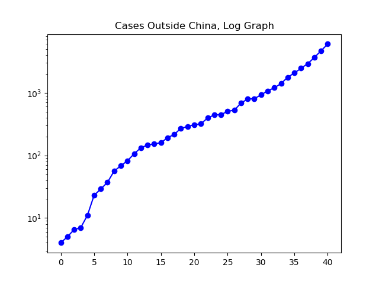

**Disclaimer**

I am not a medical expert, or a statistical expert, nor someone with any kind of qualifications to know how accurate the various numbers reported around the world are. I'm just watching the data and making graphs.

**Today**

This report for February 29th is produced one day late, as a result of a visit with family Saturday evening.

Going forward, I intend to take a special interest in United States cases of the coronavirus, both because I live here and because I have relatives very close to the center of the recent bad news out of Washington State. Today Washington was the site of the first death from coronavirus in the United States. Community transmission has also been picking up a bit. There are basically three types of data of primary interest to me at the moment.

First, there is the global situation: the total number of infected cases. This continues to decline, driven by what China is reporting as an excellent and sustained decrease in active infections as thousands of people recover. Secondly, there is the total number of cases outside of China, which continues to skyrocket. Finally, as US cases are beginning to increase and community transmission is appearing, I'll be tracking US cases day to day.

**The Graphs**

**Figure 1.** The number of cases outside of China continues to grow steeply, with the number of cases on February 29th more than four times the number of cases a week earlier. This graph tracks cumulative infections, and does not subtract dead or recovered cases. At this point, cumulative cases reflect essentially the same story as active infections. There have been about sixty deaths and six hundred recoveries outside of China, not enough to change the trajectory of the story at this early date.

**Figure 2.** A log graph of the same data shown in Figure 1. If you don't understand log graphs, please ignore this and focus on Figure 1.

**Figure 3.** Total active confirmed cases worldwide. This reflects taking the cumulative number of confirmed cases and subtracting the dead and recovered. Driven by large numbers of Chinese recoveries, the total known number of active cases worldwide continues to decline.

**Figure 4.** This graph has had a couple of retroactive changes since yesterday. It includes everything in Figure 3, plus cases China reports as "suspected", plus adds "clinical diagnosis" numbers -- not reported at the time -- for February 10th and 11th in China.

**Figure 5.** This shows cumulative cases in the United States. Unfortunately, testing has been rather sparse so far. This includes deliberately imported infections from the _Diamond Princess_ and elsewhere.

**Figure 6.** This is the same as Figure 5, but on a log chart. If we were to try to approximate an exponential curve that bets fits this data, we would say that cases have approximately doubled weekly since the first discovered case January 21. However, the data is still rough and jumpy, so it is early to say whether such an approximation is at all meaningful.

---

_This page is released under the [CC0 1.0](https://creativecommons.org/publicdomain/zero/1.0/) license._

