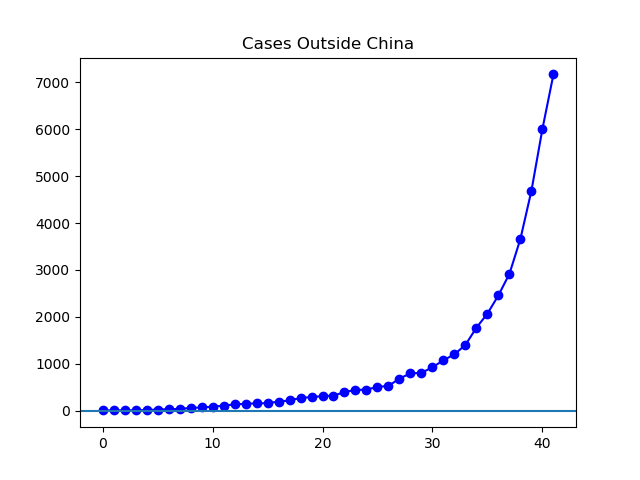
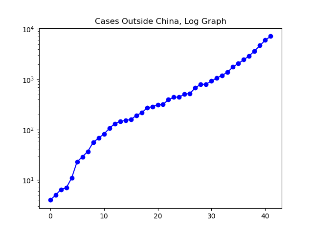
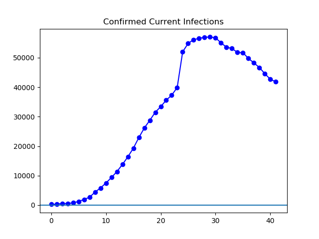
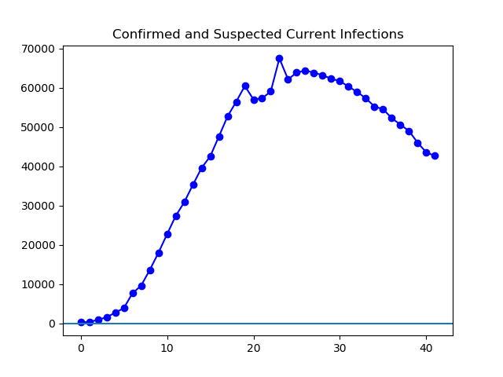
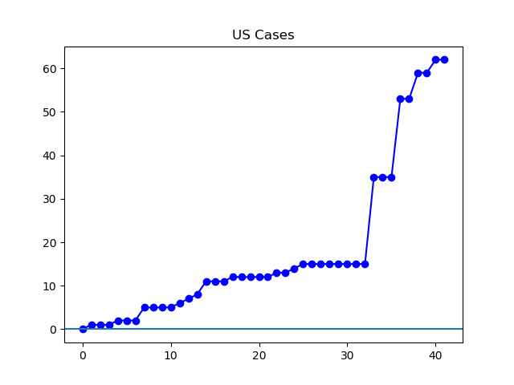

**Disclaimer**

I am not a medical or statistical expert, and I don't know how accurate the reported numbers. Here I'm just looking at graphs you can make from the reported numbers.

**Today**

In the United States, the count of people with the virus continues to rise, and the most disturbing recent development is a nursing home in which two people -- one staff, one resident -- have tested positive. Approximately fifty people -- half residents, half staff -- are displaying coronavirus symptoms. We await word on whether this will constitute the first time the US has patients besides a few cases of community transmission and the imported cases ([K5 News](https://www.king5.com/article/news/health/coronavirus/coronavirus-outbreak-kirkland-investigation/281-03e21bc4-9f68-4ad6-bc8c-a337b27de567)).

Worldwide, excluding China the number of cases continues to grow rapidly. The latest WHO report shows 7169 cases outside of China, over quadruple the number a week ago ([WHO](https://www.who.int/docs/default-source/coronaviruse/situation-reports/20200301-sitrep-41-covid-19.pdf?sfvrsn=6768306d_2)).

The situation within China continues to improve, according to official figures.

**The Graphs**

**Figure 1**. In a rapidly evolving situation, the number of confirmed cases outside China stands at quadruple those a week ago.

**Figure 2.** This is the same data as Figure 1, plotted logarithmically. Cases continue a steady, approximately exponential climb over the last month, in which we have gone from 132 cases outside China to 7169, a 54-fold increase in confirmed cases. A 54-fold increase in each of the next three months would end with over one billion confirmed cases at the beginning of June. I hope it doesn't come to that, and have no expertise to determine whether it will.

**Figure 3**. The total number of active confirmed infections worldwide continues to drop, driven by large numbers of recoveries in China.

**Figure 4.** Attached is data similar to Figure 3, except with the addition of Chinese "suspected" cases and diagnoses made by CT scan for February 10th and 11th.

**Figure 5**. Number of US cases, as found in daily WHO reports. As this figure includes only "confirmed" cases as defined by the CDC, several recent cases that are "presumptive" (positive tests by state governments yet to be confirmed by CDC) and the approximately 50 potential cases in a Washington nursing home are not included at present. While the latest WHO numbers give 62 persons, the latest from BNO coronavirus tracking shows 73. I hope that the CDC will be able to keep up with local reports in order to give an accurate picture of the US situation, and that this will not turn into a serious long-term set of discrepancies in US data.

---

_This page is released under the [CC0 1.0](https://creativecommons.org/publicdomain/zero/1.0/) license._

