**Disclaimer**

I’m not a medical expert or any other kind of expert. I’m just an interested
amateur graphing out the data found at Johns Hopkins University’s coronavirus
GitHub
([source](https://github.com/CSSEGISandData/COVID-19/tree/master/csse_covid_19_data/csse_covid_19_daily_reports)).

All numbers refer to governmentally-confirmed cases, minus those who can no
longer spread the virus because they either died or have recovered. Unless
otherwise noted, terms like “increasing” or “decreasing” simply refer to
official figures. I have a limited ability to speculate beyond the official
figures.

I use _country_ in a special sense here, to refer to the geographical units by
which Johns Hopkins categorizes its data. These _countries_ are often sovereign
nations, but not always. For example, while Hong Kong is part of China, Johns
Hopkins separates its data from that of Mainland China, and so for convenience,
so do I. I am simply following the lead of the best source of data I know, and
none of this should be taken as a political judgment about what constitutes a
real “country” or a judgment about disputed territories.

**The Latest**

As we have seen for some time now, the number of cases continues to drop
steadily in China and increase quickly outside. The EU outbreak, lead by Italy
but with increasing contributions from the rest of the Union, continues to
explode. However, today, for the first time, the data shows a _decrease_ in the
number of confirmed active cases in South Korea. While this certainly does not
mean that South Korea has _contained_ the virus, it is still excellent to see
that South Korea has joined China on the very short list (two!) of countries
that have at least for now turned a corner after suffering thousands of
confirmed cases. Iran continues to publish statistics, and I continue to have a
fuzzy picture of what relationship, if any, they have to the reality in Iran.

Finally, the US, my beloved homeland, reported more cases in the past day than
on any previous day, and universities have begun shutting down. As a result,
two close relatives of mine are temporarily no longer college students; both
had their colleges give the announcement today. It seems that the US has
stepped up its testing significantly in the last few days, though controversy
still swirls and I am seeing conflicting reports about just how available
testing is.

**The Graphs**

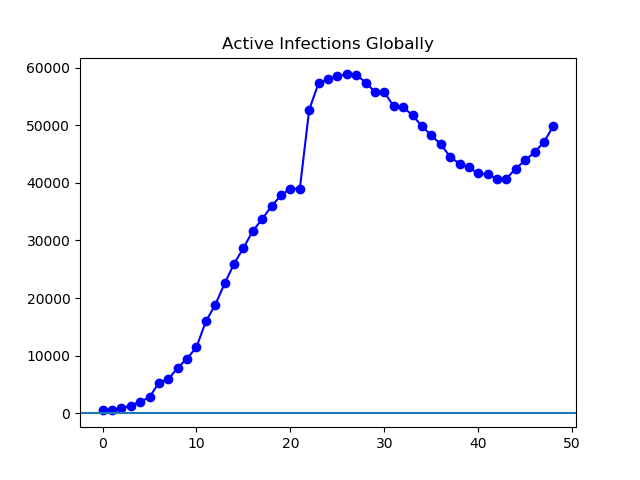

**Figure 1.** Global infections continue their upward march.

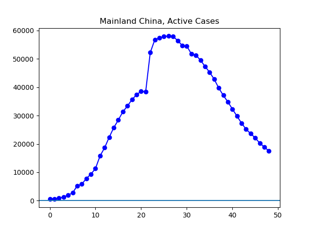

**Figure 2**. Conditions continue to improve in China.

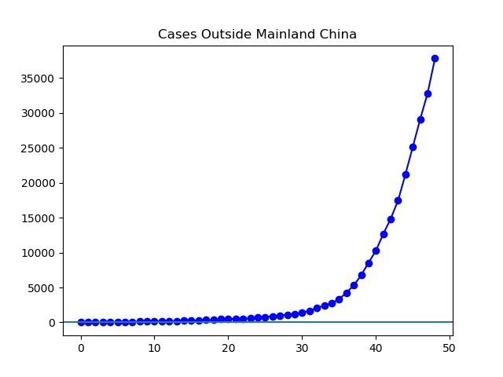

**Figure 3**. Steep growth continues outside China. Cases outside Mainland
China numbered 37,825 today, well over double the 14,853 a week ago.

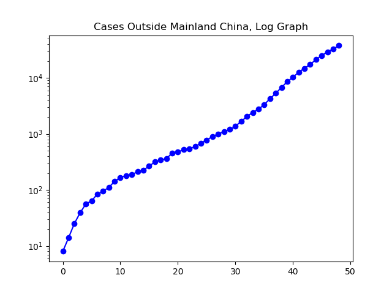

**Figure 4.**

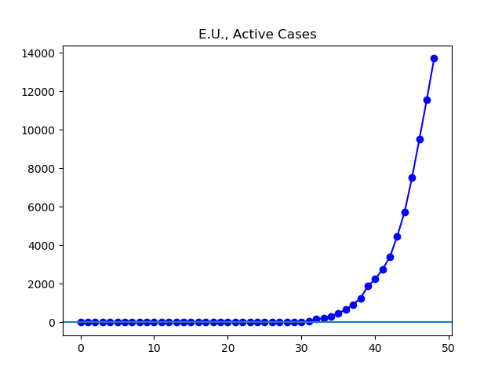

**Figure 5**. Cases continue to grow rapidly in the E.U. The current 13,715
cases are about five times the 2751 cases reported a week ago.

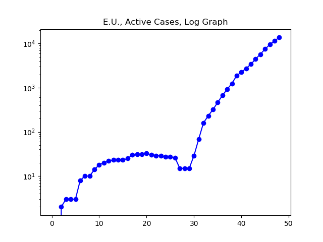

**Figure 6**.

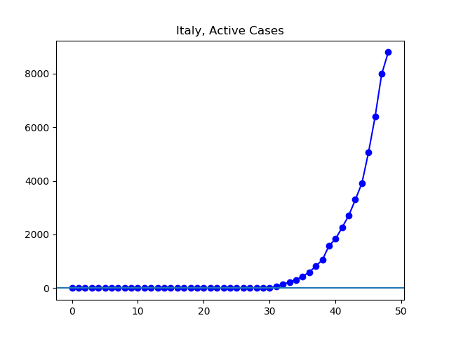

**Figure 7.** Italy stands at 8,794 cases, about four times the 2263 cases reported a week ago.

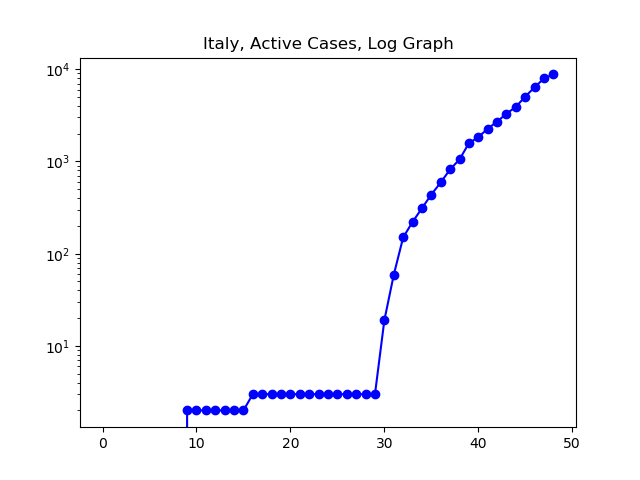

**Figure 8.**

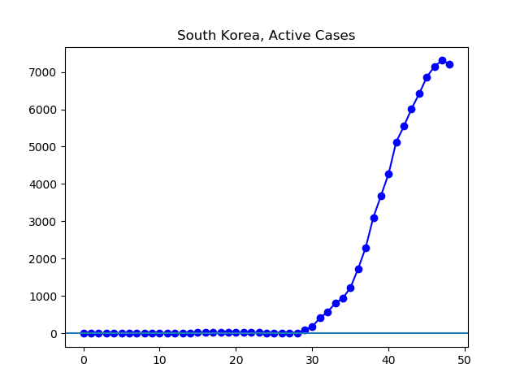

**Figure 9.** For the first time since the outbreak began in earnest, South
Korea shows a decrease in the number of confirmed cases.

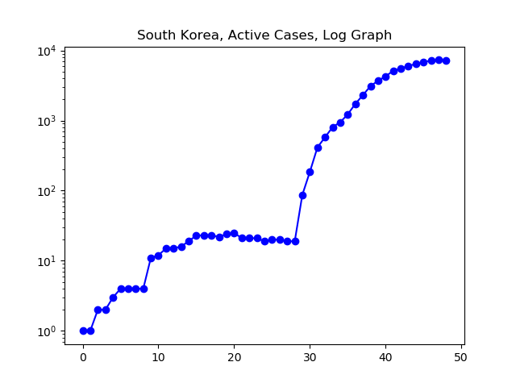

**Figure 10.** We can see clearly here how South Korea gradually achieved lower
and lower rates of growth leading up to the current leveling.

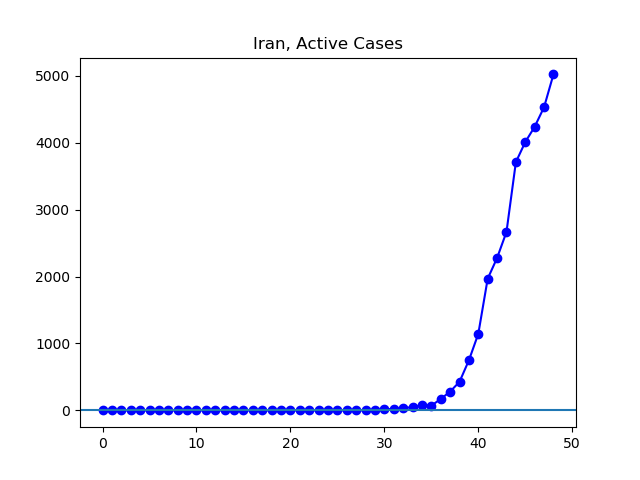

**Figure 11**. I don't know what relationship the reported cases have to the
reality in Iran.

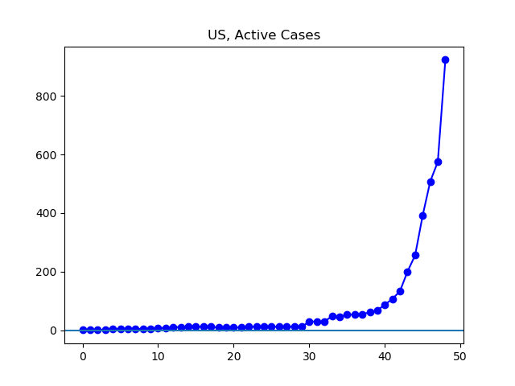

**Figure 12.** Today, the United States reported its largest jump in cases yet.
At 923 active infections confirmed, over eight times the 107 reported a week
ago.

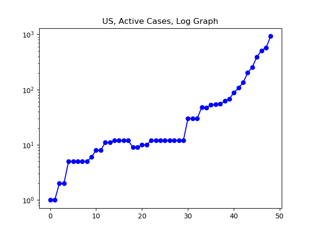

**Figure 13**.

---

_This page is released under the [CC0
1.0](https://creativecommons.org/publicdomain/zero/1.0/) license._

