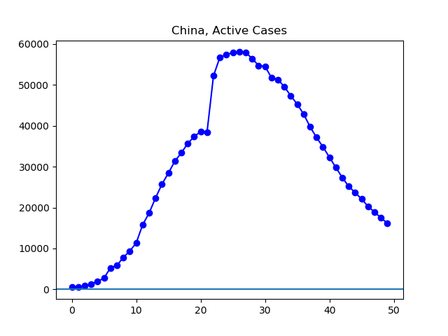

**Disclaimer**

I’m not a medical expert or any other kind of expert. I’m just an interested amateur graphing out the data found at Johns Hopkins University’s coronavirus GitHub ([source](https://github.com/CSSEGISandData/COVID-19/tree/master/csse_covid_19_data/csse_covid_19_daily_reports)).

All numbers refer to governmentally-confirmed cases, minus those who can no longer spread the virus because they either died or have recovered. Unless otherwise noted, terms like “increasing” or “decreasing” simply refer to official figures. I have a limited ability to speculate beyond the official figures.

I use _country_ in a special sense here, to refer to the geographical units by which Johns Hopkins categorizes its data. These _countries_ are often sovereign nations, but not always. And Johns Hopkins has been inconsistently naming the countries, which makes pulling automated data harder. I think I've corrected for all that, but I'm not entirely sure.

**The Latest**

Previous trends are holding: things getting better inside China, worse outside. Things continue to deteriorate in the European Union, in Iran, and in the United States. South Korea seems to be, for now, at something like a plateau.

**The Graphs**

**Figure 1.** The first increase was driven by Chinese infections. The first decrease was driven by Chinese recoveries. And since infections outside China started to outpace the rate of improvement inside China, it's been steadily uphill. Or downhill, depending on how you look at it.

**Figure 2.** Things continue to improve rapidly in China. They have decreased infections by more than two-thirds.

**Figure 3.** The number of cases continues to grow quickly outside China.

**Figure 4.** The rate of expansion outside China continues to be somewhere in the neighborhood of exponential.

**Figure 5.** Europe currently has the worst outbreak in progress.

**Figure 5.** Graphed logarithmically, Europe's growth continues pretty steadily.

**Figure 6.** The level of detected infection continues to grow rapidly in Italy.

**Figure 7.**

**Figure 8.** At the moment, South Korea appears to be getting some kind of handle on its epidemic.

**Figure 9.** Seen exponentially, the progress South Korea has made in controlling the virus is even more clearly visible.

**Figure 10.** Here is the government-reported number of active cases for Iran, for whatever it is worth.

**Figure 11.** The number of active cases in the United States continues to make large daily jumps. News reports continue to suggest the United States is still testing few people for the virus compared with other nations.

**Figure 12.**
