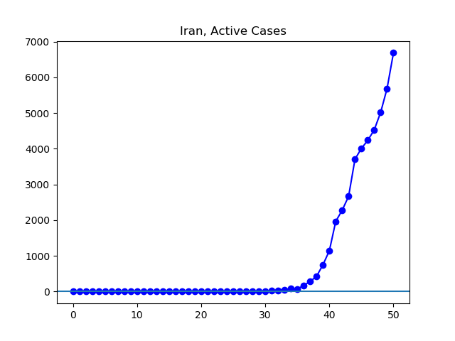
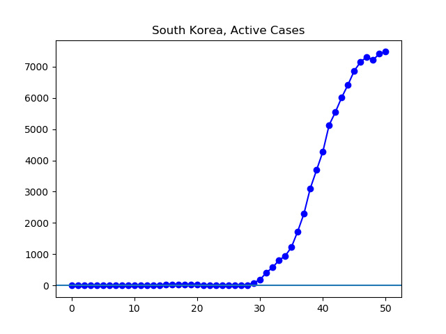
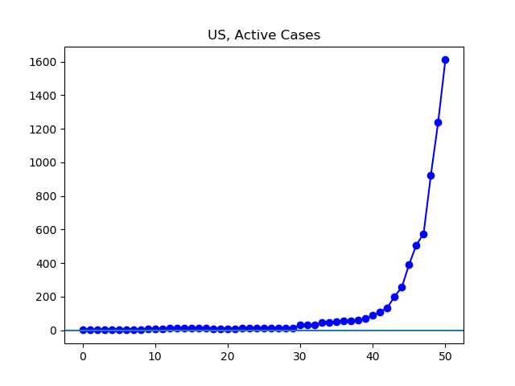

**Disclaimer**

I’m not a medical expert or any other kind of expert. I’m just an interested amateur graphing out the data found at Johns Hopkins University’s coronavirus GitHub ([source](https://github.com/CSSEGISandData/COVID-19/tree/master/csse_covid_19_data/csse_covid_19_daily_reports)).

All numbers refer to governmentally-confirmed cases, minus those who can no longer spread the virus because they either died or have recovered. Unless otherwise noted, terms like “increasing” or “decreasing” simply refer to official figures. I have a limited ability to speculate beyond the official figures.

I use _country_ in a special sense here, to refer to the geographical units by which Johns Hopkins categorizes its data. These _countries_ are often sovereign nations, but not always. In addition, there are inconsistencies in the Johns Hopkins data, such as changing the names of countries, which I have tried to correct for as they have come to my attention. However, while I am confident that the graphs below broadly agree with reported figures, it is entirely possible that some irregularities have slipped through my finger.

**The Latest**

Today, my own state, Ohio, has taken what I think is the most drastic step to control coronavirus that has been taken by any state. They have suspended all schools for three weeks. Nationwide, the number continues to skyrocket, and the stock market has deteriorated much further today.

The situation in Iran continues to be unclear to me. I am providing the graphs of the data, but I do not know what relationship that data bears to reality. The situation in the E.U., and especially Italy, continues to deteriorate, as far as we can see from the data. However, the numbers for Italy today, for confirmed cases, deaths, and recoveries, have not moved since yesterday. This is surely a fact about the reporting of data, not about the reality of the situation. This ends up distorting a number of the graphs.

In South Korea, the encouraging plateau in cases continues. In China, an even more encouraging drop in cases continues steadily.

**The Graphs**

**Figure 1.** The number of active cases continues to rise. The slowing over the past day is driven by reporting irregularities in Italy, the worst-affected country at the moment.

**Figure 2**. The situation in China continues to improve.

**Figure 3**. The situation in the E.U. continues to escalate. The one-day slowing in growth is driven by reporting irregularities in Italy.

**Figure 4**.

**Figure 5**. The number of cases in Italy has grown each day, except that no new data was entered into the Johns Hopkins system between 11 March and 12 March.

**Figure 6.**

**Figure 7**. The Iranian government continues to report an increasing number of cases.

**Figure 8.** It continues to appear that new cases have peaked in South Korea.

**Figure 9.** This shows especially clearly the decrease in South Korea's growth rate.

**Figure 10.** The number of cases has been rising very quickly.

**Figure 11.**
