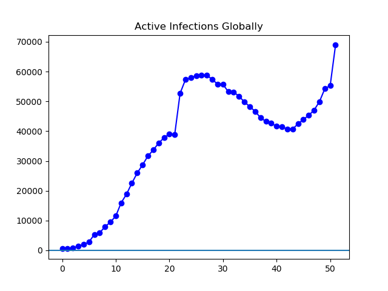
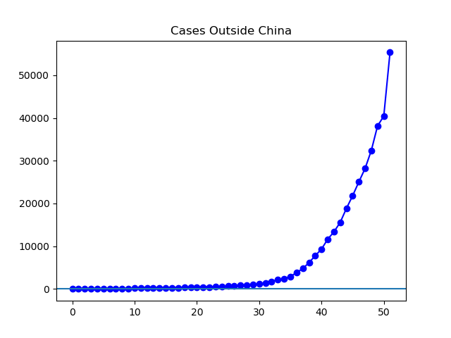
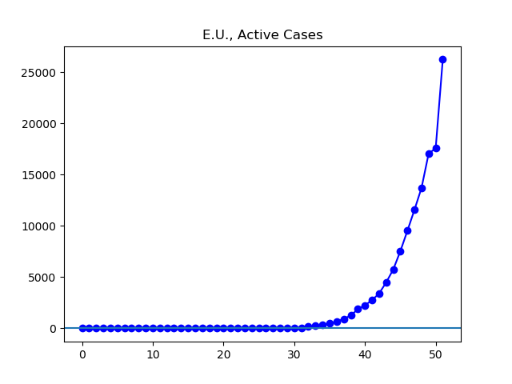
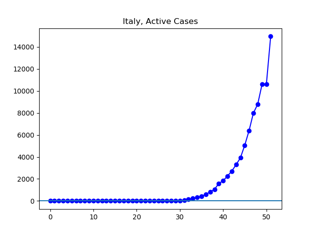
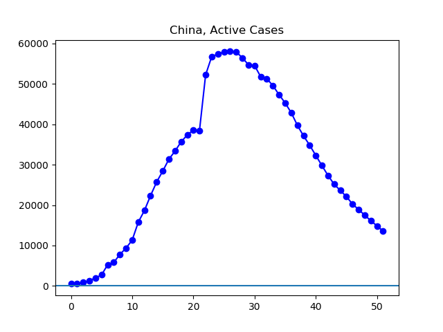
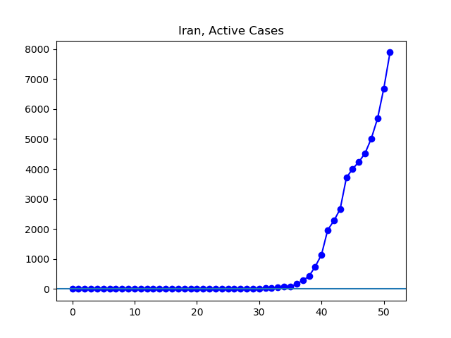
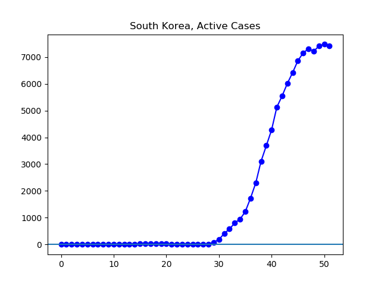
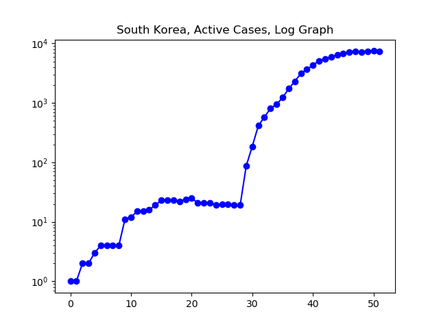
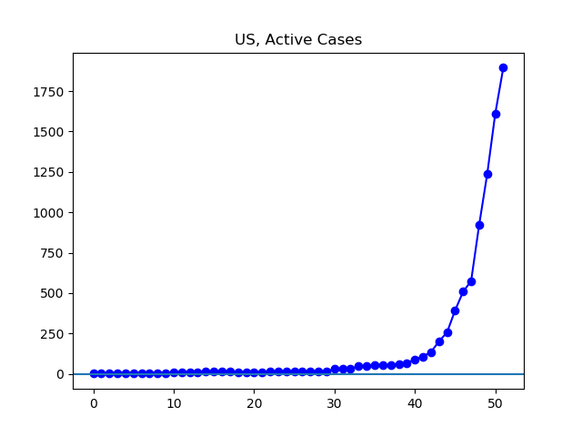
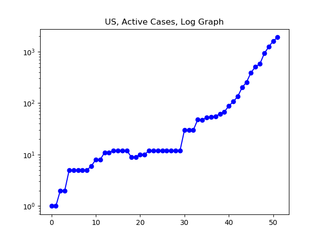

**Disclaimer**

I’m not a medical expert or any other kind of expert. I’m just an interested amateur graphing out the data found at Johns Hopkins University’s coronavirus GitHub ([source](https://github.com/CSSEGISandData/COVID-19/tree/master/csse_covid_19_data/csse_covid_19_daily_reports)).

All numbers refer to governmentally-confirmed cases, minus those who can no longer spread the virus because they either died or have recovered. Unless otherwise noted, terms like “increasing” or “decreasing” simply refer to official figures. I have a limited ability to speculate beyond the official figures.

I use _country_ in a special sense here, to refer to the geographical units by which Johns Hopkins categorizes its data. These _countries_ are often sovereign nations, but not always. In addition, there are inconsistencies in the Johns Hopkins data, such as changing the names of countries, which I have tried to correct for as they have come to my attention. However, while I am confident that the graphs below broadly agree with reported figures, it is entirely possible that some irregularities have slipped through my fingers.

**The Latest**

Today, my home state of Ohio banned all visits to nursing homes, so I will not be seeing my grandmother until the crisis has abated. The President of the United States declared a national state of emergency, as the nation reports about seven times the cases it reported a week ago.

Today Italy moved into first place as the country with the most confirmed active infections in the world, while China slid into second. Italy still has the majority of confirmed European Union cases, but not an overwhelming majority; a little under 60%. The situation continues to get rapidly worse outside of China in general, while China rapidly cleans up its remaining infections. South Korea's cases have essentially been at a plateau for five days now. Iran is now reporting about double the number of cases it reported a week ago.

**The Graphs**

**Figure 1.** After a period in which confirmed cases were almost entirely confined to China, where things were and continue to improve, the explosion in cases outside China has now increased the number of active infections beyond its previous peak.

**Figure 2.** The number of cases outside China continues to rise rapidly. Currently, the 55,331 reported cases are about triple the 18,831 cases reported a week ago.

**Figure 3.** Approximately half of the cases outside China are found in the European Union, which is currently reporting 26,236 cases, between four and five times the 5,743 cases reported a week ago.

**Figure 4.** A slim majority of the cases in the European Union are in Italy, which is reporting 14,955 active cases, nearly four times the 3,916 cases reported a week ago.

**Figure 5.** Steady improvement continues in China, where cases have fallen from 23,643 to 13,569 over the past week.

**Figure 6.** The number of cases in Iran continues to grow, approximately doubling over the last week from 3710 to 7891 cases. These are the official numbers; various media reports suggest much higher real figures, and the _Washington Post_ has published photos of what it claims are mass coronavirus graves.

**Figure 7**. The number of active cases in South Korea seems to have stopped growing.

**Figure 8**. The log graph shows South Korea progressively gaining control over the rate of spread.

**Figure 9**. There are 1895 reported cases now, seven times the 256 cases a week ago. Amy Acton, head of the Ohio Department of Health, estimates there are over 100,000 actual infections in Ohio alone.

**Figure 10**. The log graph shows little to no sign so far of the US gaining control of the epidemic. Testing is expanding rapidly -- so we are told -- so hopefully we will have a better understanding shortly.
