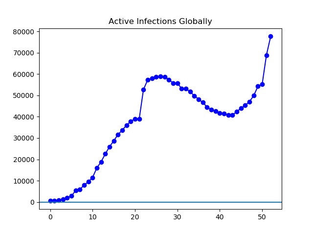
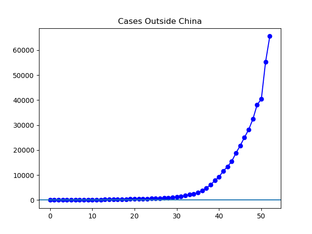
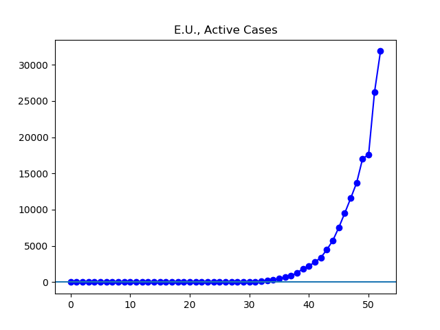
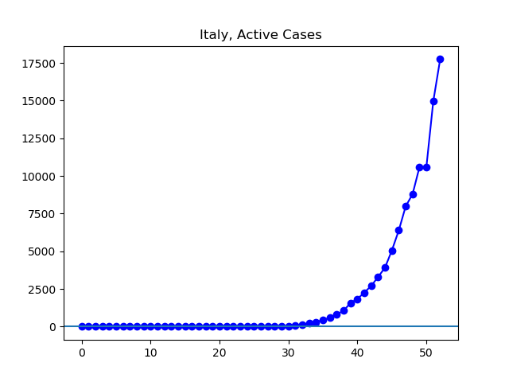
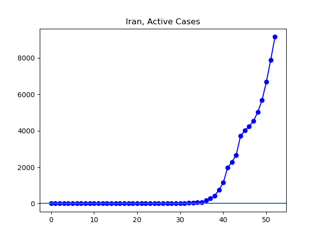
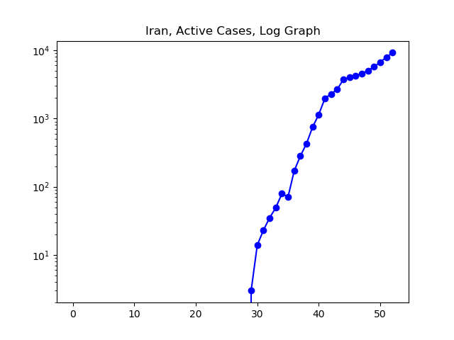
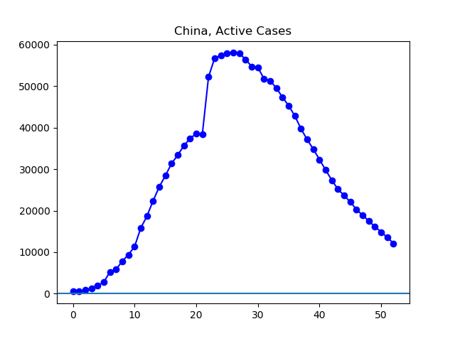
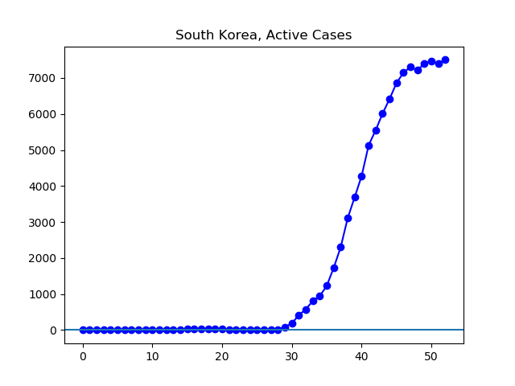
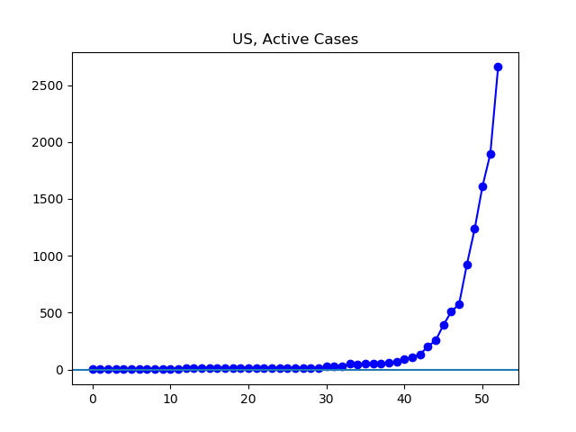

**Disclaimer**

I’m not an expert. I’m just an graphing out data found at Johns Hopkins University’s coronavirus GitHub ([source](https://github.com/CSSEGISandData/COVID-19/tree/master/csse_covid_19_data/csse_covid_19_daily_reports)). They get this data from governments, who are announcing numbers of "confirmed" cases with varying levels of completeness, competence, and candor.

Unless otherwise noted, all numbers I'm talking about or graphing refer to these governmentally confirmed numbers, _not including_ people who have died or recovered by now. I have a very limited ability to speculate about the accuracy of these figures, beyond obvious things: China's recovery is real, Iran has been less than forthcoming, etc.

Johns Hopkins divided up the data by what it called "Country/Region/Sovereignty". For convenience, I will just call these units "countries", even though they aren't all countries, and even though there are disputed cases (is Taiwan a country?). In addition, Johns Hopkins' data has been somewhat inconsistent about these classifications: Macau is not treated as part of China for a while, and then it is. To the best of my knowledge, these wrinkles here and there in the data do not have any material change to the overall situation I have been presenting.

**The Graphs**

**Figure 1**. The last few days have seen a dizzying increase in the global growth of the virus. The growth is occurring outside of China, which is now in a stage of rapid recovery. We stand at 77,656 active cases, up from 43,919 a week ago.

**Figure 2**. The situation outside China has gotten progressively worse. There are 65,532 cases, triple the 21,815 of a week ago.

**Figure 3.** The hottest region right now, containing about half the cases outside China, is Europe. This figure contains the number of cases found in the European Union. There are 31,870 cases, quadruple the 7,525 a week ago. Over the last several days, increasing numbers of European countries have been rolling out China-style social distancing measures, in the hope of making this graph look more like Figure 7.

**Figure 4**. The hottest country right now, as far as reported cases, is Italy. There are 17,750 cases, nearly triple the 6,387 a week ago.

**Figure 5.** These are the official active cases according to the Iranian government.

**Figure 6.** The log graph is strange, and when this is all behind us I look forward to learning just how such an odd set of changes in the growth of confirmed cases occurred.

**Figure 7.** The story in China, so far, has been relatively simple. The virus infected an enormous number of people, extreme social controls were enacted, and for now the country appears to be in remission.

**Figure 8.** South Korea has seen a leveling off lately, and I hope they will soon being seeing a sustained drop.

**Figure 9**. The number of cases is rising quickly in the United States, and increasing numbers of states are shutting down schools.
