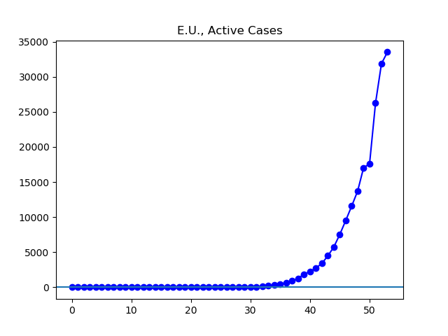

**Disclaimer**

I’m not an expert. I’m just graphing out data found at Johns Hopkins University’s coronavirus GitHub ([source](https://github.com/CSSEGISandData/COVID-19/tree/master/csse_covid_19_data/csse_covid_19_daily_reports)). This data comes from governments, who are announcing numbers of “confirmed” cases with varying levels of reliability.

Unless otherwise noted, all numbers I’m talking about or graphing refer to these governmentally confirmed numbers, _not including_ people who have died or recovered by now. I have a limited ability to speculate about the accuracy of these figures.

Johns Hopkins divided up the data by what it called “Country/Region/Sovereignty”. For convenience, I will just call these units “countries”, even though they aren’t all countries, and even though there are disputed cases (like Taiwan). In addition, Johns Hopkins’ data has been sometimes inconsistent about these classifications. To the best of my knowledge, these wrinkles here and there in the data do not have any material change to the overall situation I have been presenting.

**The Graphs**

**Figure 1.** The number of cases globally continues to rise quickly. Just like a few days ago, today there is a little apparent slowdown in cases that seems to be driven by reporting issues involving Italy.

**Figure 2.** The number of cases outside China has been rising rapidly. After today's small rise, I expect a larger rise tomorrow once Johns Hopkins is up to date on the large increases in Italy.

**Figure 3.** About half of the cases outside China continue to be concentrated in the European Union.

**Figure 4.** While apparently the latest figures to reach Johns Hopkins show no growth in cases for Italy, there are in fact right now about 20,000 reported cases from Italy, so I expect this graph to pick up again shortly.

**Figure 5.** I still do not have a clear picture of events inside Iran.

**Figure 6.** South Korea continues to hang out on something like a plateau, while I hope to see their total caseload of active infections start dropping significantly soon.

**Figure 7.** Cases in the US continue to grow rapidly. Increasingly large parts of the country are seeing restrictions on schools, restaurants, and bars.
