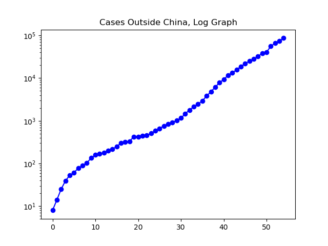
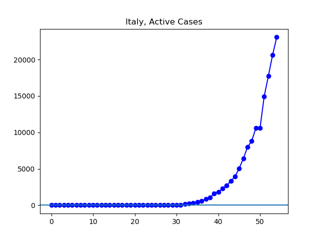
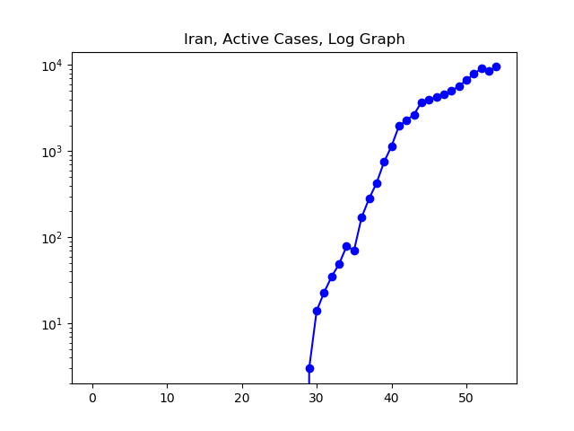

**Disclaimer**

I’m not an expert. I’m using data found at Johns Hopkins University’s coronavirus GitHub ([source](https://github.com/CSSEGISandData/COVID-19/tree/master/csse_covid_19_data/csse_covid_19_daily_reports)). This data comes from various governments, and has varying levels of reliability.

Unless otherwise noted, all numbers I’m talking about or graphing refer to these governmentally confirmed numbers, _not including_ people who have died or recovered by now.

Johns Hopkins divides up the data by what it calls “Country/Region/Sovereignty”. For convenience, I will just call these units “countries”, even though they aren’t all countries, and even though there are disputed cases (like Taiwan). In addition, Johns Hopkins’ data has been sometimes inconsistent about these classifications. To the best of my knowledge, these wrinkles here and there do not significantly alter the overall picture.

**The Graphs**

**Figure 1.** The number of active cases worldwide stands at 96,332, just over double the 47,074 cases reported a week ago.

**Figure 2.** Once one removes the Chinese cases, the story of the new coronavirus is one of unrelenting and approximately exponential growth.

**Figure 3.** On January 22th, there were eight confirmed cases outside of China. Over the next 27 days, cases grew on hundredfold, to 841. In the next 27 days, they did so again, and now stand at 86,426.

**Figure 4.** About half of the cases outside of China are in the European Union. There are 43,955 active cases, about quadruple the 11,571 as of a week ago.

**Figure 5**. A little over half of the cases in the E.U. are in Italy. The 23,073 cases there are approximately triple the 7985 reported a week ago.

**Figure 6.** The 9906 cases currently reported in China are almost exactly half the 18,880 reported a week ago.

**Figure 7.** Iran is reporting 9548 cases, about double the 4530 it reported a week ago.

**Figure 8**. The log graph of Iran's cases seems to show the outbreak slowing. The question is to what degree the reported statistics match reality.

**Figure 9**. After hanging on a plateau for a while, today it looks like perhaps the South Korean cases are beginning to drop.

**Figure 10.** The log graph of South Korea's cases shows that the recent drop is the continuation of a multi-week trend toward a slower and slower growth rate in cases.

**Figure 11.** The US is reporting 4530 active cases, about eight times the 575 cases reported a week ago.

---

_This page is released under the [CC0 1.0](https://creativecommons.org/publicdomain/zero/1.0/) license._

