**Disclaimer**

I’m not an expert. I’m using data found at Johns Hopkins University’s coronavirus GitHub ([source](https://github.com/CSSEGISandData/COVID-19/tree/master/csse_covid_19_data/csse_covid_19_daily_reports)). This data comes from various governments, and has varying levels of reliability.

Unless otherwise noted, all numbers I’m talking about or graphing refer to these governmentally confirmed numbers, _not including_ people who have died or recovered by now.

Johns Hopkins divides up the data by what it calls “Country/Region/Sovereignty”. For convenience, I will just call these units “countries”, even though they aren’t all countries, and even though there are disputed cases (like Taiwan). In addition, Johns Hopkins’ data has been sometimes inconsistent about these classifications. To the best of my knowledge, these wrinkles here and there do not significantly alter the overall picture.

**The Present Situation**

Today, the number of active infections passed 100,000 worldwide for the first time, and over 90% of those cases are outside China. About half of the cases outside China are in the European Union, and about half of the cases in the European Union are in Italy, the country with the greatest number of cases at the moment. Outside China and the E.U., the largest numbers of cases have been reported from Iran, South Korea, and the United States, in that order.

**The Graphs**

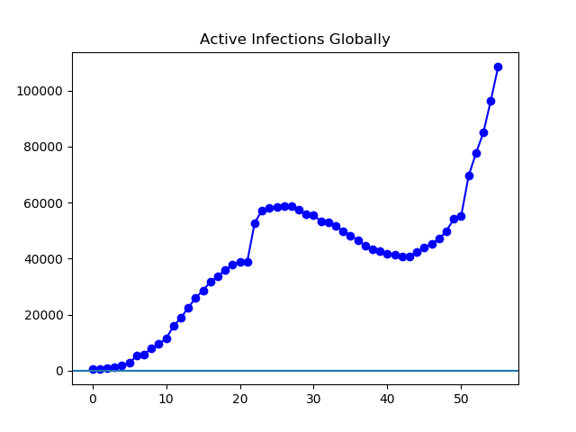

**Figure 1.** Globally, there are 108,423 active infections currently reported, a little over double the 49,916 cases reported a week ago.

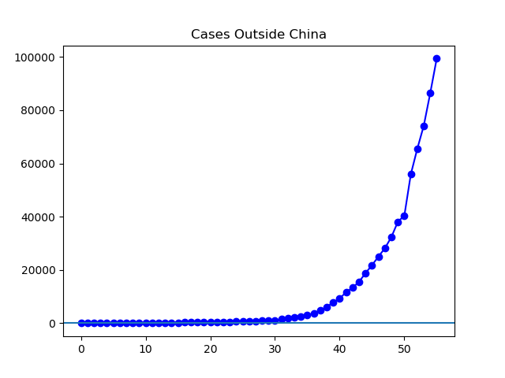

**Figure 2.** Outside China, the 99,393 cases currently reported are just over triple the 32,401 cases reported a week ago.

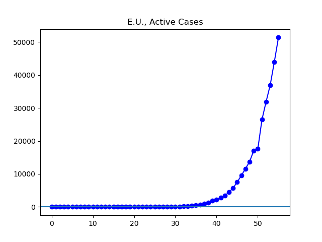

**Figure 3.** There are currently 51,342 confirmed infections in the European Union, a bit less than four times the 13,715 reported a week ago.

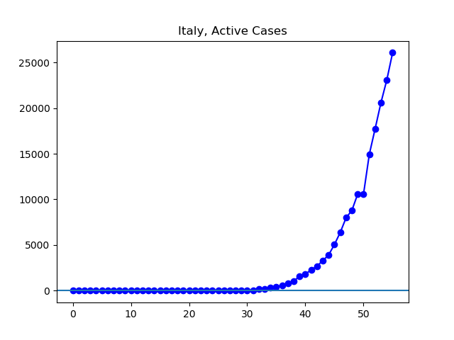

**Figure 4**. There are 26,062 confirmed infections in Italy, about three times the 8,794 reported a week ago.

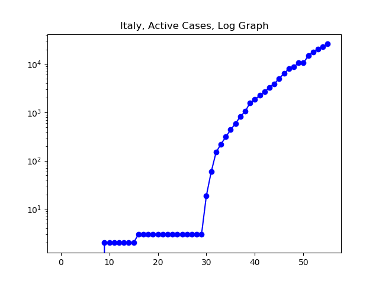

**Figure 5.** Though we cannot say cases have by any means leveled off in Italy, there has been some slowing in the growth rate of the infected population.

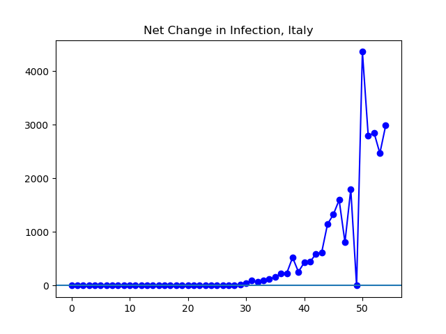

**Figure 6.** It may be too early to say what will happen yet, but over the last four days, the net increase in active infections in Italy has hovered in the realm of 2,500-3,000. It will be instructive to watch, over the next few days, whether this represents the new spread finding a peak.

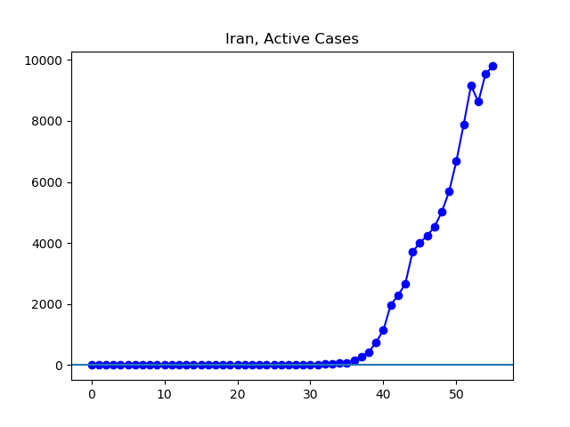

**Figure 7.** There has been some slowing in the growth of infections reported by Iran over the last few days. News articles I have seen continue to cast some doubt on the Iranian government's version of events.

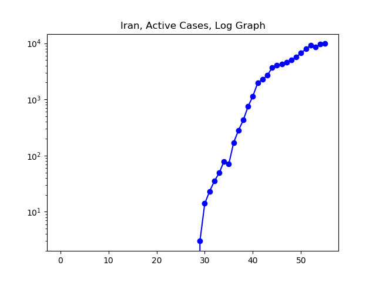

**Figure 8.** The log graph more clearly shows the slowing in the growth rate of reported infections in Iran.

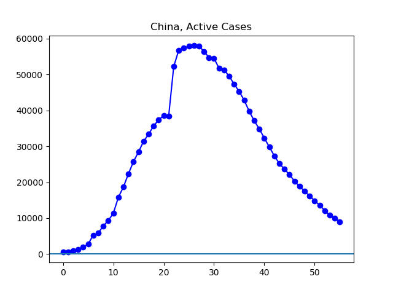

**Figure 9.** The number of infections in China continues to drop. The 9,030 active infections reported today are about half the 17,515 cases reported a week ago.

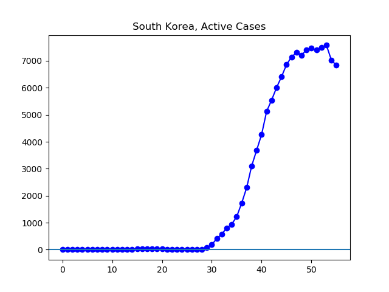

**Figure 10**. The number of active infections in Korea continues its recently-begun drop.

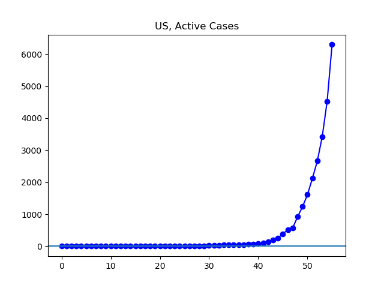

**Figure 11.** The United States is currently reporting 6,296 cases, about seven times the 923 reported a week ago.
