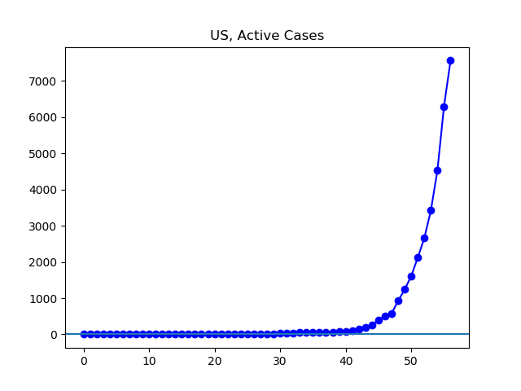

**Disclaimer**

I’m not an expert. I’m using data found at Johns Hopkins University’s coronavirus GitHub ([source](https://github.com/CSSEGISandData/COVID-19/tree/master/csse_covid_19_data/csse_covid_19_daily_reports)). It comes from various governments, and has varying levels of reliability.

Unless otherwise noted, all numbers I’m talking about or graphing refer to these governmentally confirmed numbers, _not including_ people who have died or recovered by now.

Johns Hopkins divides up the data by what it calls “Country/Region/Sovereignty”. For convenience, I will just call these units “countries”, even though they aren’t all countries, and even though there are disputed cases (like Taiwan). In addition, Johns Hopkins’ data has been sometimes inconsistent about these classifications. To the best of my knowledge, these wrinkles here and there do not significantly alter the overall picture.

**The Latest**

The global number of infections is rising quickly, and over 90% of the cases are outside China. China continues to see a decrease in the number of infected. Of the cases outside China, about half are in the European Union, where the number of cases is growing rapidly. Of the cases in the European Union, about half are in Italy, where the number of cases is growing rapidly, but perhaps new cases are leveling off for the moment. Outside Europe and China, the largest number of cases is in Iran, where the growth rate of the virus, at least according to the government's reports, has slowed a bit, although the overall number continues to rise.

And the next country, the United States, where I live, has a rapidly rising number of cases, and is seeing a long-overdue but now rapid increase in the [number of tests being administered](https://covidtracking.com/us-daily/). Next is South Korea, where the number of infections is in decline.

**The Graphs**

**Figure 1.** The number of global infections continues to rise rapidly. The current 122,869 cases are over double the 54,267 cases reported a week ago.

**Figure 2.** The number of cases outside China continues to rise sharply. The 114,763 cases currently are about triple the 38,131 reported a week ago.

**Figure 3.** The number of cases inside the European Union continues to rise sharply. The 59,712 current infections are over triple the 17,046 reported a week ago.

**Figure 4.** The number of cases in Italy continues its steady climb. Today there are 28,710 cases, up from 10,590 a week ago.

**Figure 5.** The net change in infection has been without significant movement for five days now. In a case of uncontrolled exponential growth, one would expect the increase in infections to continue increasing day by day. Perhaps this is a glimmer of hope.

**Figure 6.** The number of active cases in Iran continues to grow.

**Figure 7.** A log graph shows a slowing in the rate of increase. These numbers reflect official Iranian figures, which continue to raise suspicions.

**Figure 8.** The number of infections in the US continues to grow rapidly. For today Johns Hopkins reported 7,562 active infections, about six times the 1237 reported a week ago.

**Figure 9.** South Korea continues to see a decline in known infections. The number of infections stands at 6,789, down from a peak of 7,577 three days ago.

---

_This page is released under the [CC0 1.0](https://creativecommons.org/publicdomain/zero/1.0/) license._

