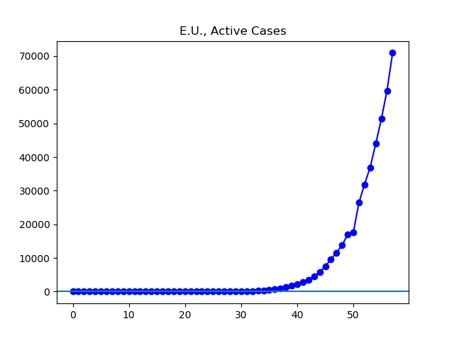

**Disclaimer**

I’m not an expert. I’m using data found at Johns Hopkins University’s coronavirus GitHub ([source](https://github.com/CSSEGISandData/COVID-19/tree/master/csse_covid_19_data/csse_covid_19_daily_reports)), which is aggregated from global sources with varying reliability.

Unless otherwise noted, all numbers I’m talking about or graphing refer to current infections, that is, they do not include people who have died or recovered by now.

Johns Hopkins divides up the data by what it calls “Country/Region/Sovereignty”. For convenience, I will just call these units “countries”, even though they aren’t all countries, and even though there are disputed cases (like Taiwan). In addition, Johns Hopkins’ data has been sometimes inconsistent about these classifications. To the best of my knowledge, these irregularities do not significantly alter the overall picture.

**The Latest**

The latest daily report is grim. Cases are rising rapidly outside China, especially in the European Union, and especially in Italy.

Outside of Europe, the country with the most cases is my homeland, the United States, where numbers have been exploding and state and local governments are taking increasingly drastic measures day by day. Today all "non-life-supporting" business in Pennsylvania have been ordered to close, and here in Ohio many people think the same sort of thing is coming to us in the next few days.

Next is Iran, where the number of cases is rising, but not as quickly as in some countries, if the Iranian government is to be believed. And the situation continues to improve in China and South Korea -- South Korea with the exception of a small bump today.

**The Graphs**

**Figure 1.** The number of infections is rising rapidly around the world. The 147,884 cases currently reported are well over double the 55,299 reported a week ago.

**Figure 2.** When China is removed from the numbers, the exponential ramping up of cases in the rest of the world shows through more clearly. About 95% of infections are now outside China.

**Figure 3.** About half of the world's confirmed cases are in the European Union.

**Figure 4**. About half of the European Union's cases are in Italy.

**Figure 5.** The 13,372 active cases in the US are over eight times the 1611 reported a week ago.

**Figure 6.** Reported cases continue to grow in Iran, though not as fast as in many countries. It remains unclear what relationship the Iranian data has with reality.

**Figure 7.** China continues steadily to reduce infections. The 7372 cases reported today are just a hair under half the 14,859 reported a week ago.

**Figure 8.** Active cases in South Korea.
