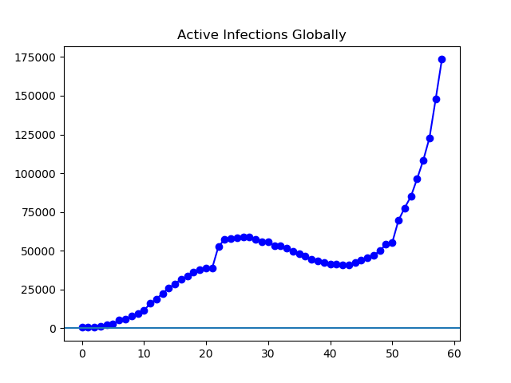
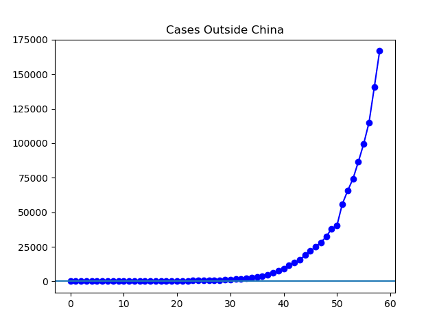
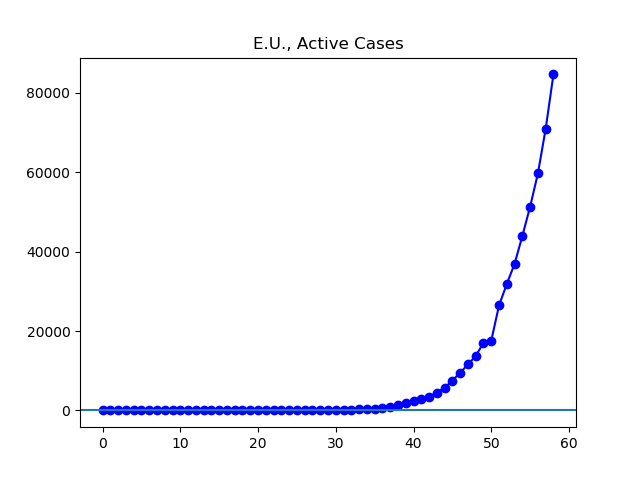
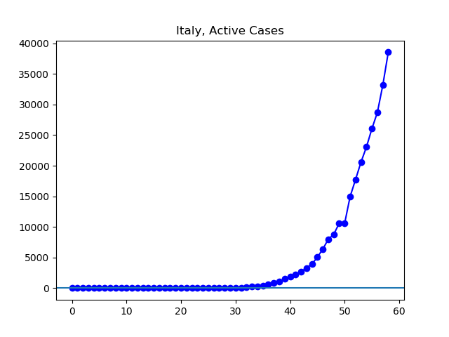
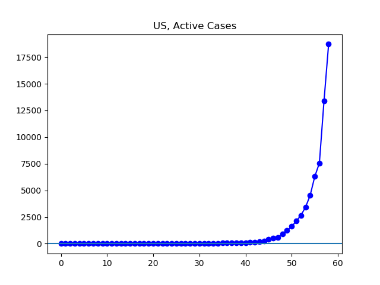
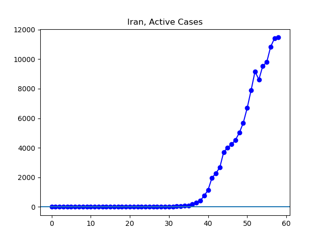
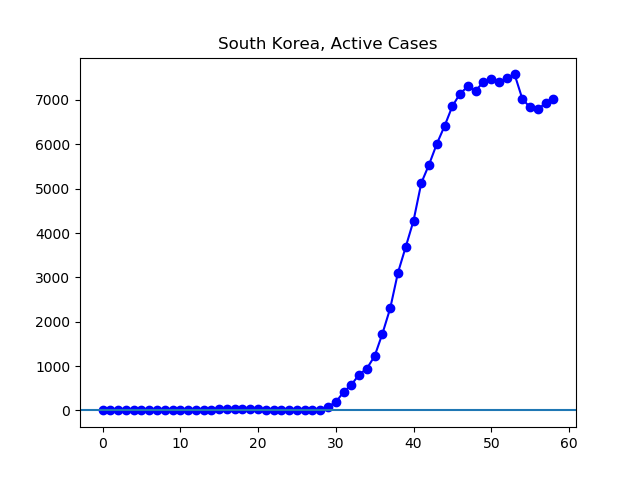
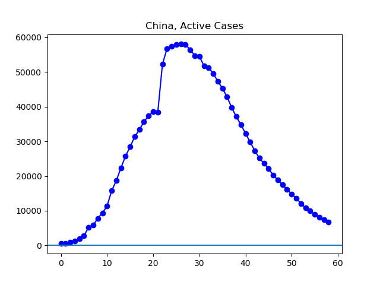

**Disclaimer**

I’m an interested amateur using data found at Johns Hopkins University’s
coronavirus GitHub
([source](https://github.com/CSSEGISandData/COVID-19/tree/master/csse_covid_19_data/csse_covid_19_daily_reports)),
which is aggregated in sometimes inconsistent ways from international sources
of varying reliability.

Unless otherwise noted, all numbers I’m talking about or graphing refer to
current infections, that is, they do not include people who have died or
recovered by now.

**The Latest**

Internationally, cases continue to skyrocket, with about half of those cases in
the European Union, especially in Italy, with Spain and Germany close behind.
Outside Europe, the most cases are in the US, my home country, where things
seem very much out of control at the moment. In addition to the lockdown of
Pennsylvania I mentioned yesterday, we've now seen lockdowns of New York State,
Illinois, and Pennsylvania. That makes about one quarter of the United States
living in states where most business are not allowed to operate. I cannot
imagine that those are the last four states that will impose these sorts of
restrictions.

In Iran, the reported number of active infections is barely growing right now.
In South Korea, it was looking like cases had peaked, but now there's been
small upticks the last two days. Time will tell whether South Korea has got its
hands around this thing. Meanwhile, cases continue to decline substantially in
China.

**The Graphs**

**Figure 1.** Cases globally continue to grow rapidly.

**Figure 2.** When China is excluded, the story is one of uninterrupted
exponential growth. The 166,734 cases currently reported make up about three
times the 55,969 cases reported a week ago.

**Figure 3.** The 84,668 cases currently active in the E.U. make up about half
of global cases, and are over triple the 26,439 cases reported a week ago.

**Figure 4**. Italy, with 38,549 cases, is the worst-affected country in the
world right now. The infections now are over double the 14,955 cases reported a
week ago.

**Figure 5.** Outside of Europe, the largest number of cases is in the United
States. The 18,710 are about eight times the 2,120 reported a week ago.

**Figure 6.** Perhaps the number of infections in Iran is peaking. Time will
tell.

**Figure 7**. Despite some recent growth, the number of cases in South Korea
remains below the high from five days ago.

**Figure 8.** The 6,731 cases in China are about half the 13,569 reported a
week ago.

---

_This page is released under the [CC0
1.0](https://creativecommons.org/publicdomain/zero/1.0/) license._

