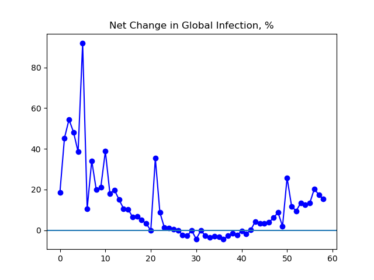

**Disclaimer**

I’m an interested amateur using data found at Johns Hopkins University’s coronavirus GitHub ([source](https://github.com/CSSEGISandData/COVID-19/tree/master/csse_covid_19_data/csse_covid_19_daily_reports)), which is aggregated in sometimes inconsistent ways from international sources of varying reliability.

Unless otherwise noted, all numbers I’m talking about or graphing refer to current infections, that is, they do not include people who have died or recovered by now.

**The Latest**

There are more and more cases of coronavirus confirmed worldwide, but an interesting thing has happened. For the last three days, the daily increase in the number of new infections has been roughly constant. I cannot say whether this is something genuinely positive or a false start. We are just shy of 200,000 active infections worldwide, well over double the number a week ago.

Almost all global cases are currently outside China, and about half are in the European Union. A bit less than half of the infections in the European Union are in Italy, and Italy is followed closely by Spain and Germany, which growing numbers of cases throughout Europe.

The United States continues to see a rapidly increasing number of cases, while Iran's data suggests a potential peak or plateau in number of cases. Things continue to improve in China, while Korea appears to be losing some of its recent improvement.

**The Graphs**

**Figure 1.** The number of global cases continues to increase, standing at 199,879, between double and triple the 77,656 cases reported a week ago.

**Figure 2.** For the last three days, about 25,000 new cases have been added per day, with little variation. An optimist would hope that this represents the beginning of some genuine slowing in the rate of spread. But it could be just noise or measurement problems for all I know.

**Figure 3.** Each day's change in net infections, expressed as a percentage. The last three days, for someone starved for good news, look like the beginning of an encouraging downhill trend, but that may well be reading too much into it. Time will tell.

**Figure 4.** Italy, the worst-afflicted country, continues to see cases rise. The 42,681 cases reported today are between double and triple the 17,750 reported a week ago.

**Figure 5.** The new number of cases reported today for Italy was less than either of the previous two days. Time will tell whether this represents the beginning of a decrease following Italy's lockdowns of March 8-9.

**Figure 6.** Active cases in the US stand at 25,015, over nine times the 2660 reported a week ago.

**Figure 7.** Daily change in current US infections. The recent steep growth is partially accounted for by the US recently starting to get its act together vis-a-vis testing.

**Figure 8.** Active cases as reported by Iran seem to be leveling off.

**Figure 9.** The number of cases in South Korea are still below their peak, but trending upward a bit the last few days.

**Figure 10.** The number of cases in China continues its trend of dramatic and sustained improvement. The 6189 cases reported today about half as many as the 12,124 reported a week ago.

---

_This page is released under the [CC0 1.0](https://creativecommons.org/publicdomain/zero/1.0/) license._

