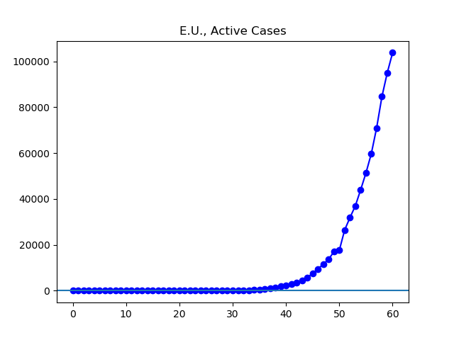

**Disclaimer**

I’m an interested amateur using data found at Johns Hopkins University’s coronavirus GitHub ([source](https://github.com/CSSEGISandData/COVID-19/tree/master/csse_covid_19_data/csse_covid_19_daily_reports)), which is aggregated in sometimes inconsistent ways from international sources of varying reliability.

Unless otherwise noted, all numbers I’m talking about or graphing refer to current infections, that is, they do not include people who have died or recovered by now.

**The Latest**

The number of infected globally continues to grow, and governments are taking increasingly strong measures to slow the spread of the virus. A bit less than half of the world's currently confirmed infections can be found in the European Union, and a little less than half of the European Union's infected can be found in Italy, the worst-affected country. Europe has been locking down its economy and movement over the past few days.

Outside Europe, that largest number of cases is found in the United States, where over the last few days lockdowns have been spreading from state to state. My own state, Ohio, will be shutting down all "non-essential" businesses, effective tomorrow night. Next is Iran, where the number of reported cases continues a (relatively, compared to other outbreaks) slow climb. In South Korea, large numbers of recoveries and continued control of new infections are starting to drive down the number of infected substantially. China is also reporting continued good news.

**The Graphs**

**Figure 1.** The world is currently reporting 223,441 active infections, between double and triple the 84,973 reported a week ago.

**Figure 2.** The net change in global infections is lower for today than the previous three days. I hope this is a reflection of large parts of the world beginning to slow the rate of new infections, and not just an artifact of testing practices.

**Figure 3**. Taken as a percentage, the net change in infection has gotten lower three days in a row, falling from 20.4% to 11.8%.

**Figure 4**. The 103,791 cases currently reported in the European Union are almost triple the 36,938 cases reported a week ago.

**Figure 5**. The 46,638 cases currently reported in Italy are a little over double the 20,603 cases reported a week ago.

**Figure 6**. The number of new cases reported in Italy today was lower than any of the past three days. I hope this reflects the approximately two weeks of lockdowns taking effect, rather than simply being a result of an overwhelmed health system unable to accurately account for cases.

**Figure 7**. The 32,681 cases reported in the US today are over nine times the 3,424 reported a week ago.

**Figure 8**. Net daily change in number of US active infections.

**Figure 9**. The number of cases in Iran continues to climb slowly, according to official government numbers.

**Figure 10**. The number of infections in South Korea continues to drop from its peak a week ago.

**Figure 11**. China is currently reporting 5,770 cases, about half the 10,783 cases it reported a week ago.
