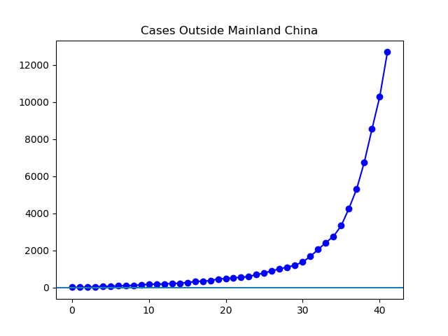
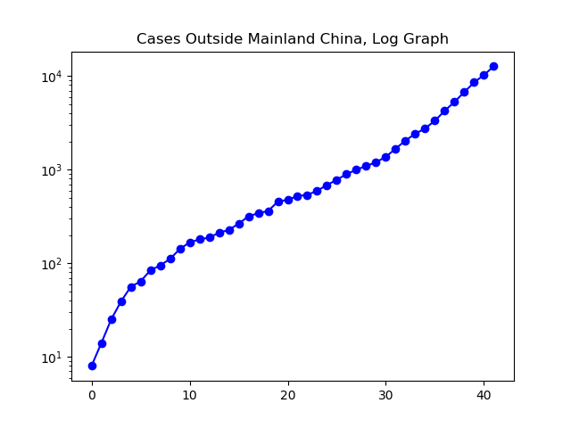
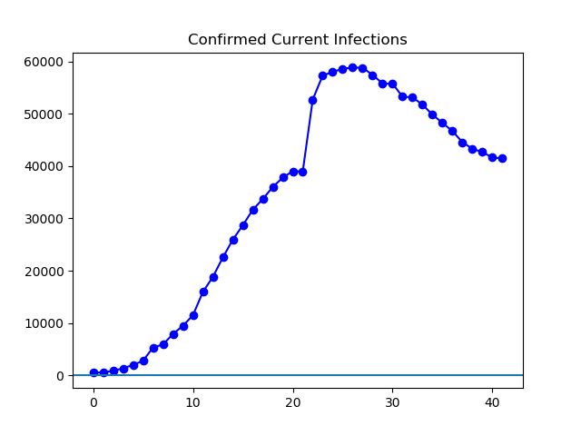
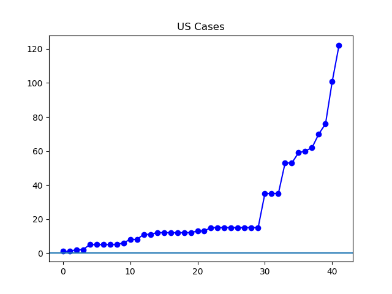
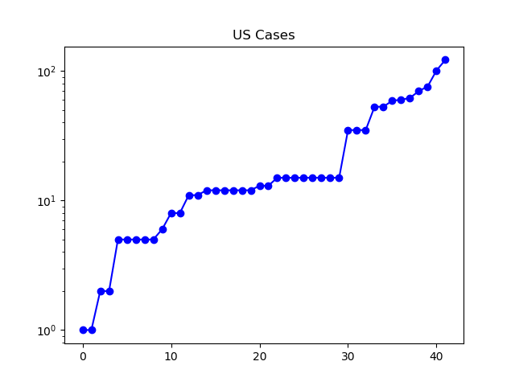

**Disclaimer**

I'm not a medical or statistical expert. I'm just some guy graphing out the data made available by Johns Hopkins University to see what I can see.

**The Latest**

Since I started making these graphs, I've been running some very simple code to which I added the data by hand. This has created various complications, including the uneasy feeling of using data reported at different times of day by different outlets. Now I'm using the data on [GitHub](https://github.com/CSSEGISandData/COVID-19/tree/master/csse_covid_19_data/csse_covid_19_daily_reports) provided by Johns Hopkins University. This required learning about how python handles csv files. What I've got worked up now, code-wise, does the job but could still use some polishing. There's some pretty repetitive code that could probably be combined into a couple of functions.

As far as the spread of the coronavirus, the picture the Johns Hopkins data paints is essentially the same picture painted by the data I had been cobbling together from the WHO, Outbreak.cc, BNO news, the Chinese government, and even Wikipedia. China had a huge outbreak that is -- for now -- significantly slowing. The world outside China has seen a rapid continued growth in total cases. Increasingly, so has the United States.

**The Graphs**



**Figure 1.** The number of cases outside of China continues to explode. For today Johns Hopkins has reported 12,693 cases outside Mainland China, more than quadruple the 2755 cases a week ago.



**Figure 2.** The same data as in Figure 1 but plotted on a log graph.



**Figure 3.** The number of active infections worldwide has continued to fall, under the influence of the steep decrease in Chinese cases. However, it does appear to be leveling off, and if the number of cases outside China continues to rise rapidly, it will begin to move back up.



**Figure 4.** This is the number of cases in the United States. Like an exponential function, it begins with slow growth, takes an upward turn, and then moves steeply upward. However, with such a comparatively small number of cases, it is no surprise that it does not look smoothly exponential.



**Figure 5.** US cases shown on a log graph. If this were smoothly exponential growth, it would look like a straight line. It remains to be seen whether it will take on that shape.

**The Code**

I do plan on making this code more efficient and a bit more logically structured, but for now, here is the code that makes the graphs.


import csv
import matplotlib.pyplot as plt

def quick\_graph(y, caption='', scale='linear'):
    """Make a quick graph from some list with a caption."""
    x = \[\]
    for i in range(len(y)):
        x.append(i)
    plt.plot(x, y, 'b-o')
    plt.yscale(scale)
    plt.axhline()
    plt.title(caption)
    plt.show()

def count\_cases(dayfile):
    with open(dayfile) as csv\_file:
        csv\_reader = csv.reader(csv\_file, delimiter=',')
        line\_count = 0
        cases = 0
        for row in csv\_reader:
            if line\_count == 0:
                line\_count += 1
            else:
                line\_count += 1
                if row\[3\]:
                    cases += int(row\[3\])
        return cases

def count\_deaths(dayfile):
    with open(dayfile) as csv\_file:
        csv\_reader = csv.reader(csv\_file, delimiter=',')
        line\_count = 0
        cases = 0
        for row in csv\_reader:
            if line\_count == 0:
                line\_count += 1
            else:
                line\_count += 1
                if row\[4\]:
                    cases += int(row\[4\])
        return cases

def count\_recovered(dayfile):
    with open(dayfile) as csv\_file:
        csv\_reader = csv.reader(csv\_file, delimiter=',')
        line\_count = 0
        cases = 0
        for row in csv\_reader:
            if line\_count == 0:
                line\_count += 1
            else:
                line\_count += 1
                if row\[5\]:
                    cases += int(row\[5\])
        return cases

def count\_outside(dayfile):
    with open(dayfile) as csv\_file:
        csv\_reader = csv.reader(csv\_file, delimiter=',')
        line\_count = 0
        cases = 0
        for row in csv\_reader:
            if line\_count == 0:
                line\_count += 1
            else:
                line\_count += 1
                if row\[3\] and row\[1\] != 'Mainland China':
                    cases += int(row\[3\])
        return cases

def count\_us(dayfile):
    with open(dayfile) as csv\_file:
        csv\_reader = csv.reader(csv\_file, delimiter=',')
        line\_count = 0
        cases = 0
        for row in csv\_reader:
            if line\_count == 0:
                line\_count += 1
            else:
                line\_count += 1
                if row\[3\] and row\[1\] == 'US':
                    cases += int(row\[3\])
        return cases

daylist = \['01-22-2020.csv', '01-23-2020.csv', '01-24-2020.csv',
           '01-25-2020.csv', '01-26-2020.csv', '01-27-2020.csv',
           '01-28-2020.csv', '01-29-2020.csv', '01-30-2020.csv',
           '01-31-2020.csv', '02-01-2020.csv', '02-02-2020.csv',
           '02-03-2020.csv', '02-04-2020.csv', '02-05-2020.csv',
           '02-06-2020.csv', '02-07-2020.csv', '02-08-2020.csv',
           '02-09-2020.csv', '02-10-2020.csv', '02-11-2020.csv',
           '02-12-2020.csv', '02-13-2020.csv', '02-14-2020.csv',
           '02-15-2020.csv', '02-16-2020.csv', '02-17-2020.csv',
           '02-18-2020.csv', '02-19-2020.csv', '02-20-2020.csv',
           '02-21-2020.csv', '02-22-2020.csv', '02-23-2020.csv',
           '02-24-2020.csv', '02-25-2020.csv', '02-26-2020.csv',
           '02-27-2020.csv', '02-28-2020.csv', '02-29-2020.csv',
           '03-01-2020.csv', '03-02-2020.csv', '03-03-2020.csv'\]

confirmed = \[\]
for day in daylist:
    confirmed.append(count\_cases(day))
    print(day\[:-4\], ":", count\_cases(day), "confirmed cumulative cases.")

dead = \[\]
for day in daylist:
    dead.append(count\_deaths(day))
    print(day\[:-4\], ":", count\_deaths(day), "cumulative deaths.")

recovered = \[\]
for day in daylist:
    recovered.append(count\_recovered(day))
    print(day\[:-4\], ":", count\_recovered(day), "cumulative recoveries.")

outside = \[\]
for day in daylist:
    outside.append(count\_outside(day))
    print(day\[:-4\], ":", count\_outside(day),
          "confirmed cumulative cases outside Mainland China.")

us\_cases = \[\]
for day in daylist:
    us\_cases.append(count\_us(day))
    print(day\[:-4\], ":", count\_us(day),
          "confirmed cumulative cases in the United States.")

print("Confirmed:", confirmed)
print("Dead:", dead)
print("Recovered:", recovered)
print("Outside Mainland China:", outside)
print("US cases:", us\_cases)

assert len(confirmed) == len(dead)
assert len(dead) == len(recovered)
assert len(recovered) == len(outside)
assert len(outside) == len(us\_cases)

active = \[\]
for x in range(len(confirmed)):
    active.append(confirmed\[x\] - recovered\[x\] - dead\[x\])
    print(daylist\[x\]\[:-4\], ":", active\[x\], "active confirmed infections.")
print("Active confirmed infections:", active)

quick\_graph(outside, "Cases Outside Mainland China")
quick\_graph(outside, "Cases Outside Mainland China, Log Graph", "log")

quick\_graph(active, "Confirmed Current Infections")

quick\_graph(us\_cases, "US Cases")
quick\_graph(us\_cases, "US Cases", "log")


**The Data**

Here is an ugly readout of the data printed by the code above. It'll do the job if you want to look up what number a particular dot in the graphs above corresponds to. On the other hand, perhaps my next step will be to get the program to output CSV files with these numbers in them.

```
python3 rando_1.py
01-22-2020 : 555 confirmed cumulative cases.
01-23-2020 : 653 confirmed cumulative cases.
01-24-2020 : 941 confirmed cumulative cases.
01-25-2020 : 1438 confirmed cumulative cases.
01-26-2020 : 2118 confirmed cumulative cases.
01-27-2020 : 2927 confirmed cumulative cases.
01-28-2020 : 5578 confirmed cumulative cases.
01-29-2020 : 6165 confirmed cumulative cases.
01-30-2020 : 8235 confirmed cumulative cases.
01-31-2020 : 9925 confirmed cumulative cases.
02-01-2020 : 12038 confirmed cumulative cases.
02-02-2020 : 16787 confirmed cumulative cases.
02-03-2020 : 19881 confirmed cumulative cases.
02-04-2020 : 23892 confirmed cumulative cases.
02-05-2020 : 27636 confirmed cumulative cases.
02-06-2020 : 30818 confirmed cumulative cases.
02-07-2020 : 34392 confirmed cumulative cases.
02-08-2020 : 37121 confirmed cumulative cases.
02-09-2020 : 40151 confirmed cumulative cases.
02-10-2020 : 42763 confirmed cumulative cases.
02-11-2020 : 44803 confirmed cumulative cases.
02-12-2020 : 45222 confirmed cumulative cases.
02-13-2020 : 60370 confirmed cumulative cases.
02-14-2020 : 66887 confirmed cumulative cases.
02-15-2020 : 69032 confirmed cumulative cases.
02-16-2020 : 71226 confirmed cumulative cases.
02-17-2020 : 73260 confirmed cumulative cases.
02-18-2020 : 75138 confirmed cumulative cases.
02-19-2020 : 75641 confirmed cumulative cases.
02-20-2020 : 76199 confirmed cumulative cases.
02-21-2020 : 76843 confirmed cumulative cases.
02-22-2020 : 78599 confirmed cumulative cases.
02-23-2020 : 78985 confirmed cumulative cases.
02-24-2020 : 79570 confirmed cumulative cases.
02-25-2020 : 80415 confirmed cumulative cases.
02-26-2020 : 81397 confirmed cumulative cases.
02-27-2020 : 82756 confirmed cumulative cases.
02-28-2020 : 84124 confirmed cumulative cases.
02-29-2020 : 86013 confirmed cumulative cases.
03-01-2020 : 88371 confirmed cumulative cases.
03-02-2020 : 90309 confirmed cumulative cases.
03-03-2020 : 92844 confirmed cumulative cases.
01-22-2020 : 17 cumulative deaths.
01-23-2020 : 18 cumulative deaths.
01-24-2020 : 26 cumulative deaths.
01-25-2020 : 42 cumulative deaths.
01-26-2020 : 56 cumulative deaths.
01-27-2020 : 82 cumulative deaths.
01-28-2020 : 131 cumulative deaths.
01-29-2020 : 133 cumulative deaths.
01-30-2020 : 171 cumulative deaths.
01-31-2020 : 213 cumulative deaths.
02-01-2020 : 259 cumulative deaths.
02-02-2020 : 362 cumulative deaths.
02-03-2020 : 426 cumulative deaths.
02-04-2020 : 492 cumulative deaths.
02-05-2020 : 564 cumulative deaths.
02-06-2020 : 634 cumulative deaths.
02-07-2020 : 719 cumulative deaths.
02-08-2020 : 806 cumulative deaths.
02-09-2020 : 906 cumulative deaths.
02-10-2020 : 1013 cumulative deaths.
02-11-2020 : 1113 cumulative deaths.
02-12-2020 : 1118 cumulative deaths.
02-13-2020 : 1371 cumulative deaths.
02-14-2020 : 1523 cumulative deaths.
02-15-2020 : 1666 cumulative deaths.
02-16-2020 : 1770 cumulative deaths.
02-17-2020 : 1868 cumulative deaths.
02-18-2020 : 2007 cumulative deaths.
02-19-2020 : 2122 cumulative deaths.
02-20-2020 : 2247 cumulative deaths.
02-21-2020 : 2251 cumulative deaths.
02-22-2020 : 2458 cumulative deaths.
02-23-2020 : 2469 cumulative deaths.
02-24-2020 : 2629 cumulative deaths.
02-25-2020 : 2708 cumulative deaths.
02-26-2020 : 2770 cumulative deaths.
02-27-2020 : 2814 cumulative deaths.
02-28-2020 : 2872 cumulative deaths.
02-29-2020 : 2941 cumulative deaths.
03-01-2020 : 2996 cumulative deaths.
03-02-2020 : 3085 cumulative deaths.
03-03-2020 : 3160 cumulative deaths.
01-22-2020 : 28 cumulative recoveries.
01-23-2020 : 30 cumulative recoveries.
01-24-2020 : 36 cumulative recoveries.
01-25-2020 : 39 cumulative recoveries.
01-26-2020 : 52 cumulative recoveries.
01-27-2020 : 61 cumulative recoveries.
01-28-2020 : 107 cumulative recoveries.
01-29-2020 : 126 cumulative recoveries.
01-30-2020 : 143 cumulative recoveries.
01-31-2020 : 222 cumulative recoveries.
02-01-2020 : 284 cumulative recoveries.
02-02-2020 : 472 cumulative recoveries.
02-03-2020 : 623 cumulative recoveries.
02-04-2020 : 852 cumulative recoveries.
02-05-2020 : 1124 cumulative recoveries.
02-06-2020 : 1487 cumulative recoveries.
02-07-2020 : 2011 cumulative recoveries.
02-08-2020 : 2616 cumulative recoveries.
02-09-2020 : 3244 cumulative recoveries.
02-10-2020 : 3946 cumulative recoveries.
02-11-2020 : 4683 cumulative recoveries.
02-12-2020 : 5150 cumulative recoveries.
02-13-2020 : 6295 cumulative recoveries.
02-14-2020 : 8058 cumulative recoveries.
02-15-2020 : 9395 cumulative recoveries.
02-16-2020 : 10865 cumulative recoveries.
02-17-2020 : 12583 cumulative recoveries.
02-18-2020 : 14352 cumulative recoveries.
02-19-2020 : 16121 cumulative recoveries.
02-20-2020 : 18177 cumulative recoveries.
02-21-2020 : 18890 cumulative recoveries.
02-22-2020 : 22886 cumulative recoveries.
02-23-2020 : 23394 cumulative recoveries.
02-24-2020 : 25227 cumulative recoveries.
02-25-2020 : 27905 cumulative recoveries.
02-26-2020 : 30384 cumulative recoveries.
02-27-2020 : 33277 cumulative recoveries.
02-28-2020 : 36711 cumulative recoveries.
02-29-2020 : 39782 cumulative recoveries.
03-01-2020 : 42716 cumulative recoveries.
03-02-2020 : 45602 cumulative recoveries.
03-03-2020 : 48229 cumulative recoveries.
01-22-2020 : 8 confirmed cumulative cases outside Mainland China.
01-23-2020 : 14 confirmed cumulative cases outside Mainland China.
01-24-2020 : 25 confirmed cumulative cases outside Mainland China.
01-25-2020 : 39 confirmed cumulative cases outside Mainland China.
01-26-2020 : 56 confirmed cumulative cases outside Mainland China.
01-27-2020 : 64 confirmed cumulative cases outside Mainland China.
01-28-2020 : 84 confirmed cumulative cases outside Mainland China.
01-29-2020 : 95 confirmed cumulative cases outside Mainland China.
01-30-2020 : 111 confirmed cumulative cases outside Mainland China.
01-31-2020 : 142 confirmed cumulative cases outside Mainland China.
02-01-2020 : 167 confirmed cumulative cases outside Mainland China.
02-02-2020 : 180 confirmed cumulative cases outside Mainland China.
02-03-2020 : 188 confirmed cumulative cases outside Mainland China.
02-04-2020 : 212 confirmed cumulative cases outside Mainland China.
02-05-2020 : 227 confirmed cumulative cases outside Mainland China.
02-06-2020 : 265 confirmed cumulative cases outside Mainland China.
02-07-2020 : 317 confirmed cumulative cases outside Mainland China.
02-08-2020 : 343 confirmed cumulative cases outside Mainland China.
02-09-2020 : 361 confirmed cumulative cases outside Mainland China.
02-10-2020 : 457 confirmed cumulative cases outside Mainland China.
02-11-2020 : 476 confirmed cumulative cases outside Mainland China.
02-12-2020 : 523 confirmed cumulative cases outside Mainland China.
02-13-2020 : 538 confirmed cumulative cases outside Mainland China.
02-14-2020 : 595 confirmed cumulative cases outside Mainland China.
02-15-2020 : 685 confirmed cumulative cases outside Mainland China.
02-16-2020 : 780 confirmed cumulative cases outside Mainland China.
02-17-2020 : 896 confirmed cumulative cases outside Mainland China.
02-18-2020 : 999 confirmed cumulative cases outside Mainland China.
02-19-2020 : 1095 confirmed cumulative cases outside Mainland China.
02-20-2020 : 1200 confirmed cumulative cases outside Mainland China.
02-21-2020 : 1371 confirmed cumulative cases outside Mainland China.
02-22-2020 : 1677 confirmed cumulative cases outside Mainland China.
02-23-2020 : 2047 confirmed cumulative cases outside Mainland China.
02-24-2020 : 2418 confirmed cumulative cases outside Mainland China.
02-25-2020 : 2755 confirmed cumulative cases outside Mainland China.
02-26-2020 : 3332 confirmed cumulative cases outside Mainland China.
02-27-2020 : 4258 confirmed cumulative cases outside Mainland China.
02-28-2020 : 5300 confirmed cumulative cases outside Mainland China.
02-29-2020 : 6762 confirmed cumulative cases outside Mainland China.
03-01-2020 : 8545 confirmed cumulative cases outside Mainland China.
03-02-2020 : 10283 confirmed cumulative cases outside Mainland China.
03-03-2020 : 12693 confirmed cumulative cases outside Mainland China.
01-22-2020 : 1 confirmed cumulative cases in the United States.
01-23-2020 : 1 confirmed cumulative cases in the United States.
01-24-2020 : 2 confirmed cumulative cases in the United States.
01-25-2020 : 2 confirmed cumulative cases in the United States.
01-26-2020 : 5 confirmed cumulative cases in the United States.
01-27-2020 : 5 confirmed cumulative cases in the United States.
01-28-2020 : 5 confirmed cumulative cases in the United States.
01-29-2020 : 5 confirmed cumulative cases in the United States.
01-30-2020 : 5 confirmed cumulative cases in the United States.
01-31-2020 : 6 confirmed cumulative cases in the United States.
02-01-2020 : 8 confirmed cumulative cases in the United States.
02-02-2020 : 8 confirmed cumulative cases in the United States.
02-03-2020 : 11 confirmed cumulative cases in the United States.
02-04-2020 : 11 confirmed cumulative cases in the United States.
02-05-2020 : 12 confirmed cumulative cases in the United States.
02-06-2020 : 12 confirmed cumulative cases in the United States.
02-07-2020 : 12 confirmed cumulative cases in the United States.
02-08-2020 : 12 confirmed cumulative cases in the United States.
02-09-2020 : 12 confirmed cumulative cases in the United States.
02-10-2020 : 12 confirmed cumulative cases in the United States.
02-11-2020 : 13 confirmed cumulative cases in the United States.
02-12-2020 : 13 confirmed cumulative cases in the United States.
02-13-2020 : 15 confirmed cumulative cases in the United States.
02-14-2020 : 15 confirmed cumulative cases in the United States.
02-15-2020 : 15 confirmed cumulative cases in the United States.
02-16-2020 : 15 confirmed cumulative cases in the United States.
02-17-2020 : 15 confirmed cumulative cases in the United States.
02-18-2020 : 15 confirmed cumulative cases in the United States.
02-19-2020 : 15 confirmed cumulative cases in the United States.
02-20-2020 : 15 confirmed cumulative cases in the United States.
02-21-2020 : 35 confirmed cumulative cases in the United States.
02-22-2020 : 35 confirmed cumulative cases in the United States.
02-23-2020 : 35 confirmed cumulative cases in the United States.
02-24-2020 : 53 confirmed cumulative cases in the United States.
02-25-2020 : 53 confirmed cumulative cases in the United States.
02-26-2020 : 59 confirmed cumulative cases in the United States.
02-27-2020 : 60 confirmed cumulative cases in the United States.
02-28-2020 : 62 confirmed cumulative cases in the United States.
02-29-2020 : 70 confirmed cumulative cases in the United States.
03-01-2020 : 76 confirmed cumulative cases in the United States.
03-02-2020 : 101 confirmed cumulative cases in the United States.
03-03-2020 : 122 confirmed cumulative cases in the United States.
Confirmed: [555, 653, 941, 1438, 2118, 2927, 5578, 6165, 8235, 9925, 12038, 16787, 19881, 23892, 27636, 30818, 34392, 37121, 40151, 42763, 44803, 45222, 60370, 66887, 69032, 71226, 73260, 75138, 75641, 76199, 76843, 78599, 78985, 79570, 80415, 81397, 82756, 84124, 86013, 88371, 90309, 92844]
Dead: [17, 18, 26, 42, 56, 82, 131, 133, 171, 213, 259, 362, 426, 492, 564, 634, 719, 806, 906, 1013, 1113, 1118, 1371, 1523, 1666, 1770, 1868, 2007, 2122, 2247, 2251, 2458, 2469, 2629, 2708, 2770, 2814, 2872, 2941, 2996, 3085, 3160]
Recovered: [28, 30, 36, 39, 52, 61, 107, 126, 143, 222, 284, 472, 623, 852, 1124, 1487, 2011, 2616, 3244, 3946, 4683, 5150, 6295, 8058, 9395, 10865, 12583, 14352, 16121, 18177, 18890, 22886, 23394, 25227, 27905, 30384, 33277, 36711, 39782, 42716, 45602, 48229]
Outside Mainland China: [8, 14, 25, 39, 56, 64, 84, 95, 111, 142, 167, 180, 188, 212, 227, 265, 317, 343, 361, 457, 476, 523, 538, 595, 685, 780, 896, 999, 1095, 1200, 1371, 1677, 2047, 2418, 2755, 3332, 4258, 5300, 6762, 8545, 10283, 12693]
US cases: [1, 1, 2, 2, 5, 5, 5, 5, 5, 6, 8, 8, 11, 11, 12, 12, 12, 12, 12, 12, 13, 13, 15, 15, 15, 15, 15, 15, 15, 15, 35, 35, 35, 53, 53, 59, 60, 62, 70, 76, 101, 122]
01-22-2020 : 510 active confirmed infections.
01-23-2020 : 605 active confirmed infections.
01-24-2020 : 879 active confirmed infections.
01-25-2020 : 1357 active confirmed infections.
01-26-2020 : 2010 active confirmed infections.
01-27-2020 : 2784 active confirmed infections.
01-28-2020 : 5340 active confirmed infections.
01-29-2020 : 5906 active confirmed infections.
01-30-2020 : 7921 active confirmed infections.
01-31-2020 : 9490 active confirmed infections.
02-01-2020 : 11495 active confirmed infections.
02-02-2020 : 15953 active confirmed infections.
02-03-2020 : 18832 active confirmed infections.
02-04-2020 : 22548 active confirmed infections.
02-05-2020 : 25948 active confirmed infections.
02-06-2020 : 28697 active confirmed infections.
02-07-2020 : 31662 active confirmed infections.
02-08-2020 : 33699 active confirmed infections.
02-09-2020 : 36001 active confirmed infections.
02-10-2020 : 37804 active confirmed infections.
02-11-2020 : 39007 active confirmed infections.
02-12-2020 : 38954 active confirmed infections.
02-13-2020 : 52704 active confirmed infections.
02-14-2020 : 57306 active confirmed infections.
02-15-2020 : 57971 active confirmed infections.
02-16-2020 : 58591 active confirmed infections.
02-17-2020 : 58809 active confirmed infections.
02-18-2020 : 58779 active confirmed infections.
02-19-2020 : 57398 active confirmed infections.
02-20-2020 : 55775 active confirmed infections.
02-21-2020 : 55702 active confirmed infections.
02-22-2020 : 53255 active confirmed infections.
02-23-2020 : 53122 active confirmed infections.
02-24-2020 : 51714 active confirmed infections.
02-25-2020 : 49802 active confirmed infections.
02-26-2020 : 48243 active confirmed infections.
02-27-2020 : 46665 active confirmed infections.
02-28-2020 : 44541 active confirmed infections.
02-29-2020 : 43290 active confirmed infections.
03-01-2020 : 42659 active confirmed infections.
03-02-2020 : 41622 active confirmed infections.
03-03-2020 : 41455 active confirmed infections.
Active confirmed infections: [510, 605, 879, 1357, 2010, 2784, 5340, 5906, 7921, 9490, 11495, 15953, 18832, 22548, 25948, 28697, 31662, 33699, 36001, 37804, 39007, 38954, 52704, 57306, 57971, 58591, 58809, 58779, 57398, 55775, 55702, 53255, 53122, 51714, 49802, 48243, 46665, 44541, 43290, 42659, 41622, 41455]
```

---

_This page is released under the [CC0 1.0](https://creativecommons.org/publicdomain/zero/1.0/) license._

