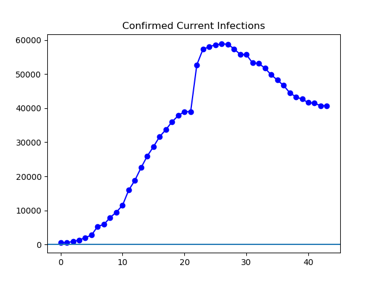

**Disclaimer**

I'm not a medical expert or any other kind of expert. Just think of me as some guy on the internet making graphs from Johns Hopkins data, because that's what I am.

**The Latest**

Today, confirmed cases continued to climb outside China at a rapid clip. The latest John Hopkins data says 17,464 people outside Mainland China have been diagnosed. This is a little over quadruple the 4258 cases diagnosed as of a week ago. The rise in cases outside Mainland China is now so fast that as of today, the number of current _active_ infections in the world is just a bit higher than yesterday. Previously, the number of worldwide active infections had been dropping; now it is essentially flat. Things continue to improve _inside_ Mainland China at a rapid rate. In the United States, the number of cases is rapidly climbing.

**The Graphs**

**Figure 1.** Here's the global total of current confirmed infections. That is, all confirmed cases, not including those now dead or recovered. It has been dropping lately, but now appears to be leveling off. The drop is due to steady improvements inside China. The leveling off has occurred because the world outside China is now producing new cases faster than Chinese cases recover.

**Figure 2**. Here is the total number of confirmed cases to date outside Mainland China. It continues to sky-rocket, and today's number is over four times the number a week ago.

**Figure 3.** A log graph confirms the exponential appearance, at least roughly, of the global cases lately.

**Figure 4.** The number of US confirmed cases continue to climb rapidly. News reports suggest that the US is still doing a relatively low level of testing, so more cases are expected to be discovered whenever the US testing facilities are able to meet the medical demand, in addition to whatever level of spread is occurring. Cases today stood at 221, nearly four times the number (59) of cases a week ago.

**Figure 5.** A log graph of US cases, for those interested in such things. As the number of cases has increased, the trendline has gotten smoother and more nearly exponential.
