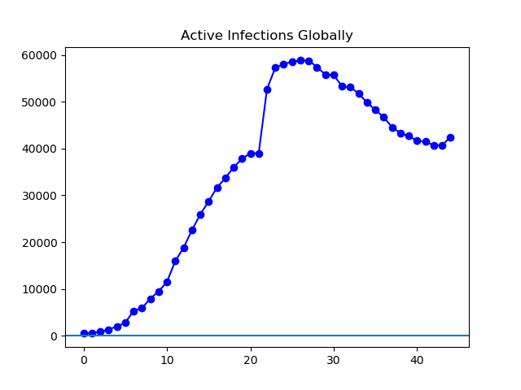
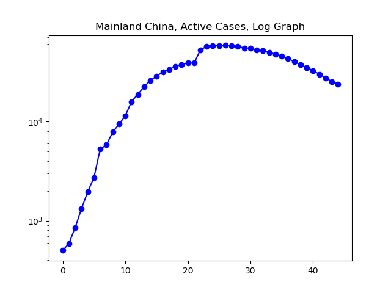
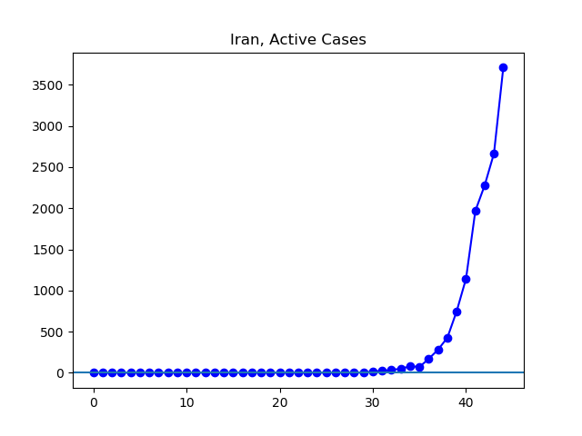
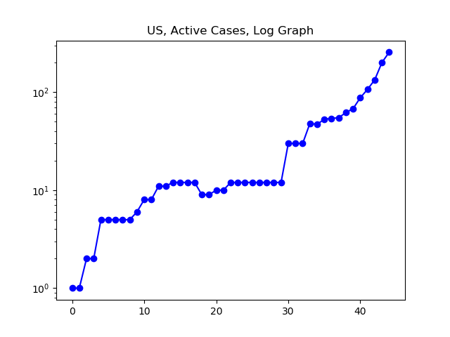

**Disclaimer**

I'm not a medical expert or any other kind of expert. I'm just a guy graphing the data on the Johns Hopkins coronavirus tracking GitHub page (source [here](https://github.com/CSSEGISandData/COVID-19/tree/master/csse_covid_19_data/csse_covid_19_daily_reports)).

**The Latest**

Coronavirus continues to spread worldwide at a rapid pace. Although the Chinese situation looks increasingly well-controlled, outside of China the number of cases is growing rapidly, and has quadrupled over the past week. In fact, though this would be hard to imagine about two weeks ago, we are on track to have more active cases outside of China than inside China some time in the next twenty-four hours.

On the subject of active cases, I have cleaned up my code considerably, and now for every area I am following only one statistic across time: the number of active, confirmed cases of the new coronavirus. If we want to understand how much it is spreading and to what degree it is or is not being contained, it seems to me that this is the number one would want to track across time. People who have recovered or died are no longer contributing to the spread; the key statistic for understanding spread, then, is the number of active cases. This is taken by taking the total number of confirmed cases across the whole outbreak, and then subtracting the dead and recovered. I am surprised that active cases are not more widely reported and tracked.

I have begun tracking the three largest global outbreaks outside China as well: South Korea, Italy, and Iran. There is a certain encouraging curvature to the log graph in the South Korea case that makes it appear, at least, that the virus may be on the path to some kind of containment in South Korea. The Italian situation is less encouraging, and the large-scale spread to other EU countries makes me inclined to add an EU graph to my collection, which perhaps I will start tracking tomorrow. Of the these three countries, Iran's situation is most dire. It's growth in cases is growing incredibly rapidly, with little to no hint of slowing, and the already difficult situation in Iran suggests their government may have more trouble than South Korea or Italy in mounting an effective response.

In the United States, case numbers continue to grow rapidly. We are over quadruple the number of cases a week ago.

**The Graphs**

All graphs track active cases, defined as the number of confirmed cases minus those dead or recovered. All graphs begin with January 22 as day "0".

**Figure 1.** As the rate of new infections outside China has begun to outpace the rate of improvement inside China, the overall global number of confirmed active infections has, for the last two days, been rising again after about two weeks of decline.

**Figure 2.** The number of confirmed active cases continues its steep decline in China, perhaps giving us hope that this success could be replicated elsewhere.

**Figure 3.** This is what the log graph of China's experience looks like. This gives a good mental picture of what success would look like in other countries as well. To the extent that a country appears to be moving toward this shape, to that extent I allow myself to hope that they are heading down the Chinese path.

**Figure 4**. As the virus continues to be found in more countries, and as more of those countries continue to have significant outbreaks, the cases outside China are maintaining a page of more than quadrupling every week. Nine more weeks of this pace would result in most of the world having coronavirus, so I can only hope we do not keep up this pace.

**Figure 5**. The log graph shows steady uphill movement, showing that the situation outside China remains more or less exponential, without any significant trend toward slowing over the past four weeks.

**Figure 6.** The number of cases in South Korea continue to rise rapidly. However, see Figure 7, the log graph, for a perhaps encouraging sign.

**Figure 7.** For all practical purposes, we can ignore the first four weeks of this graph, as it all covers a time when South Korea had no more than a couple dozen active cases. Around day 30, a sharp spike began, and since then the rate of increase, compared to exponential growth, has been slowing. I hope this continues until it levels off. It is still worth noting, though, that growth in South Korea is very fast, with current cases between double and triple those of a week ago. We cannot say the situation is under control yet, at least not on the basis of these numbers.

**Figure 8**. Italy is at quadruple its cases a week ago, a noticeably faster rate of growth than South Korea is experiencing.

**Figure 9.** I suppose an optimist might see the beginnings of a flattening in the log graph here, but the situation is still rapidly escalating in Italy.

**Figure 10.** Iran is now reporting _thirteen_ times the number of cases it reported a week ago.

**Figure 11.**

**Figure 12.** The United States, according to the latest daily numbers from Johns Hopkins, is at 256 cases as of about 7 pm today, nearly five times the number a week ago. However -- this may give you a sense of how fast things are moving -- as of right now, just before 11 pm, Johns Hopkins is reporting 330 cases.

**Figure 13.**
