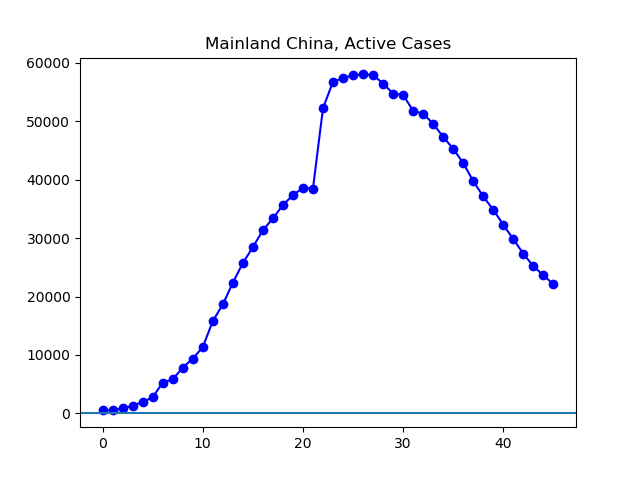

**Disclaimer**

I'm not a medical expert or any other kind of expert. I'm just someone graphing the data that can be found on the Johns Hopkins GitHub ([source](https://github.com/CSSEGISandData/COVID-19/tree/master/csse_covid_19_data/csse_covid_19_daily_reports)).

**The Latest**

Today is the first day that the number of active confirmed cases outside Mainland China (25,184) has outnumbered the number of cases inside Mainland China (22,104). The situation inside Mainland China continues to rapidly improve -- the number of active cases there is down about 15,000 from a week ago. On the other hand, the situation outside Mainland China is rapidly getting worse. The current 25,184 cases are well over triple the 6,762 confirmed active cases as of a week ago.

There are a couple of ways to think about the situation outside Mainland China. One is to focus on the three largest outbreaks: South Korea, Italy, and Iran, all reporting thousands of cases. But the cases in Italy are accompanied by outbreaks in in Germany and Spain which are also of significant size. So it seemed good to me to start tracking the EU as a unit as well. Between the EU (7,525), South Korea (6,862), and Iran (4,009), the 18,396 cases make up about three-quarters of the number outside China. And combined with China, these four zones of infection make up about 92% of the global total.

However, while its reported cases are still smaller, I take a special interest in the US situation, with 392 cases reported this evening by Johns Hopkins, up more than sixfold from the 62 cases reported a week ago.

**The Graphs**

**Figure 1.** This graph tells a story with three major stages. In the first, the total number of active infections sky-rocketed, mostly driven by infections in China. Then, as China began to gain some level of control over the situation, the improvements in China drove a decline in the size of the overall problem. However, starting in the past couple of days, the overall number has been rising, this time driven not by the Chinese situation, but by the rapidly increasing number of cases in the rest of the world.

**Figure 2.** The situation continues to improve steadily in China.

**Figure 3.** A log graph does an especially good job of showing the outbreak in China being gradually brought under control, and then reversed.

**Figure 4.** The total number of cases outside China continues to grow rapidly.

**Figure 4**. A log graph shows that the growth rate outside China continues to look pretty close to the straight line that would indicate exponential growth.

**Figure 5**. Growth in active cases is very rapid in the European Union, with current cases more than eight times the number reported a week ago.

**Figure 6.** The log graph here is most useful when looking at cases after day 30; the previous days concern a period when there were very low numbers of infections.

**Figure 7**. This graph looks about like the graph of the European Union as a whole, which makes sense, as the E.U. outbreak is, so far, still mostly found in Italy.

**Figure 8.** Although the log curve has become a little less steep lately, it is important to note still that Italy still is reporting about five times as many cases as a week ago, which is very rapid growth.

**Figure 9.** The South Korean outbreak is about the same size as the outbreak so far reported for all of the European Union. However, while E.U. reported cases have grown eightfold in the past week, the Korean cases have approximately doubled in the past week. See the next graph for signs that Korea's outbreak may be slowing.

**Figure 10**. The number of cases is South Korea is still rising substantially, but as shown on this log graph, there are some signs that the outbreak may be on a path to leveling off.

**Figure 11**. The Iranian situation continues to develop rapidly, with over nine times the number of cases reported a week ago.

**Figure 12.** Log graph of the Iranian situation.

**Figure 13.** The outbreak in the United States continues to grow rapidly, which current figures over six times the number reported a week ago.

**Figure 14.** The log graph of US cases does not, so far, show signs of the situation coming under control.
