**Disclaimer**

I'm not a medical expert or any other kind of expert. I'm just an interested
amateur graphing out the data found at Johns Hopkins University's coronavirus
GitHub
([source](https://github.com/CSSEGISandData/COVID-19/tree/master/csse_covid_19_data/csse_covid_19_daily_reports)).
All numbers refer to governmentally-confirmed cases, minus those who can no
longer spread the virus because they either died or have recovered. So a
comparison, such as "there are more cases in China than in Italy", or a
statement such as "the situation in Iran is getting worse", is simply a
reflection of the number of confirmed active cases both governments have
reported; it is not a judgment about the reliability of those figures. I use
_territory_ in a special sense here, to refer to the geographical units by
which Johns Hopkins categorizes its data. These _territories_ are often
sovereign nations, but not always. For example, while Hong Kong is part of
China, Johns Hopkins separates its data from that of Mainland China, and so for
convenience, so do I. I am simply following the lead of the best source of data
I know, and none of this should be taken as a political judgment about what
constitutes a real "country" or a judgment about disputed territories.

**The Latest**

Although the largest number of cases in any one territory remains Mainland
China, that situation continues to rapidly improve. There are about 20,282
cases in China, down from 34,838 a week ago.

The next-largest outbreak is the one in the European Union (9519), which, as a
zone with largely open borders, seems to be somewhat like a country in that
respect. Most of the cases there are in Italy (6387), though with substantial
outbreaks in Spain, Germany, and France. The situation in the European Union is
escalating rapidly, with the current number of cases over five times that
reported a week ago. Just yesterday, a lockdown was placed on about 16 million
people in northern Italy, and it remains to be seen what effects that policy
might have.

The outbreak in South Korea has 7146 cases. The number of active cases
continues to grow daily, but has been showing some signs of leveling off. The
number has not quite doubled in the last week, making the current spread slower
than the same week in the E.U., Iran, or the United States.

Iran has 4238 cases, about six times the number a week ago.

Finally, my homeland, the United States, has 508 cases, over seven times the
number seen a week ago. The US continues to struggle with rolling out
large-scale testing of suspected cases, so the picture is still unclear here.

**The Graphs**

All graphs give the number of active confirmed cases, beginning with January
22nd as "day 0". Active confirmed cases is defined as the total cumulative
number of governmentally confirmed cases, minus the reported deaths and
recoveries.

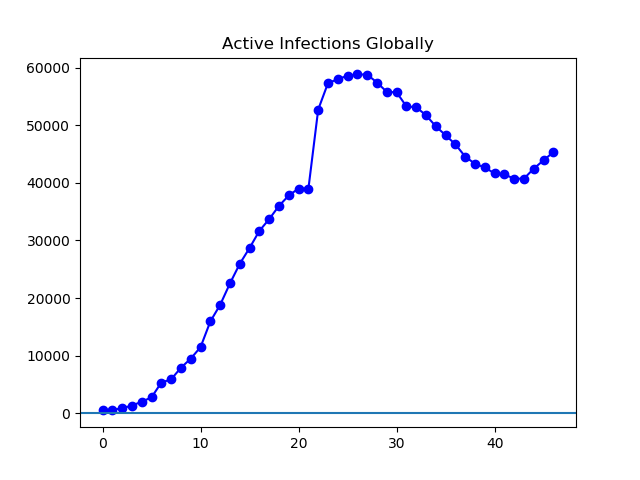

**Figure 1**. First, active cases rose globally, almost entirely driven by the
rise in Chinese cases, and then fell due to a fall in Chinese cases. Now, where
most cases are no longer in China, China's situation continues to improve
(Figure 2) but the overall count is rising driven by cases outside Mainland
China (Figure 3).

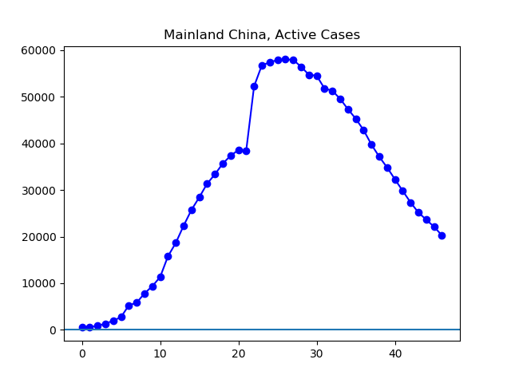

**Figure 2**. The situation continues to improve steadily in Mainland China,
and now stands at 20,282, down from a peak of 58,809.

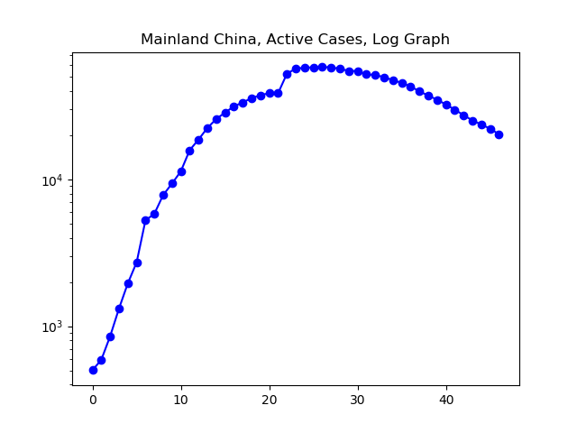

**Figure 3.** The log graph shows the story of how the growth rate of the virus
was gradually and steadily brought under control. It remains to be seen whether
these improvements will continue as the Chinese economy works its way back to
full production.

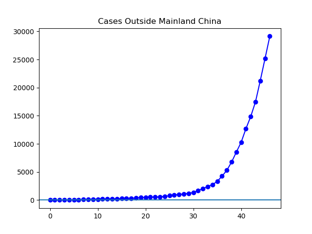

**Figure 4**. The number of cases outside Mainland Chins continues to grow
rapidly. The current number of cases represent more than a threefold increase
from a week ago.

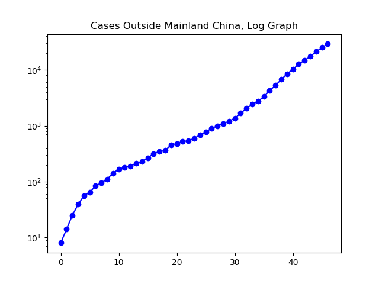

**Figure 5.** The upward growth of cases outside China, as shown on a log plot,
remain disturbingly similar to the straight line that would represent perfectly
exponential growth. Growth is in no sense contained outside of China.

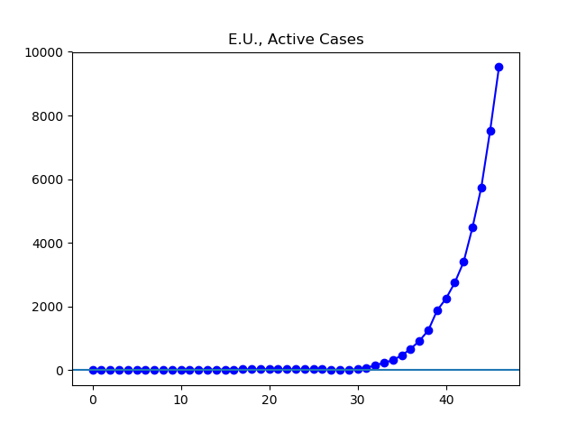

**Figure 6.** Growth in the E.U.'s cases has been particularly severe. While
globally cases have grown between threefold and fourfold in the last week, they
have grown fivefold in the E.U.

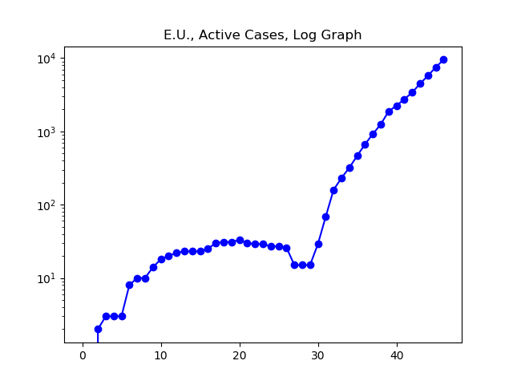

**Figure 7.** The log graph of E.U. cases illustrates just how sharply the
growth rate continues unabated.

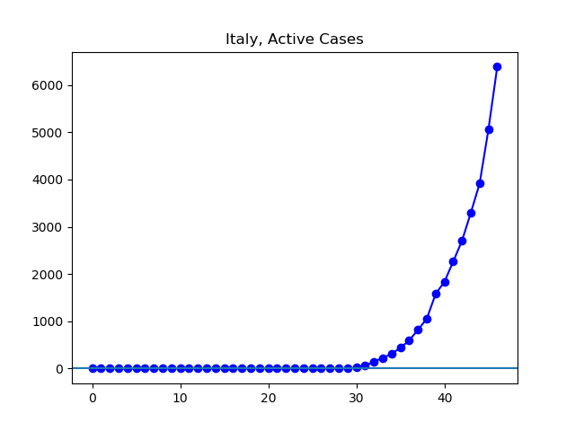

**Figure 8.** The majority, but by no means all, of the E.U. cases continue to
be found in Italy, where the number of cases has increased fourfold in the past
week.

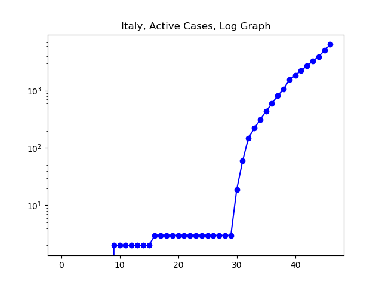

**Figure 9**. One might argue that perhaps the earliest signs of Italy reaching
a slowing in growth might be visible here. Alternately, it could be that Italy
is simply too overwhelmed to be effectively counting cases, as its unusually
high death rate might suggest. It remains to be seen what effect the recent
lockdown of a quarter of Italy's population will have.

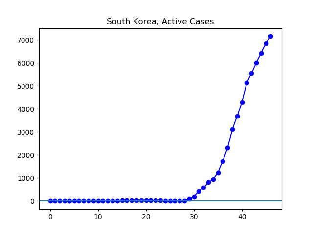

**Figure 10.** The number of active cases in South Korea continues to grow.
However, as can be seen in Figure 11, there has been an encouraging slowing in
the rate of growth lately.

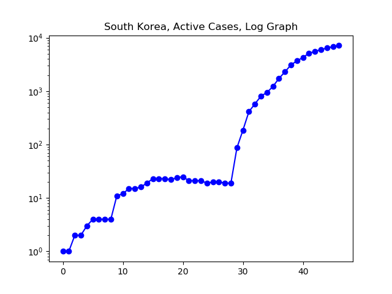

**Figure 11.** The log graph of South Korean cases seems to show the epidemic
growing more and more slowly there.

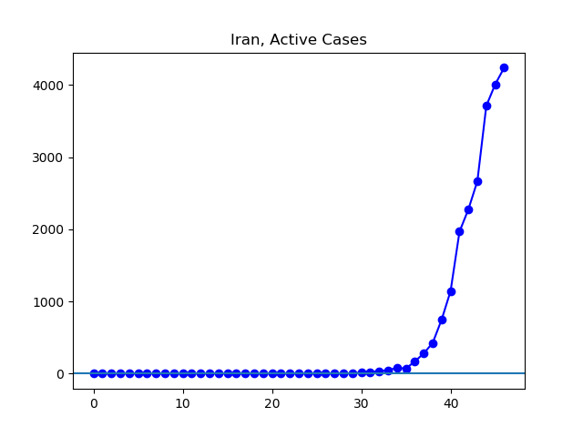

**Figure 12.** The Iranian situation continues to develop rapidly, with nearly
six times as many cases now as a week ago.

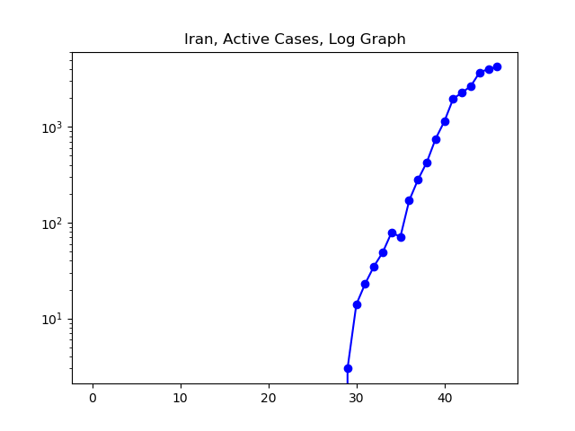

**Figure 13.** It remains to be seen whether the situation in Iran, where the
data is viewed with skepticism by many, will level off before infecting a very
large portion of the country.

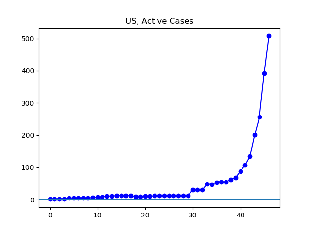

**Figure 14**. The number of cases in the US continues to grow rapidly, even as
problems continue with supplying adequate numbers of lab tests.

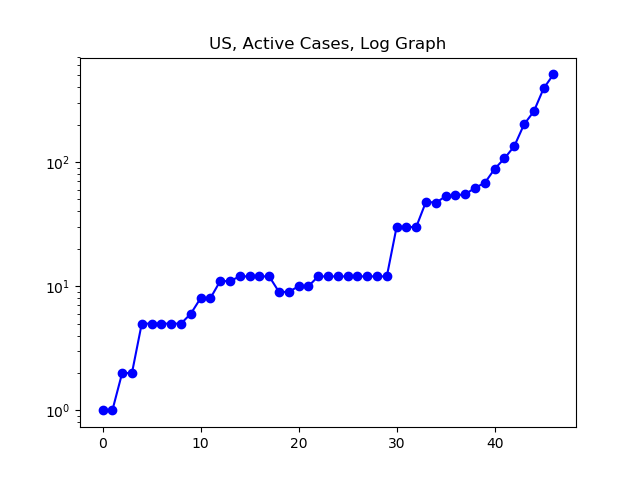

**Figure 15.** After a few weeks in which very little testing was done and the
number of cases in the US seemed to plateau at around 15, and then at around 35
cases, there has been a rapid and steady increase in the number of cases.

**The Data**

My little code produces a readout of the active cases it calculates, in lists
beginning with January 22. Here are the numbers:

`Global Active:
[510, 605, 879, 1357, 2010, 2784, 5340, 5906, 7921, 9490, 11495, 15953, 18832, 22548, 25948, 28697, 31662, 33699, 36001, 37804, 39007, 38954, 52704, 57306, 57971, 58591, 58809, 58779, 57398, 55775, 55702, 53255, 53122, 51714, 49802, 48243, 46665, 44541, 43290, 42659, 41622, 41455, 40699, 40741, 42474, 43919, 45337]`  
`Mainland China:
[502, 591, 854, 1318, 1957, 2723, 5262, 5817, 7818, 9356, 11337, 15783, 18654, 22347, 25732, 28445, 31360, 33379, 35668, 37378, 38581, 38504, 52251, 56799, 57391, 57933, 58046, 57938, 56480, 54761, 54543, 51794, 51325, 49569, 47347, 45297, 42856, 39745, 37137, 34838, 32304, 29802, 27335, 25169, 23643, 22104, 20282]` 
`Outside Mainland China:
[8, 14, 25, 39, 56, 64, 84, 95, 111, 142, 167, 180, 188, 212, 227, 265, 317, 343, 361, 457, 476, 523, 538, 595, 685, 780, 896, 999, 1095, 1200, 1371, 1677, 2047, 2418, 2755, 3332, 4258, 5300, 6762, 8545, 10283, 12693, 14853, 17464, 21227, 25184, 29136]`  
`E.U.:
[0, 0, 2, 3, 3, 3, 8, 10, 10, 14, 18, 20, 22, 23, 23, 23, 25, 30, 31, 31, 33, 30, 29, 29, 27, 27, 26, 15, 15, 15, 29, 69, 160, 231, 320, 465, 669, 924, 1250, 1878, 2247, 2751, 3401, 4481, 5743, 7525, 9519]`  
`Italy:
[0, 0, 0, 0, 0, 0, 0, 0, 0, 2, 2, 2, 2, 2, 2, 2, 3, 3, 3, 3, 3, 3, 3, 3, 3, 3, 3, 3, 3, 3, 19, 59, 150, 221, 311, 438, 593, 821, 1053, 1577, 1835, 2263, 2706, 3296, 3916, 5061, 6387]`  
`South Korea:
[1, 1, 2, 2, 3, 4, 4, 4, 4, 11, 12, 15, 15, 16, 19, 23, 23, 23, 22, 24, 25, 21, 21, 21, 19, 20, 20, 19, 19, 87, 186, 415, 578, 807, 945, 1227, 1731, 2302, 3107, 3689, 4277, 5128, 5545, 6012, 6416, 6862, 7146]`  
`Iran:
[0, 0, 0, 0, 0, 0, 0, 0, 0, 0, 0, 0, 0, 0, 0, 0, 0, 0, 0, 0, 0, 0, 0, 0, 0, 0, 0, 0, 0, 3, 14, 23, 35, 49, 79, 71, 170, 281, 427, 749, 1144, 1968, 2278, 2667, 3710, 4009, 4238]`  
`US:
[1, 1, 2, 2, 5, 5, 5, 5, 5, 6, 8, 8, 11, 11, 12, 12, 12, 12, 9, 9, 10, 10, 12, 12, 12, 12, 12, 12, 12, 12, 30, 30, 30, 48, 47, 53, 54, 55, 62, 68, 88, 107, 134, 201, 256, 392, 508]`  

**The Code**

Here is the code that makes the graphs and prints the data above:


"""Make graphs about nCoV-19."""

import csv
import datetime
import matplotlib.pyplot as plt

def graph_active_cases(daylist, countries, name):
    """Graph active cases in a list of countries over time.

    Daylist is our list of csv files from Johns Hopkins.
    country is a list of strings, each of which must match
    a country name as used in the Johns Hopkins csv files.
    name is the name of the country or collection of countries
    being graphed, and is used to generate graph captions.
    """
    active_list = []
    for day in daylist:
        confirmed = 0
        dead = 0
        recovered = 0
        for state in countries:
            confirmed += local_count(day, state, 1, 3)
            dead += local_count(day, state, 1, 4)
            recovered += local_count(day, state, 1, 5)
        active_list.append(confirmed - dead - recovered)
    two_graphs(active_list, name + ', Active Cases')
    print(name + ":")
    print(active_list)

def two_graphs(y, caption):
    """Make a linear and a log graph from some list with a caption."""
    quick_graph(y, caption, 'linear')
    quick_graph(y, caption + ', Log Graph', 'log')

def quick_graph(y, caption='', scale='linear'):
    """Make a quick graph from some list with a caption."""
    x = []
    for i in range(len(y)):
        x.append(i)
    plt.plot(x, y, 'b-o')
    plt.yscale(scale)
    plt.axhline()
    plt.title(caption)
    plt.show()

def local_count(dayfile, locality, loc_column=1, num_column=3):
    """Sum up numbers in num_column in dayfile for locality in loc_column.

    Dayfile is the name of a csv file containing data. locality
    is a place in the world, expressed as a string matching naming
    conventions as found in the csv file. num_column is the loc_column
    the data is being summed for. loc_column is the column in the
    file where the locality name is.
    """
    with open(dayfile) as csv_file:
        csv_reader = csv.reader(csv_file, delimiter=",")
        line_count = 0
        cases = 0
        for row in csv_reader:
            if line_count != 0:
                if row[num_column] and row[loc_column] == locality:
                    cases += int(row[num_column])
            line_count += 1
    return cases

def global_count(dayfile, num_column=3):
    """Add up all numbers in num_column of dayfile."""
    with open(dayfile) as csv_file:
        csv_reader = csv.reader(csv_file, delimiter=',')
        line_count = 0
        cases = 0
        for row in csv_reader:
            if line_count != 0:
                if row[num_column]:
                    cases += int(row[num_column])
            line_count += 1
    return cases

def generate_daylist(first, last):
    """Generate list of csv file names.

    The Johns Hopkins data this program uses is found in a lists
    of csv files. This creates a list of such files, Beginning
    at a 'first' date and ending at and including the 'last' date.
    first and last must be datetime 'date' objects.
    """
    daylist = []
    counter = first
    one_day = datetime.timedelta(days=1)
    while counter != last + one_day:
        daylist.append(str(counter)[5:] + '-' + str(counter)[:-6] + '.csv')
        counter = counter + one_day
    return daylist

# Generate list of csv files to work with.
first_day = datetime.date(2020, 1, 22)
last_day = datetime.date(2020, 3, 8)
daylist = generate_daylist(first_day, last_day)

# Calculate number of cases outside Mainland China.
outside = []
for day in daylist:
    outside.append(global_count(day) - local_count(day, 'Mainland China'))

# Calculate number of active cases worldwide.
global_active = []
for day in daylist:
    confirmed = global_count(day, 3)
    dead = global_count(day, 4)
    recovered = global_count(day, 5)
    global_active.append(confirmed - recovered - dead)

# Define the European Union
eu = ['Austria', 'Belgium',
      'Croatia', 'Cyprus', 'Czech Republic', 'Denmark',
      'Estonia', 'Finland', 'France',
      'Germany', 'Greece', 'Hungary'
      'Ireland', 'Italy',
      'Latvia', 'Lithuania', 'Luxembourg',
      'Malta', 'Netherlands',
      'Poland', 'Portugal', 'Romania',
      'Slovakia', 'Slovenia'
      'Spain', 'Sweden']

# Make the graphs, print the data.
quick_graph(global_active, "Active Infections Globally")
print("Global Active:")
print(global_active)

graph_active_cases(daylist, ['Mainland China'], 'Mainland China')

two_graphs(outside, "Cases Outside Mainland China")
print("Outside Mainland China:")
print(outside)

graph_active_cases(daylist, eu, 'E.U.')
graph_active_cases(daylist, ['Italy'], 'Italy')
graph_active_cases(daylist, ['South Korea'], 'South Korea')
graph_active_cases(daylist, ['Iran'], 'Iran')
graph_active_cases(daylist, ['US'], 'US')


---

This page is released under the [CC0
1.0](https://creativecommons.org/publicdomain/zero/1.0/) license._

