**Disclaimer**

I’m not a medical expert or any other kind of expert. I’m just an interested amateur graphing out the data found at Johns Hopkins University’s coronavirus GitHub ([source](https://github.com/CSSEGISandData/COVID-19/tree/master/csse_covid_19_data/csse_covid_19_daily_reports)).

All numbers refer to governmentally-confirmed cases, minus those who can no longer spread the virus because they either died or have recovered. Unless otherwise noted, terms like "increasing" or "decreasing" simply refer to official figures. I have a limited ability to speculate beyond the official figures.

I use _country_ in a special sense here, to refer to the geographical units by which Johns Hopkins categorizes its data. These _countries_ are often sovereign nations, but not always. For example, while Hong Kong is part of China, Johns Hopkins separates its data from that of Mainland China, and so for convenience, so do I. I am simply following the lead of the best source of data I know, and none of this should be taken as a political judgment about what constitutes a real “country” or a judgment about disputed territories.

**The Latest**

Last night, perhaps in part due to the increasing spread of the novel coronavirus, markets took quite a hit. The worldwide number of cases continues to grow, despite continued improvement in Mainland China. Outside Mainland China, it is something like three-quarters of the cases are in the EU, South Korea, and Iran, although coronavirus has touched over 100 countries.

South Korea's case shows the most promise -- the growth in cases continues to slow. Meanwhile, the infection is still growing more rapidly in the E.U., where the recent lockdown of Lombardy was extended, to some degree, to all of Italy. I find that there is widespread skepticism about the quality of data coming from Iran, but I will graph it anyhow.

**The Graphs**

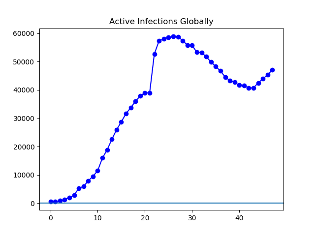

**Figure 1.** The global number of infected continues to grow.

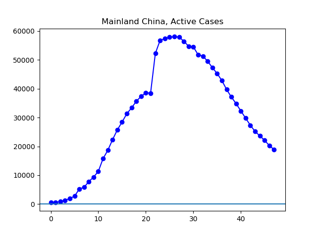

**Figure 2.** The number of cases in Mainland China continues to decrease at an encouraging rate. China reports 18,880 active cases, down from 32,304 a week ago.

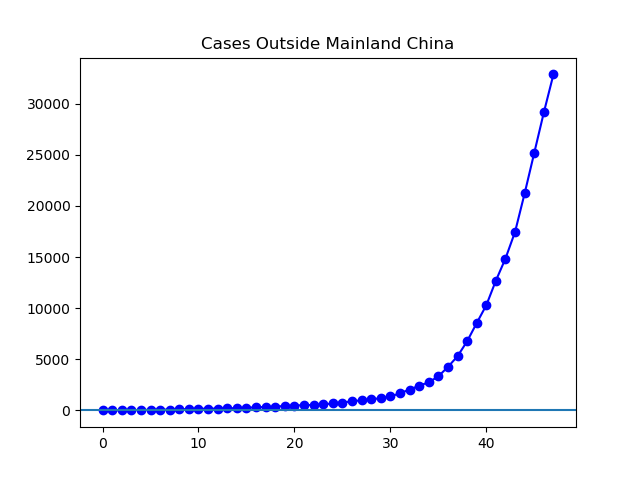

**Figure 3**. Outside Mainland China, cases continue to grow. The current count of 32,847 is just over triple the 10,283 a week ago.

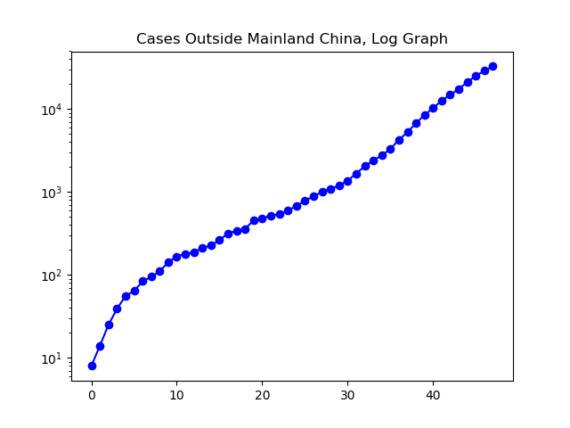

**Figure 4.**

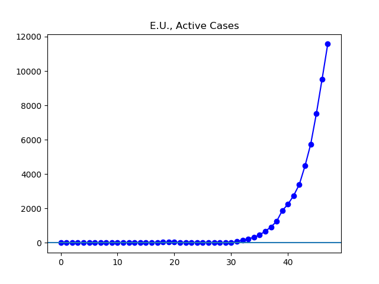

**Figure 5.** Rapid growth in reported cases is occurring in the E.U.

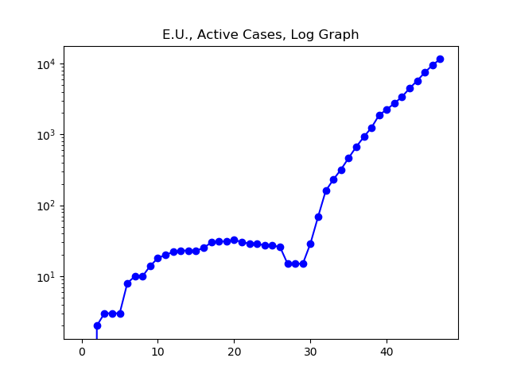

**Figure 6.**

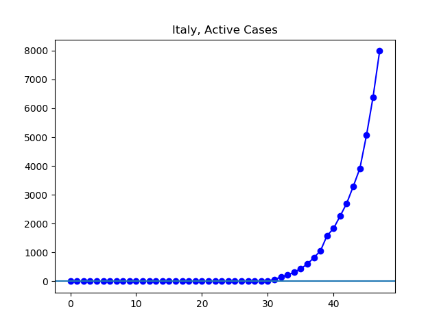

**Figure 7.** Italy's 7985 cases are more than quadruple the 1835 cases a week ago.

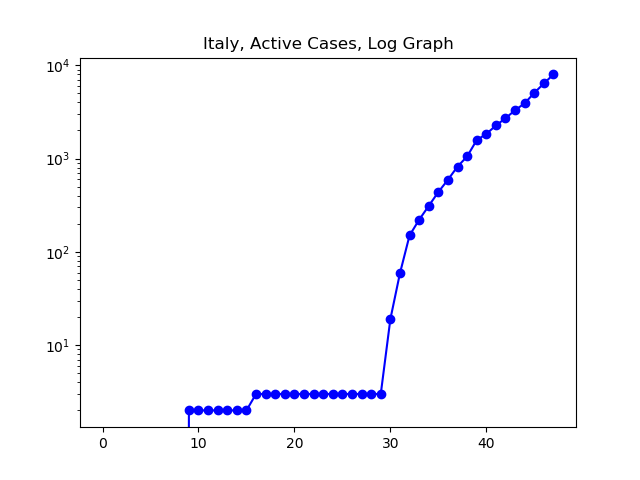

**Figure 8.**

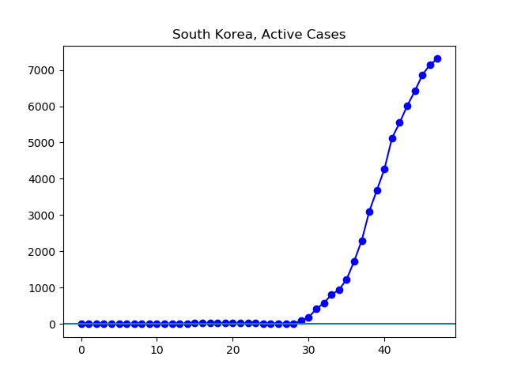

**Figure 9.** Although South Korea's number of active cases continues to grow, some slowing is visible. The slowing is even more clearly visible in Figure 10.

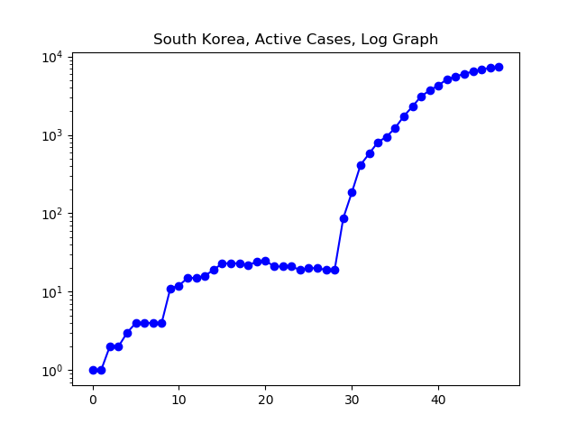

**Figure 10.** On a log graph, the gradual decline in the growth rate of South Korea's cases is more clearly visible.

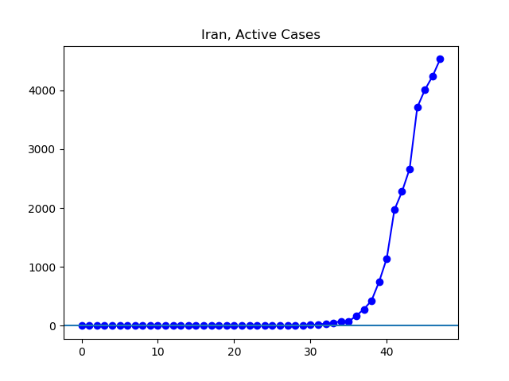

**Figure 11.** I am completely unable to say what the data from Iran means. There are various reports that the Iranian situation is much worse than Iran is publicly admitting.

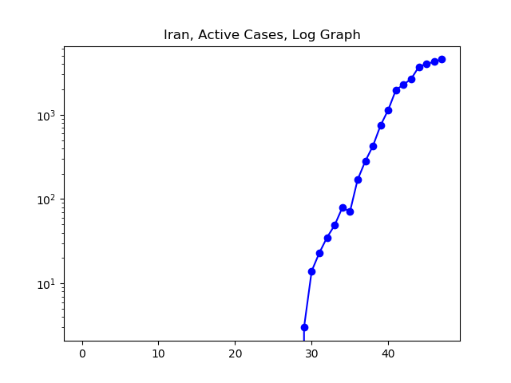

**Figure 12.**

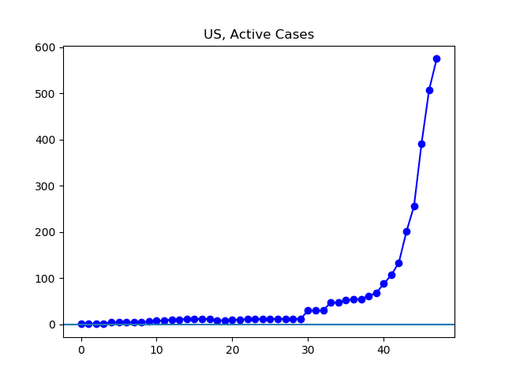

**Figure 13**. The number of new cases was lower today than the previous two days. I do not know whether this represents the US starting to get a handle on the testing situation, or whether it simply represents a lack of adequate testing. The pace of reported testing seems to have increased significantly over the last few days, but as of this afternoon _The Atlantic_ was only able to confirm that about 4,000 people had been tested (source).
