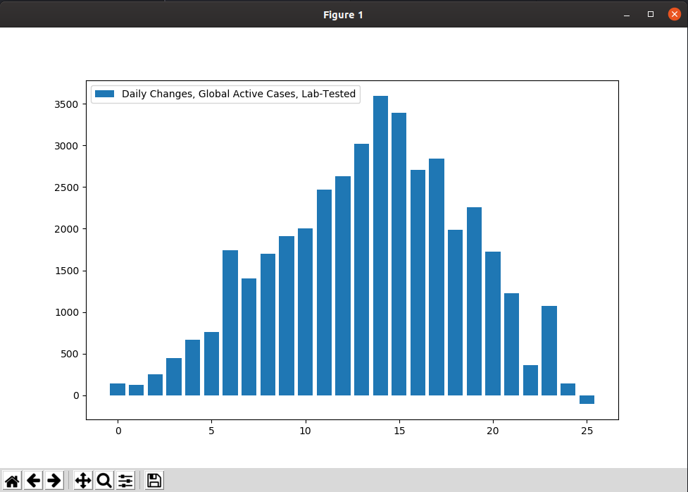

_Post originally written February 16, 2020._

As someone who likes statistics and doesn't like disease, I've been following
numbers each day on the new coronavirus. Unfortunately, I don't have medical
expertise, and like everyone else away from the front lines, I'm limited to
what data we have. So take anything here with a bag of salt: it's just some guy
on the internet messing around with the numbers and seeing what he can see.

Fortunately, although the medical details are often murky, we are getting daily
updates on some key figures. The principal figures I've been interested in are

- confirmed cases: the total number of confirmed cases so far
- suspected cases: the total number of people identified by their governments
  as being suspected of carrying the virus
- recovered cases: the total number of people who have recovered so far
- deaths

These are the numbers most often reported in the news: especially confirmed
cases. The news was also, until February 12th, beginning to fill with headlines
about whether coronavirus might be peaking. As to whether it really is peaking,
I have no way to know, but at the very least I can check if the data was
consistent with peaking, and it did seem to be tending in that direction.

I have found these numbers in the [WHO Situation
Reports](https://www.who.int/emergencies/diseases/novel-coronavirus-2019/situation-reports),
as well as on a nifty site called [outbreak.cc](https://outbreak.cc/), on
[Wikipedia](https://en.wikipedia.org/wiki/2019%E2%80%9320_Wuhan_coronavirus_outbreak),
and, finally, from the [Chinese
government](http://www.nhc.gov.cn/yjb/pzhgli/new_list.shtml). That last site is
in Chinese, but it all auto-translates easily enough. _We have [the
technology.](https://www.youtube.com/watch?v=BthNjd_jUl4)_ They all seem
broadly in agreement with each other, once allowances are made for occasional
retroactive updates to data, the different times of day that sites are updated,
and two big definitional issues.

The first has to do with what "China" is, and for my purposes I am including
mainland China, Hong Kong, and Taiwan as a single nation. Although various
sensitive political issues are involved, the mainland, Hong Kong, and Taiwanese
governments all agree that they constitute a single nation, and so I will
follow their lead for the purposes of this exercise and wish them the best as
they continue to work out their differences.

The second definitional issue has to do with what a "confirmed case" is. Until
February 12th, this was not a problem. Talk of the virus peaking was common in
my Google News feed, and the WHO and China were on the same page about how many
confirmed cases there were.

Then, on February 12th, the government of China suddenly added about 15,000
"confirmed cases" in a single day, and announced that these numbers were due to
a change in the definition of "confirmed". Prior to February 12th, only lab
tests were acceptable as confirmation; starting February 12th, CT scans were
also admissible. The World Health Organization, however, continued reporting
lab cases most prominently in its situation reports.

At the same time, two other trends were becoming increasingly important.
Tragically, a larger number of people were beginning to die of the disease;
somewhere on the range of 100 to 150 per day. On the other hand, great numbers
of people were beginning to recover from the disease; something like 1000 to
1500 per day.

The WHO spoke positively about China's recording of CT scan cases, while still
choosing to keep its own data consistent with pre-February 12th norms. The
Chinese government continued to report lab data as well, as a subset of its
total cases. Since both the WHO and China appear to see some value in the
other's approach, I have also chosen to track both the broader and narrower
senses of "confirmed".

In the case of the Chinese data, which has been subject to redefinitions, I
find myself unconvinced that we can meaningfully speak of long-term trends in
terms of the "confirmed" versus "suspected" distinction. It seems, especially
since February 8th, that there has been a lot of movement from "suspected" to
"confirmed" in a way that causes apparent shifts in numbers but does not have a
clear relevance (so far) for understanding the full situation. So for my
broader measure, I have added both together. This is my "broader test" number.

For both the WHO and Chinese approaches, I think it is useful to think in terms
of "active" cases. If we want to get a handle on how big the disease is _right
now_, and how many people are known or suspected to be capable of spreading it,
we need to avoid including the recovered and the dead.

The math is simple, but tedious. Python can handle this. First, I keep a
running tab on six numbers, which takes all of a minute or two a day and a
couple website visits to update. Right now, that looks like this (all lists
begin January 20th):


\# Number of lab-confirmed cases (WHO approach).
lab\_tested = \[295, 445, 580, 845, 1317, 2015, 2800, 4581, 6058, 7813,
              9821, 11948, 14551, 17389, 20628, 24553, 28276, 31439, 34876,
              37552, 40553, 43103, 45171, 46997, 49053, 50580, 51857\]

# Number of cases reported by governments as "confirmed" (mostly Chinese).
broad\_tested = \[295, 445, 580, 845, 1317, 2015, 2800, 4581, 6058, 7813,
                9821, 11948, 14551, 17389, 20628, 24553, 28276, 31439, 34876,
                37552, 40553, 43099, 44919, 60326, 64442, 67100, 69104,
                71330\]

# Cases reported as suspected by governments.
suspected = \[54, 436, 393, 1072, 1965, 2684, 5794, 6973, 9239, 12167,
             15238, 17988, 19544, 21558, 23214, 23260, 24702, 26539,
             27657, 28942, 23598, 21675, 16067, 13435, 10109, 8969,
             8228, 7264\]

# Cases reported as recovered by governments.
recovered = \[25, 28, 28, 34, 38, 49, 51, 60, 104, 125, 175, 255, 341, 489,
             648, 912, 1175, 1563, 2075, 2675, 3324, 4039, 4783, 5988,
             6955, 8192, 9434, 10984\]

# Total deaths reported.
dead = \[6, 9, 17, 25, 41, 56, 80, 106, 132, 170, 213, 259, 304, 362,
        426, 492, 565, 638, 724, 813, 910, 1018, 1115, 1369, 1383, 1526,
        1666, 1775\]

# People outside China reported to have the coronavirus.
outsiders = \[4, 4, 7, 10, 11, 23, 29, 37, 56, 68, 82, 106, 132, 146,
             153, 159, 191, 216, 270, 288, 307, 319, 395, 441, 447,
             505, 526, 683\]


Then, it's a matter of just a little math to work up our lists for the broadest
and narrowest measures of total active cases.


active\_narrow = \[\] 
for x in range(len(lab\_tested)): 
    active\_narrow.append(lab\_tested\[x\] - dead\[x\] - recovered\[x\])


Since viewing a trend works best with a graphic, we can import
`matplotlib.pyplot` and whip up a function to draw a quick, dirty graph:


import matplotlib.pyplot as plt

def quick\_dirty\_graph(y, caption):
    """Make a quick, dirty graph from some list with a caption."""
    x = \[\]
    for i in range(len(y)):
        x.append(i)
    plt.bar(x, y, label=caption)
    plt.legend()
    plt.show()


And then all we need to do is call it, like so:


quick\_dirty\_graph(active\_narrow, "Global Active Cases (Lab-Tested Measure).")
quick\_dirty\_graph(active\_broad, "Global Active Cases (Broadest Measure).")


And it gives these graphs:

Certainly, we could do more to make the graphs pretty and informative, but if
the goal is just to quickly visualize all sorts of data, we've got a framework
here where we can quickly whip up code to do different kinds of math and take a
look.

For example, both measures seem to show what looks like a recent peak in active
cases. I say that as someone just eyeballing the numbers, of course. Consult
your national health service for any kind of data you'd actually use, etc.

Perhaps we'd like to see the day to day changes more clearly. We could draw up
a function that takes, essentially, the derivative of some list:


def delta\_list(data):
    x = \[\]
    for i in range(1, len(data)):
        x.append(data\[i\] - data\[i-1\])
    return x


And then we can use that to call up the daily changes:


narrow\_deltas = delta\_list(active\_narrow)
caption = "Daily Changes, Global Active Cases, Lab-Tested"
quick\_dirty\_graph(narrow\_deltas, caption)

broad\_deltas = delta\_list(active\_broad)
caption = "Daily Changes, Global Active Cases, Broadest Measure."
quick\_dirty\_graph(broad\_deltas, caption)


And we get the following two graphs:

The lab-tested measure shows about two weeks of escalating increases in active
cases, following by smaller and smaller increases. The broadest measure, which
includes all sorts of nebulous "suspected" and "clinical cases", is more
chaotic, and shows the disconcerting spike at February 12th, but outside of the
spike it does seem to show a peak in growth, even followed by a number of days
where cases have declined.

Now, with any outbreak like this, the big concern is exponential growth. If the
number of active cases were to grow at some steady percentage rate each day, be
it 10% or 50% or even 1%, that trend would, if not stopped, eventually lead to
everyone getting the disease. And with a mortality rate that is in the
neighborhood of perhaps 2%, that would be disturbing. So we might be curious
about what is happening to the percentage rate of growth, to see just how
closely this outbreak matches an exponential curve.

And so we can draw up another function that draws up the percentage changes we
want, and then call it appropriately.


def percent\_changes(data):
    """Show how a list changes from index to index, as a percentage."""
    x = \[\]
    for i in range(1, len(data)):
        x.append((100 \* (data\[i\] - data\[i-1\]) / data\[i-1\]))
    return x

percentages\_narrow = percent\_changes(active\_narrow)
caption = "Daily Percent Changes, Lab-Tested Active Cases"
quick\_dirty\_graph(percentages\_narrow, caption)

percentages\_broad = percent\_changes(active\_broad)
caption = "Daily Percent Measure, Broadest Measure of Active Cases"
quick\_dirty\_graph(percentages\_broad, caption)


This gives us the following:

And so, on both measures, we see that the daily growth rate is anything but
stable, and in fact has been steadily dropping from early in the outbreak. Now,
it's garbage in, garbage out if the data doesn't accurately reflect the real
situation, and an amateur like me isn't at all in a position to say that the
trends will hold.

But I hope the trends are real, and I hope they hold up, and I'll be keying in
my various data and building these and other graphs daily for at least the next
few days.

And because I am not aware of anyone else online who is running these six
graphs on a regular basis, I plan to post updated graphs day by day as new data
comes up.

---

_This page is released under the [CC0
1.0](https://creativecommons.org/publicdomain/zero/1.0/) license._

