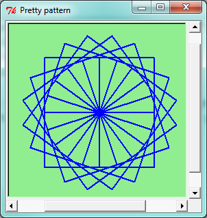

*2019*

Below are exercises from chapter 4 of *[How to Think Like a Computer Scientist:
Learning with Python 3](index.html)* The bits in italics are from the book; the
code is my solutions.

# 4.9.1 -- Draw some squares

*Write a void (non-fruitful) function to draw a square. Use it in a program to
draw the image shown below. Assume each side is 20 units. (Hint: notice that
the turtle has already moved away from the ending point of the last square when
the program ends.)*


def draw_square(nm):
    """Takes a turtle (nm), draws a square with it, and then
    moves the turtle to the right."""
    for dummy in range(4):
        nm.forward(20)
        nm.left(90)

    nm.penup()
    nm.forward(40)
    nm.pendown()

import turtle 

alex = turtle.Turtle()
alex.color("HotPink")
alex.pensize(3)
wn = turtle.Screen()
wn.bgcolor("lightgreen")

for dummy in range(5):
    draw_square(alex)

wn.mainloop()


# 4.9.2 -- Draw some more squares

*Write a program to draw this. Assume the innermost square is 20 units per
side, and each successive square is 20 units bigger, per side, than the one
inside it.*


"""Use a turtle to create a concentric arrangement of squares"""

def draw_square(ttl, len):
    """Takes a turtle ttl and uses it to create a square
    of sides len long."""

    ttl.pendown()          # Makes sure the turtle is ready to draw.
    for dummy in range(4):
        ttl.forward(len)
        ttl.left(90)
    ttl.penup()             # Position turtle for next square
    ttl.backward(10)
    ttl.right(90)
    ttl.forward(10)
    ttl.left(90)

import turtle
window = turtle.Screen()            # Set up a window and some attributes
window.bgcolor("lightgreen")

alex = turtle.Turtle()              # Set up a turtle and some attributes
alex.color("HotPink")
alex.pensize(3)

for i in range(5):
    draw_square(alex, 20 + 20 * i)

window.mainloop()


# 4.9.3 -- An octagon again

*Write a void function* `draw_poly(t, n, sz)` *which makes a turtle draw a
regular polygon. When called with* `draw_poly(tess, 8, 50)`, *it will draw a
shape like this:*

This is basically what I did for exercise 3.8.6 ([here](c3.html), so we could
just recycle and tweak some code from there, but I did some exercises out of
order, so here's what I did for this one:


"""This program makes a polygon for exercise 4.9.3 of _How to Think Like
a Computer Scientist: Learning with Python 3_."""

def draw_poly(t, n, sz):
    """Make a turtle t draw a polygon with n sides of length sz."""

    for dummy in range(n):
        t.forward(sz)
        t.left(360 / n)

import turtle

tess = turtle.Turtle()          # Create a turtle and set some attributes.
tess.color("HotPink")
tess.pensize(3)

wn = turtle.Screen()            # Create a screen and set its color.
wn.bgcolor("lightgreen")

draw_poly(tess, 8, 50)          # Draw the polygon

wn.mainloop()                   # Keep the window open till user closes it.


# 4.9.4 -- A pretty pattern

*Draw this pretty pattern.*


"""This program makes a pretty pattern for exercise 4.9.4 of
   _How to Think Like a Computer Scientist: Learning with Python 3_."""

def draw_poly(t, n, sz):
    """Makes turtle t draw an n-sided polygon with each side of
       length sz."""

    for dummy in range(n):
        t.forward(sz)
        t.left(360 / n)

import turtle

tess = turtle.Turtle()     # Set up a turtle and attributes.
tess.color("blue")
tess.pensize(2)

wn = turtle.Screen()       # Set up screen for it draw on
wn.bgcolor("lightgreen")   # and some attributes.
wn.title("Pretty pattern")

for dummy in range(0, 20):   # Draws a series of squares, 
    draw_poly(tess, 4, 100)  
    tess.right(18)           # and rotates to match pattern.

wn.mainloop()                # Hold window open.


# 4.9.5 -- Two spirals

*The two spirals in this picture differ only by the turn angle. Draw both.*


def square_spiral(ttl, trn, fwd):
    """Make turtle ttl draw a blue 'square spiral', 
       turning trn degrees at each corner. Before drawing
       it moves forward fwd (backward if fwd is negative)."""

    ttl.color("blue")    # Set up turtle's attributes
    ttl.pensize(1.5)
    ttl.speed(10)

    ttl.penup()          # Move to starting position.
    ttl.forward(fwd)

    ttl.pendown()           # Draw the spiral.
    for a in range(0, 100):
        ttl.forward(a * 2)
        ttl.right(trn)

import turtle

wn = turtle.Screen()        # Set up screen to draw on.
wn.bgcolor("lightgreen")
wn.title("Two spirals")

tess = turtle.Turtle()          # Make a turtle
square_spiral(tess, 90, -150)   # Draw the 'squarer' spiral

alex = turtle.Turtle()          # Another turtle
square_spiral(alex, 89, 150)    # The 'slanted' spiral

wn.mainloop()   # Hold screen open till user closes it.


# 4.9.6 -- A triangle is a polygon

*Write a void function* `draw equitriangle(t, sz)` *which calls* `draw_poly`
*from the previous question to have its turtle draw an equilateral triangle.*

Assuming we have the function from 4.9.3, we'll now need just two lines of code.


def draw_equitriangle(t, sz):
    draw_poly(t, 3, sz)


# 4.9.7 -- Sum of counting numbers

*Write a fruitful function* `sum_to(n)` *that returns the sum of all integer
numbers up to and including* n. *So* `sum_to(10)` *would be* `1+2+3 ... +10`,
*which would return the value* `55`.

One way to solve this is just to add up all the numbers from 1 to n:


def sum_to(n):
    counter = 0
    for a in range(n+1):
        counter += a
    return counter


It works fine till you start getting into bigger numbers. So, for 10^8, this
algorithm takes about 4.8 seconds on my computer. But it can be proven -- I'll
leave it as an exercise for the reader -- that 

So we can rewrite our function:


def sum_to(n):
    return int((n**2 + n) / 2)


Now we can find `sum_to(10**8)` in about 0.00006 seconds. And it scales better. While the first algorithm scaled linearly, executing `sum_to(10**10)` still takes about the same amount of time. There's no appreciable increase in execution time as you go up, but around 10^155 my computer stars throwing an error: `OverflowError: integer division result too large for a float.`

So let's just stop doing float division. Now we can use:


def sum_to(n):
    return (n**2 + n) // 2


Now it handles 10^155 without a problem. It also handles 10^1000 and 10^10,000
fine. Eventually, though, even this starts slowing down. Using this function to
find 10^100,000 takes about 0.9 seconds. But virtually all of that time is
because we're printing the result. If we just assign the result to a variable
instead of printing it, we're down to about 0.02 seconds. And we can do
10^1,000,000 in less than a second.

That's enough for now.

# 4.9.8 -- Are of a circle

*Write a function* `area_of_circle(r)` *which returns the area of a circle of radius* `r`.


def area_of_circle(r):
    pi = 3.14159265358979323846264338327950288420
    return pi * r**2


4.9.9 -- Pentagram again

*Write a void function to draw a star, where the length of each side is 100
units. (Hint: You should turn the turtle by 144 degrees at each point.)*

This is just exercise 8.11 from [chapter 3](c3.html),  rearranged so a function
does the drawing.


def draw_pentagram(ttl):
    """Takes a turtle ttl and draws a pentagram with it."""
    for x in range(5):
        ttl.forward(200)
        ttl.right(144)


# 4.9.10 -- Five pentagrams

*Extend your program above. Draw five stars, but between each, pick up the pen,
move forward by 350 units, turn right by 144, put the pen down, and draw the
next star. You’ll get something like this:*


def draw_pentagram(ttl):
    """Takes a turtle ttl and draws a pentagram with it. 
    Leaves the turtle in penup state."""

    ttl.pendown()           # So we can draw.
    for x in range(5):      # Draws pentagram
        ttl.forward(100)
        ttl.right(144)
    
    ttl.penup()             # Because we're done drawing for now.

import turtle

wn = turtle.Screen()        # Set up a screen, 
wn.bgcolor("lightgreen")    # and make it light green.

tess = turtle.Turtle()      # Set up a turtle, 
tess.color("HotPink")       # and some attributes.
tess.pensize(3)
tess.penup()                # We'll keep the pen up by default
                            # from here on.

tess.backward(175)          # Position tess at a convenient spot.
tess.left(90)
tess.forward(60)
tess.right(90)

for dummy in range(5):      # Draw five pentagrams
    draw_pentagram(tess)    # Draw a pentagram
    tess.forward(350)       # Reposition the tess for the next 
    tess.right(144)         # pentagram.

wn.mainloop()   # Hold screen open until user closes it.


*What would it look like if you didn’t pick up the pen?*

If we comment out lines 10 and 20, we get this:

---

_This page is released under the [GNU Free Documentation
License](http://openbookproject.net/thinkcs/python/english3e/fdl-1.3.html), any
version 1.3 or later produced by the Free Software Foundation. I am grateful to
the authors of the original textbook for releasing it that way: Peter
Wentworth, Jeffrey Elkner, Allen B. Downey, and Chris Meyers._

